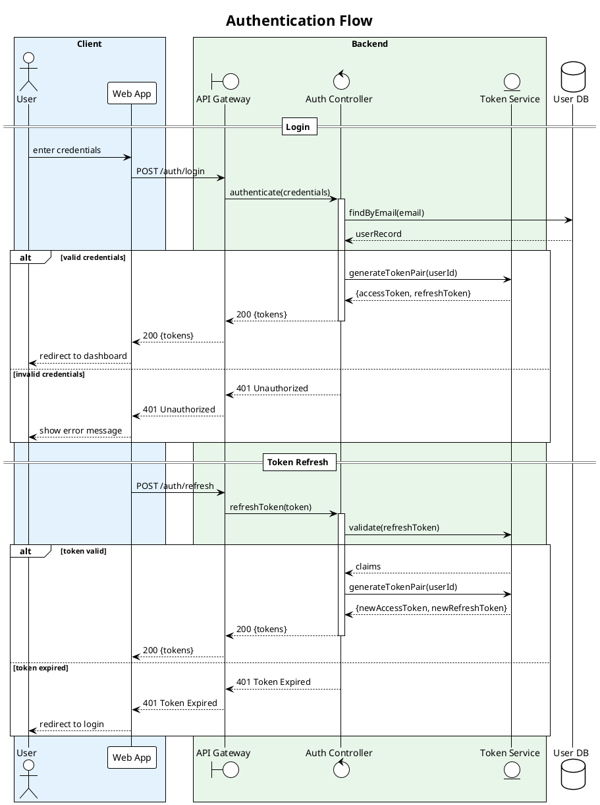
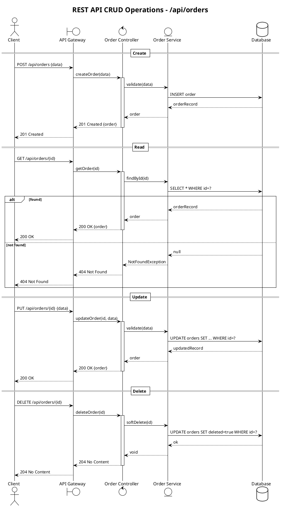
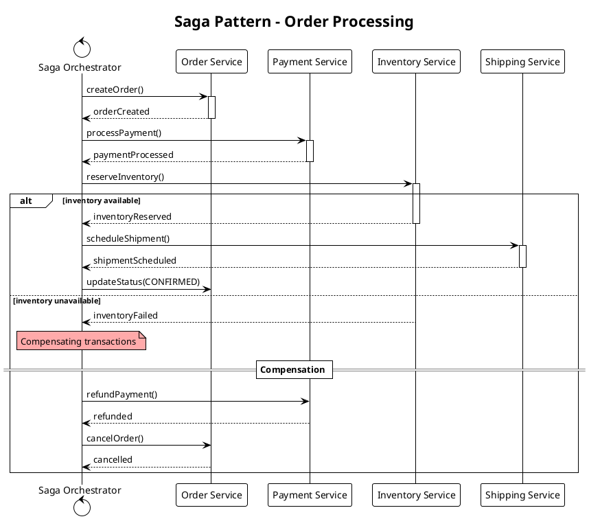
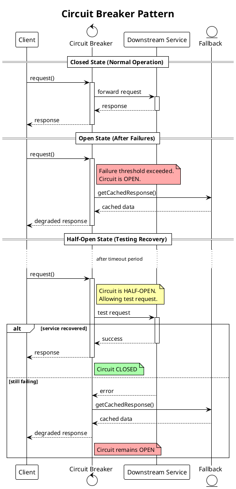
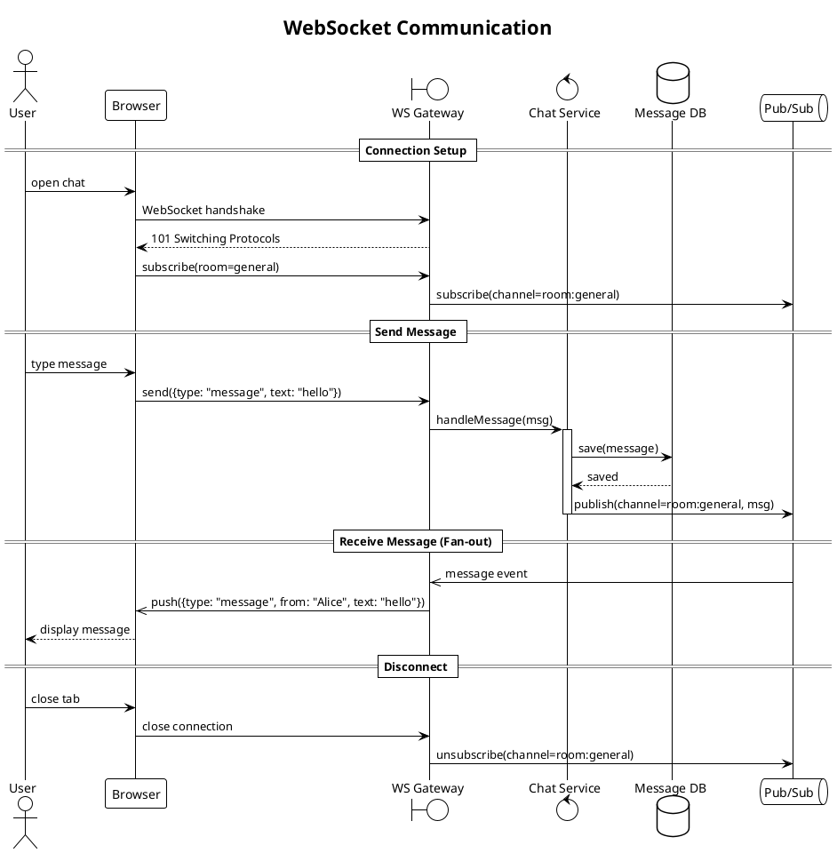
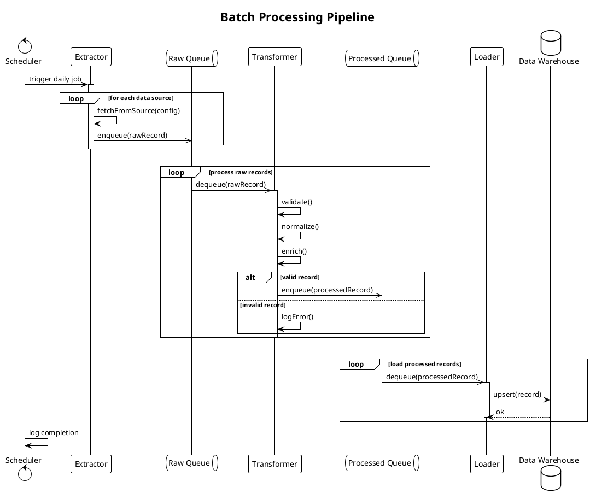

# Common Interaction Diagram Patterns

Reusable PlantUML sequence diagram patterns for frequently encountered system interactions. Each pattern includes a complete PlantUML source block, a description of when to use it, and customization notes.

## Pattern 1: REST API Authentication Flow

### When to Use

Any system where a client authenticates with credentials and receives tokens. Covers login, token validation, and refresh.

### PlantUML Source



### Customization Points

- Add `opt MFA enabled` block between credential validation and token generation for multi-factor auth.
- Replace `POST /auth/login` with OAuth or SSO endpoints as needed.
- Add rate limiting with a `break` fragment before authentication.

## Pattern 2: REST API CRUD Operations

### When to Use

Standard create-read-update-delete operations on a resource via a RESTful API.

### PlantUML Source



### Customization Points

- Replace `/api/orders` with the actual resource endpoint.
- Add authorization checks before each operation.
- Add pagination to the Read section for list endpoints.

## Pattern 3: Microservice Choreography (Event-Driven)

### When to Use

Multiple microservices communicating through events/messages without a central orchestrator.

### PlantUML Source

```plantuml
@startuml event-driven
!theme plain
title Event-Driven Order Processing

actor Customer
participant "Order Service" as Orders
queue "Event Bus" as Bus
participant "Payment Service" as Payment
participant "Inventory Service" as Inventory
participant "Notification Service" as Notify
database "Order DB" as OrderDB
database "Payment DB" as PayDB

Customer -> Orders ++: placeOrder(items, payment)
Orders -> OrderDB: save(order, status=PENDING)
OrderDB --> Orders: saved
Orders ->> Bus: emit OrderCreated
Orders --> Customer --: 202 Accepted {orderId}

== Payment Processing ==
Bus ->> Payment ++: OrderCreated event
Payment -> PayDB: chargeCard(payment)

alt payment successful
  PayDB --> Payment: charged
  Payment ->> Bus: emit PaymentCompleted
  deactivate Payment
else payment failed
  PayDB --> Payment: declined
  Payment ->> Bus: emit PaymentFailed
  deactivate Payment
end

== Inventory and Notification (Parallel) ==
par process order
  Bus ->> Inventory ++: PaymentCompleted event
  Inventory -> Inventory: reserveStock(items)
  Inventory ->> Bus: emit StockReserved
  deactivate Inventory
and
  Bus ->> Notify ++: PaymentCompleted event
  Notify -> Customer: sendConfirmationEmail()
  deactivate Notify
end

== Order Finalization ==
Bus ->> Orders ++: StockReserved event
Orders -> OrderDB: updateStatus(CONFIRMED)
OrderDB --> Orders: updated
deactivate Orders

note over Bus
  Events are durable and
  processed at-least-once
end note

@enduml
```

### Customization Points

- Add a `break` fragment for `PaymentFailed` to show compensation/rollback logic.
- Replace the event bus with specific technology names (Kafka, RabbitMQ, SNS/SQS).
- Add retry logic with `loop max 3 retries` around event processing.

## Pattern 4: Saga Pattern (Orchestration)

### When to Use

Distributed transactions coordinated by a central orchestrator that manages compensating transactions on failure.

### PlantUML Source



### Customization Points

- Add timeout handling between steps.
- Include more compensation steps for complex workflows.
- Add state tracking with notes (`note over Saga: state = PAYMENT_PENDING`).

## Pattern 5: Circuit Breaker

### When to Use

Showing how a client handles failures from an unreliable downstream service using the circuit breaker pattern.

### PlantUML Source



## Pattern 6: WebSocket / Real-Time Communication

### When to Use

Bidirectional real-time communication between client and server.

### PlantUML Source



## Pattern 7: Batch Processing Pipeline

### When to Use

Data pipeline with staged processing, typically for ETL or batch job workflows.

### PlantUML Source



## Combining Patterns

Complex systems often combine multiple patterns. For example, an e-commerce checkout might use:

1. **Auth Flow** (Pattern 1) for user authentication
2. **CRUD** (Pattern 2) for cart management
3. **Saga** (Pattern 4) for distributed order processing
4. **Event-Driven** (Pattern 3) for post-order notifications
5. **Circuit Breaker** (Pattern 5) for external payment provider calls

When combining, use dividers (`== Phase Name ==`) to separate the patterns and keep each section focused on one concern.
