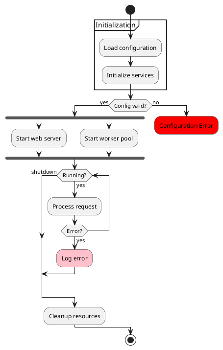

# Activity Diagram Syntax Reference (New Syntax)

This covers the NEW syntax only (not legacy). No Graphviz dependency required.

## Actions

```plantuml
:Action label;                    ' basic action
:Multi-line
action label;                     ' multi-line action
#HotPink:Colored action;          ' with background color
```

## Start / Stop / End

```plantuml
start                             ' filled circle
stop                              ' filled circle with ring (normal end)
end                               ' X symbol (abnormal/forced end)
```

## Conditionals

### if / elseif / else / endif

```plantuml
if (condition?) then (yes)
  :action A;
elseif (condition B?) then (yes)
  :action B;
else (no)
  :action C;
endif
```

Three condition forms:
- `if (condition?) then (yes)` -- standard
- `if (color?) is (red) then` -- equality with `is`
- `if (counter?) equals (5) then` -- equality with `equals`

### Vertical mode for elseif

```plantuml
!pragma useVerticalIf on
```

### Switch / Case

```plantuml
switch (test?)
case (condition A)
  :Text 1;
case (condition B)
  :Text 2;
endswitch
```

## Loops

### Repeat Loop

```plantuml
repeat
  :read data;
  :generate diagrams;
repeat while (more data?) is (yes) not (no)
```

With starting label and backward action:

```plantuml
repeat :starting label;
  :read data;
  backward :retry;
repeat while (more data?) is (yes)
->no;
```

### While Loop

```plantuml
while (data available?)
  :read data;
endwhile

while (check filesize?) is (not empty)
  :read file;
  backward :log;
endwhile (empty)
```

### Break in Repeat

```plantuml
repeat
  :Test something;
  if (OK?) then (yes)
    break
  endif
repeat while (loop?) is (yes) not (no)
```

## Parallel Processing

### Fork

```plantuml
fork
  :action 1;
fork again
  :action 2;
fork again
  :action 3;
end fork              ' synchronization bar (all must complete)

' or:
end merge             ' merge (any path continues)
end fork {or}         ' label: any completes
end fork {and}        ' label: all must complete
```

## Split

```plantuml
split
  :A;
split again
  :B;
end split
```

## Detach / Kill

`detach` or `kill` removes outgoing arrow (dead-end path).

## Notes

```plantuml
note right
  Multi-line note with **bold**
end note
floating note left: Floating note
```

## Arrows

```plantuml
-> label;                          ' labeled
-[#blue]-> ;                       ' colored
-[#green,dashed]-> ;               ' dashed
-[hidden]-> ;                      ' hidden
```

## Connectors

`(A)` creates a circle connector. Use with `detach` for goto-like jumps.

## Grouping

```plantuml
partition "Phase" { :action; }     ' partition (with braces)
group Name ... end group           ' group (with end keyword)
```

Also: `package`, `rectangle`, `card` (same syntax).

## Swimlanes

```plantuml
|Swimlane1|
start
:foo1;
|#AntiqueWhite|Swimlane2|
:foo2;
|Swimlane1|
:foo3;
stop
```

Alias syntax: `|#palegreen|f| Fisherman` then `|f|` to switch.

## SDL Shapes

Append shape char instead of `;`: `<` input, `>` output, `|` procedure, `/` save, `\` load, `}` continuous, `]` task.

## Colors

```plantuml
#HotPink:colored action;
partition #lightGreen "Phase" { :action; }
```

## Example


