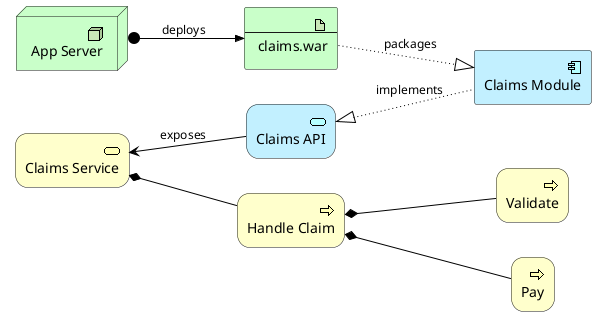

# ArchiMate Diagram Syntax Reference

ArchiMate is an enterprise architecture modeling language with Business,
Application, and Technology layers. PlantUML supports both raw keywords
and a macro library for creating ArchiMate diagrams.

## Archimate Keyword (Low-Level)

```plantuml
archimate #Business "Business Process" as bp <<business-process>>
archimate #Application "App Service" as as <<application-service>>
archimate #Technology "Server" as srv <<technology-device>>
```

### Layer Colors

| Color keyword   | Layer / Domain     |
|-----------------|--------------------|
| `#Business`     | Business layer     |
| `#Application`  | Application layer  |
| `#Technology`   | Technology layer   |
| `#Motivation`   | Motivation         |
| `#Strategy`     | Strategy           |
| `#Physical`     | Physical           |
| `#Implementation` | Implementation   |

## Macro Library (Recommended)

Include the standard library for simplified element creation:

```plantuml
!include <archimate/Archimate>
```

### Element Syntax

```
Category_ElementName(alias, "Description")
```

### Business Layer Elements

```plantuml
Business_Actor(ba, "Customer")
Business_Role(br, "Account Manager")
Business_Process(bp, "Handle Claim")
Business_Function(bf, "Payment Processing")
Business_Service(bs, "Insurance Service")
Business_Object(bo, "Claim Record")
Business_Event(be, "Claim Submitted")
Business_Interaction(bi, "Review Meeting")
Business_Collaboration(bc, "Claims Team")
Business_Interface(bif, "Customer Portal")
```

### Application Layer Elements

```plantuml
Application_Service(as, "Claims API")
Application_Component(ac, "Claims Module")
Application_Function(af, "Validate Claim")
Application_Interface(ai, "REST Endpoint")
Application_DataObject(ado, "Claim DTO")
Application_Collaboration(acl, "Microservice Cluster")
Application_Event(ae, "ClaimCreated Event")
Application_Process(ap, "ETL Pipeline")
```

### Technology Layer Elements

```plantuml
Technology_Service(ts, "Hosting Service")
Technology_Node(tn, "Application Server")
Technology_Device(td, "Firewall")
Technology_Artifact(ta, "claims.war")
Technology_CommunicationNetwork(tcn, "Corporate LAN")
Technology_SystemSoftware(tss, "Linux OS")
Technology_Path(tp, "VPN Tunnel")
Technology_Interface(ti, "HTTPS Port 443")
Technology_Function(tf, "Load Balancing")
Technology_Process(tpr, "Backup Process")
```

### Motivation Elements

```plantuml
Motivation_Stakeholder(ms, "Board of Directors")
Motivation_Driver(md, "Cost Reduction")
Motivation_Goal(mg, "Reduce Processing Time")
Motivation_Principle(mp, "Single Source of Truth")
Motivation_Requirement(mr, "Sub-second Response")
Motivation_Constraint(mc, "Budget Limit")
```

### Strategy Elements

```plantuml
Strategy_Resource(sr, "Development Team")
Strategy_Capability(sc, "Cloud Migration")
Strategy_CourseOfAction(sca, "Phase 1 Rollout")
```

## Relationships

### Syntax

```
Rel_RelationType(fromAlias, toAlias, "description")
Rel_RelationType_Direction(fromAlias, toAlias, "description")
```

### Relationship Types

| Macro              | Notation    | Meaning                            |
|--------------------|-------------|------------------------------------|
| `Rel_Composition`  | filled diamond | Part-of (strong ownership)      |
| `Rel_Aggregation`  | open diamond   | Part-of (weak ownership)        |
| `Rel_Assignment`   | filled circle  | Allocation of responsibility    |
| `Rel_Serving`      | open arrow     | Provides functionality to       |
| `Rel_Realization`  | dashed + triangle | Implements / realizes        |
| `Rel_Flow`         | dashed + arrow | Transfer of content             |
| `Rel_Triggering`   | filled arrow   | Causes execution of             |
| `Rel_Access`       | dashed line    | Reads/writes data               |
| `Rel_Access_r`     | dashed + arrow in | Read access                  |
| `Rel_Access_w`     | dashed + arrow out | Write access                |
| `Rel_Access_rw`    | dashed + both  | Read-write access               |
| `Rel_Influence`    | dashed + arrow | Affects another element         |
| `Rel_Association`  | plain line     | Unspecified relationship        |
| `Rel_Association_dir` | arrow      | Directed association            |
| `Rel_Specialization` | open triangle | Is-a / inherits from          |

### Direction Suffixes

Append `_Up`, `_Down`, `_Left`, or `_Right` to control layout:

```plantuml
Rel_Composition_Down(parent, child, "contains")
Rel_Serving_Right(service, consumer, "serves")
```

## Junctions

```plantuml
!define Junction_Or circle #black
!define Junction_And circle #whitesmoke

Junction_And JunctionAnd
Junction_Or JunctionOr
```

## Grouping

Use `rectangle` for visual grouping of related elements:

```plantuml
rectangle "Business Layer" {
  Business_Process(bp, "Handle Claim")
  Business_Service(bs, "Claims Service")
}
```

## Sprites

List all available ArchiMate sprites:

```plantuml
sprite $bProcess jar:archimate/business-process
sprite $aService jar:archimate/application-service
sprite $aComponent jar:archimate/application-component
```

Or use inline: `<<$archimate/business-process>>`

## Layout

```plantuml
left to right direction
skinparam nodesep 4
skinparam roundcorner 25

skinparam rectangle<<behavior>> {
  roundCorner 25
}
```

## Complete Example


