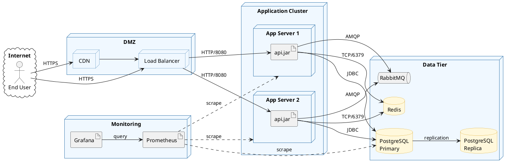

# Deployment Diagram Syntax Reference

PlantUML deployment diagrams visualize how software components are deployed onto
hardware infrastructure, showing the distribution of components across nodes, servers,
and devices. Source: PlantUML Language Reference Guide, Chapter 8.

## Element Types

### All Available Elements

```plantuml
node node
artifact artifact
cloud cloud
database database
file file
folder folder
frame frame
rectangle rectangle
package package
card card
stack stack
storage storage
queue queue
hexagon hexagon
collections collections
agent agent
actor actor
boundary boundary
control control
entity entity
interface interface
label label
person person
```

### Long Descriptions

Use brackets `[]` for multi-line descriptions:

```plantuml
node webServer [
  This is a <b>web server
  ----
  Hosts the application
  ====
  Ubuntu 22.04 LTS
]
```

Separators inside descriptions: `----`, `====`, `....`, `____`

### Short Forms

| Long Form   | Short Form | Example                    |
|-------------|------------|----------------------------|
| `actor`     | `:name:`   | `:admin:`                  |
| `component` | `[name]`   | `[WebApp]`                 |
| `interface` | `()`       | `() "REST API"`            |
| `usecase`   | `(name)`   | `(Login)`                  |

### Aliases

```plantuml
node Node1 as n1
node "Node 2" as n2
file f1 as "File 1"
cloud c1 as "this
is a
cloud"
```

## Relationships

### Line Styles

| Syntax | Style   |
|--------|---------|
| `--`   | Solid   |
| `..`   | Dashed  |
| `~~`   | Dotted  |
| `==`   | Bold    |

### Arrow Heads

| Syntax    | Meaning                 |
|-----------|-------------------------|
| `-->`     | Solid arrow             |
| `--*`     | Composition             |
| `--o`     | Aggregation             |
| `--+`     | Plus                    |
| `--#`     | Hash                    |
| `-->>`    | Double arrow            |
| `--0`     | Circle                  |
| `--\|>`   | Triangle (inheritance)  |
| `--\|\|>` | Double triangle         |

### Circle/Socket Arrows

```plantuml
cloud1 -0- cloud2       ' circle both sides
cloud1 -0)- cloud3      ' circle-socket
cloud1 -(0- cloud4      ' socket-circle
cloud1 -(0)- cloud5     ' socket-circle-socket
```

### Labels

```plantuml
node1 -- node2 : label1
node1 .. node3 : label2
node1 ~~ node4 : label3
```

### Arrow Direction

```plantuml
[Component] -left-> left
[Component] -right-> right
[Component] -up-> up
[Component] -down-> down
```

Shorten: `-l->`, `-r->`, `-u->`, `-d->`

### Arrow Styling (Bracketed)

```plantuml
foo -[bold]-> bar1
foo -[dashed]-> bar2
foo -[dotted]-> bar3
foo -[#red]-> bar4 : red
foo -[#green,dashed,thickness=2]-> bar5
foo -[#blue,dotted,thickness=8]-> bar6
```

Inline: `foo --> bar #line:red;line.bold;text:red : label`

## Grouping and Layout

### Nestable Elements

All of these can contain other elements via `{}`:

```plantuml
node "Web Server" {
  artifact "webapp.war"
}
cloud "AWS" {
  node "EC2 Instance" {
    component [App]
  }
  database "RDS" {
    storage "Data"
  }
}
```

Nestable types: `action`, `artifact`, `card`, `cloud`, `component`, `database`,
`file`, `folder`, `frame`, `hexagon`, `node`, `package`, `process`, `queue`,
`rectangle`, `stack`, `storage`.

### Deep Nesting

Elements can nest arbitrarily deep:

```plantuml
cloud vpc {
  node ec2 {
    stack appStack {
      artifact "app.jar"
    }
  }
}
```

### Diagram Orientation

```plantuml
left to right direction
' or (default):
top to bottom direction
```

### Hide Unlinked

```plantuml
hide @unlinked
remove @unlinked
```

## Styling

### Skinparam

```plantuml
skinparam node {
  BackgroundColor Yellow
  BorderColor Green
  BackgroundColor<<shared>> Magenta
}
skinparam database {
  BackgroundColor Aqua
}
skinparam roundCorner 15
```

### Stereotype-Specific Styling

```plantuml
skinparam rectangle {
  roundCorner<<Concept>> 25
}
rectangle "Model" <<Concept>>
```

### Inline Element Color

```plantuml
agent a
cloud c #pink;line:red;line.bold;text:red
file f #palegreen;line:green;line.dashed;text:green
node n #aliceblue;line:blue;line.dotted;text:blue
```

### Style Block (Modern Syntax)

```plantuml
<style>
node {
  BackGroundColor #22ccaa
  LineThickness 1
  LineColor black
}
database {
  BackGroundColor #ff9933
  LineThickness 1
  LineColor black
}
cloud {
  BackGroundColor #ff4422
  LineThickness 1
  LineColor black
}
</style>
```

### Notes

```plantuml
note top of myNode : A top note
note right of myNode
  Multi-line note
  content here
end note
note "Floating note" as N1
myNode .. N1
```

## Example


