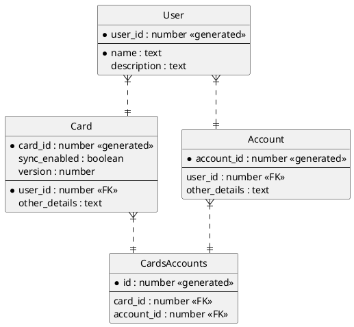

# ER Diagram Syntax Reference (Information Engineering)

Information Engineering diagrams extend PlantUML class diagrams with ER-specific
notation. Use `entity` instead of `class` and crow's foot relationship symbols.

## Entity Definition

```plantuml
entity "EntityName" as alias {
  * mandatory_attribute : type <<stereotype>>
  --
  * mandatory_attribute : type
  optional_attribute : type
}
```

- `*` marks mandatory (NOT NULL) attributes
- `--` separates the primary key section from other attributes
- Use `<<generated>>` for auto-increment keys
- Use `<<FK>>` for foreign key markers
- Aliases with `as` enable short names in relationships

## Attribute Patterns

```plantuml
entity "User" as u {
  * user_id : number <<generated>>
  --
  * name : text
  * email : varchar(255)
  description : text
  created_at : timestamp
}
```

### Bold Attributes

Use a space after `*` to avoid conflicts with Creole bold syntax:

```plantuml
entity "Example" {
  optional attribute
  **optional bold attribute**
  * **mandatory bold attribute**
}
```

## Relationship Symbols

### Left-Side Markers

| Symbol | Meaning     |
|--------|-------------|
| `\|o`  | Zero or One |
| `\|\|` | Exactly One |
| `}o`   | Zero or Many|
| `}\|`  | One or Many |

### Right-Side Markers

| Symbol | Meaning     |
|--------|-------------|
| `o\|`  | Zero or One |
| `\|\|` | Exactly One |
| `o{`   | Zero or Many|
| `\|{`  | One or Many |

### Line Styles

| Symbol | Meaning        |
|--------|----------------|
| `--`   | Solid line     |
| `..`   | Dotted line    |

## Relationship Examples

```plantuml
Entity01 }|..|| Entity02    ' one-or-many to exactly-one (dotted)
Entity03 }o..o| Entity04    ' zero-or-many to zero-or-one (dotted)
Entity05 ||--o{ Entity06    ' exactly-one to zero-or-many (solid)
Entity07 |o--|| Entity08    ' zero-or-one to exactly-one (solid)
```

### Common Cardinality Patterns

```
||--||   one-to-one (mandatory both sides)
||--o{   one-to-many (optional on many side)
}|..|{   many-to-many (mandatory both sides)
|o--o{   zero-or-one to zero-or-many
```

## Notes

```plantuml
note left of EntityName : short note
note right of EntityName : short note

note left of EntityName
  Multi-line note
  with details
end note
```

## Layout Tips

```plantuml
' Use ortho lines for clean crow's foot rendering
skinparam linetype ortho

' Hide the circle/spot on entities
hide circle
```

Angled crow's feet render poorly. Always use `skinparam linetype ortho`
to force orthogonal (right-angle) lines.

## Complete Example



## Skinparam (Common)

```plantuml
skinparam linetype ortho
skinparam entity {
  BackgroundColor #B3D9F2
  BorderColor #003B5C
  FontColor #1A1A2E
}
```
