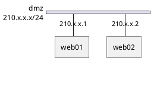

# Network Diagram Syntax Reference (nwdiag)

Network diagrams use nwdiag syntax integrated into PlantUML to visualize
network topology, server placement, and interconnections.

## Basic Structure



All content goes inside `nwdiag { }`. Define networks with `network name { }`,
then place servers/devices inside.

## Networks

```plantuml
network network_name {
  address = "192.168.10.0/24"    ' subnet address
  color = "red"                   ' background color
  width = full                    ' stretch to full diagram width
}
```

## Servers and Devices

Servers are declared inside network blocks with optional properties in brackets:

```plantuml
network lan {
  web01 [address = "192.168.1.1"];
  web02 [address = ".2"];                              ' shorthand
  db01 [address = "192.168.1.100", shape = database];
  lb01 [address = ".10", description = "Load Balancer"];
}
```

### Server Properties

| Property      | Description                    |
|---------------|--------------------------------|
| `address`     | IP address(es), comma-separated|
| `shape`       | Visual shape (see below)       |
| `description` | Label with Creole markup       |
| `color`       | Background color               |

### Multiple Addresses

```plantuml
web01 [address = "210.x.x.1, 210.x.x.20"];
```

## Multi-Network Servers

Place the same server name in multiple networks to show it spans them:

```plantuml
nwdiag {
  network dmz {
    address = "210.x.x.x/24"
    web01 [address = "210.x.x.1"];
  }
  network internal {
    address = "172.x.x.x/24"
    web01 [address = "172.x.x.1"];
    db01;
  }
}
```

Nodes on more than two networks use automatic "jump lines" over intermediate networks.

## Grouping Nodes

### Inside a Network

```plantuml
network lan {
  group web {
    web01 [address = ".1"];
    web02 [address = ".2"];
  }
}
```

### Outside Networks (Global Group)

```plantuml
nwdiag {
  group {
    color = "#FFAAAA";
    description = "Web Tier";
    web01;
    web02;
  }
  network dmz { web01; web02; }
  network internal { web01; web02; db01; }
}
```

### Group Properties

| Property      | Description          |
|---------------|----------------------|
| `color`       | Background color     |
| `description` | Group label text     |

## Shapes

Common shapes for server nodes:

```
(default)   ' standard server box
database    ' cylinder
cloud       ' cloud shape
node        ' 3D box
```

Usage: `server01 [shape = cloud];`

## Peer Networks

Direct connections between two nodes without a network busbar:

```plantuml
nwdiag {
  inet [shape = cloud];
  inet -- router;

  network lan {
    router;
    web01;
  }
}
```

## Internal Connections

Define direct device-to-device links outside of networks:

```plantuml
nwdiag {
  network LAN {
    a [address = "a1"];
    switch [address = "s2"];
  }
  switch -- equip;
  equip [address = "e3"];
  equip -- printer;
  printer [address = "USB"];
}
```

## Sprites and Icons

```plantuml
!include <office/Servers/application_server>
!include <office/Servers/database_server>

nwdiag {
  network dmz {
    web01 [description = "<$application_server>\nweb01"];
    db01 [description = "<$database_server>\ndb01"];
  }
}
```

### OpenIconic Icons

```plantuml
web01 [description = "<&cog*4>\nweb01"];
user [description = "<&person*4.5>\nuser1"];
```

## Title, Header, Footer, Legend

```plantuml
header some header
footer some footer
title Network Topology

nwdiag {
  network lan { server; }
}

legend
  Color legend here
end legend
caption Figure 1: Production Network
```

## Shadow Control

```plantuml
' Remove shadows
<style>
root {
  shadowing 0
}
</style>
```

## Complete Example

```plantuml
@startuml
title Production Network

nwdiag {
  group web_tier {
    color = "#B3D9F2";
    description = "Web Tier";
    web01; web02;
  }

  internet [shape = cloud];
  internet -- lb;

  network dmz {
    address = "10.0.1.0/24"
    color = "#F0F7FC"
    lb [address = ".10", description = "Load Balancer"];
    web01 [address = ".11"];
    web02 [address = ".12"];
  }

  network backend {
    address = "10.0.2.0/24"
    web01 [address = ".11"];
    web02 [address = ".12"];
    api01 [address = ".20"];
  }

  network data {
    address = "10.0.3.0/24"
    api01 [address = ".20"];
    db01 [address = ".100", shape = database];
    db02 [address = ".101", shape = database];
  }
}
@enduml
```
