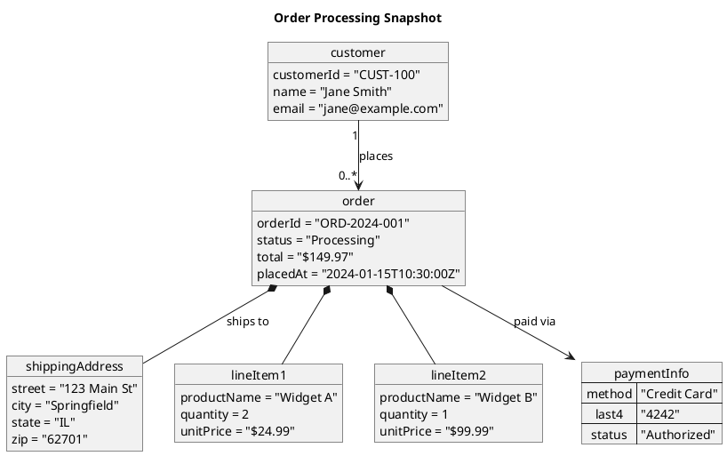

# Object Diagram Syntax Reference

PlantUML object diagrams show instances and their relationships at a specific point
in time -- a snapshot of the system's structure. Source: PlantUML Language Reference
Guide, Chapter 4.

## Element Types

### Defining Objects

```plantuml
object myObject
object "My Named Object" as obj2
```

### Adding Fields

With `:` syntax:

```plantuml
object user
user : name = "Dummy"
user : id = 123
```

With grouped `{}` syntax:

```plantuml
object user {
  name = "Dummy"
  id = 123
}
```

### Map / Associative Array

Use `map` keyword with `=>` separator for key-value tables:

```plantuml
map CapitalCity {
  UK => London
  USA => Washington
  Germany => Berlin
}
```

Maps with display names:

```plantuml
map "Map<Integer, String>" as users {
  1 => Alice
  2 => Bob
  3 => Charlie
}
```

### Diamond (Association Node)

```plantuml
diamond dia
object o1
object o2
object o3
o1 --> dia
o2 --> dia
dia --> o3
```

## Relationships

Object diagrams use the same relationship symbols as class diagrams:

| Syntax    | Type           | Meaning                             |
|-----------|----------------|-------------------------------------|
| `<\|--`   | Extension      | Inheritance (solid + triangle)      |
| `<\|..`   | Implementation | Realization (dotted + triangle)     |
| `*--`     | Composition    | Part cannot exist without the whole |
| `o--`     | Aggregation    | Part can exist independently        |
| `-->`     | Dependency     | Uses (solid arrow)                  |
| `..>`     | Dependency     | Uses (dotted arrow)                 |
| `--`      | Association    | Plain line                          |
| `..`      | Association    | Dotted line                         |

### Labels and Cardinality

```plantuml
Object01 <|-- Object02
Object03 *-- Object04
Object05 o-- "4" Object06
Object07 .. Object08 : some labels
```

### Map Links

Link map entries to objects or other maps:

```plantuml
object London
map CapitalCity {
  UK *-> London
  USA => Washington
}
```

Reference specific map entries with `::`:

```plantuml
object Baz
map Bar {
  abc =>
  def =>
}
Bar::abc --> Baz : Label one
Foo --> Bar::def : Label two
```

## Grouping and Layout

### Packages

```plantuml
package "Runtime State" {
  object server1 {
    hostname = "web-01"
    status = "running"
  }
  object server2 {
    hostname = "web-02"
    status = "stopped"
  }
}
```

### Direction

```plantuml
left to right direction
```

### PERT Diagrams with Maps

Maps work well for PERT (project evaluation) diagrams:

```plantuml
left to right direction
map Kick.Off {
}
map task.1 {
  Start => End
}
map task.2 {
  Start => End
}
Kick.Off --> task.1 : Label 1
Kick.Off --> task.2 : Label 2
task.1 --> task.2
```

## Styling

### Notes

Object diagrams share note syntax with class diagrams:

```plantuml
note top of myObject : This is a note
note left of myObject
  Multi-line
  note text
end note
note "Floating note" as N1
myObject .. N1
```

### Hide/Show

```plantuml
hide empty members
hide methods
```

### Skinparam

```plantuml
skinparam object {
  BackgroundColor PaleGreen
  BorderColor DarkGreen
  ArrowColor SeaGreen
}
```

### Inline Colors

```plantuml
object myObj #palegreen;line:green
```

### JSON Data

Mix JSON with objects on the same diagram:

```plantuml
allowmixing
object myObject
json JSON {
  "fruit": "Apple",
  "size": "Large",
  "color": ["Red", "Green"]
}
```

## Example


