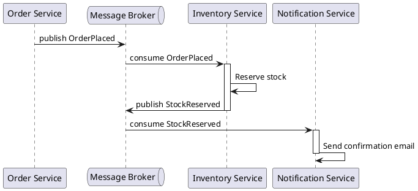
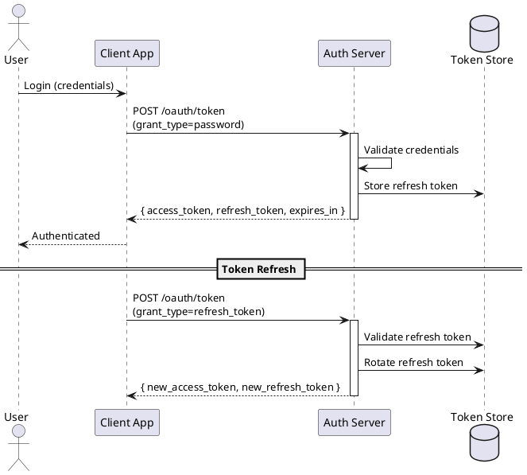
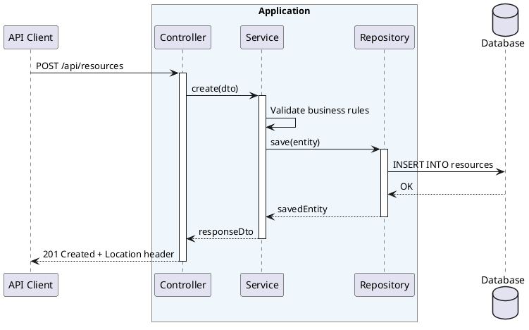
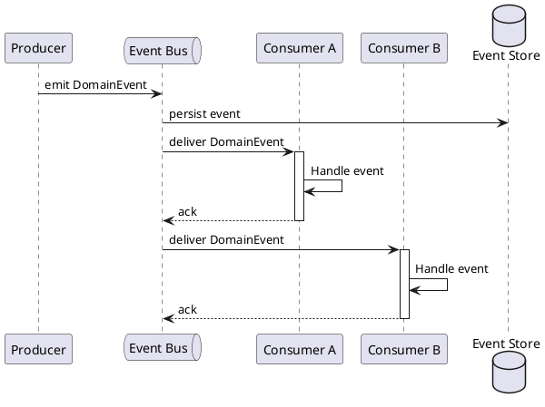
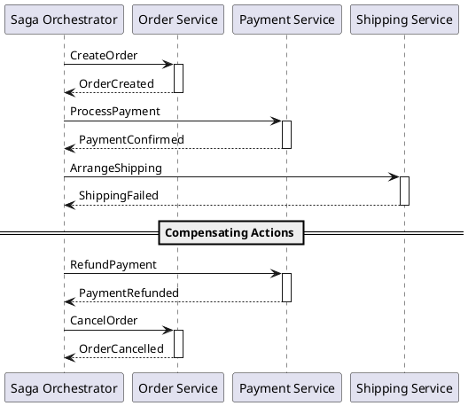
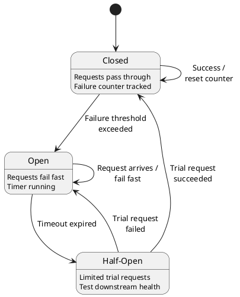
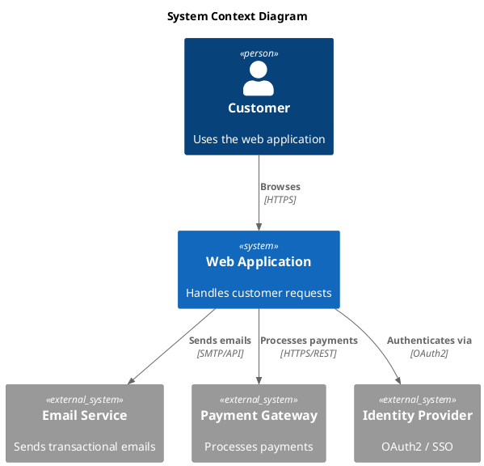

# Architecture Documentation Patterns

Reusable PlantUML snippets for common architecture patterns.
Each pattern is a starting point; adapt participants, labels, and
structure to your specific system.

## Microservice Choreography

Async messages between services via message queue.

## Authentication Flow (OAuth2/JWT)

Token-based auth with refresh flow.

## REST CRUD API

Controller to service to repository to database layering.

## Event-Driven Architecture

Producer publishes events to a bus consumed by multiple subscribers.

## Saga Pattern

Distributed transaction with compensating actions on failure.

## Circuit Breaker

State machine for closed, open, and half-open states.

## C4 System Context

Person interacting with a system that depends on external systems.

