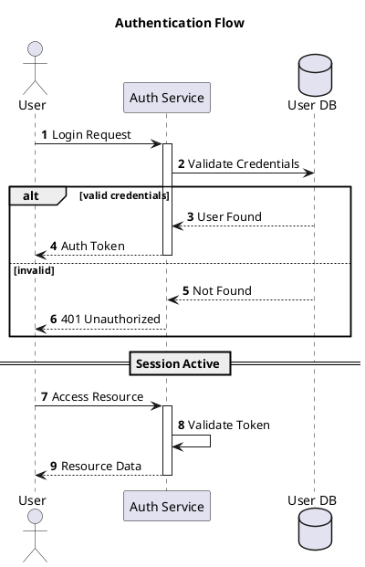

# Sequence Diagram Syntax Reference

## Participant Types

```plantuml
participant "Name"      ' default box
actor "Name"            ' stick figure
boundary "Name"         ' boundary icon
control "Name"          ' control icon
entity "Name"           ' entity icon
database "Name"         ' database icon
collections "Name"      ' collections icon
queue "Name"            ' queue icon
```

- Use `as` for aliases: `participant "Long Name" as P1`
- Set color: `actor Bob #red`
- Set order: `participant First order 10`

## Arrow Syntax

### Basic Arrows

```
->    solid line, solid arrowhead
-->   dotted line, solid arrowhead
->>   solid line, thin arrowhead
-->>  dotted line, thin arrowhead
-\    solid line, upper half arrowhead
-/    solid line, lower half arrowhead
->x   solid line, lost message (X)
<->   bidirectional
->o   solid line, open arrowhead
```

### Arrow Color

```plantuml
Bob -[#red]> Alice : hello
Alice -[#0000FF]-> Bob : ok
```

### Incoming/Outgoing (Boundary Arrows)

```plantuml
[-> A : incoming from left
A ->] : outgoing to right
[<- A : outgoing to left
A <-] : incoming from right
```

## Activation / Lifeline

### Explicit

```plantuml
activate A
deactivate A
destroy A
```

### Shortcut (on arrow target)

```plantuml
alice -> bob ++ : hello       ' activate bob
bob -> bob ++ : self call     ' nested activation
bob --> alice -- : done       ' deactivate bob
alice -> bob ** : create      ' create instance
alice -> bob !! : delete      ' destroy instance
```

### Autoactivation

```plantuml
autoactivate on
```

### Return

```plantuml
return label    ' generates return arrow to most recent activator
```

## Message Sequence Numbering

```plantuml
autonumber                        ' start at 1, increment 1
autonumber 10                     ' start at 10
autonumber 10 5                   ' start at 10, increment 5
autonumber "<b>[000]"             ' formatted
autonumber stop                   ' pause numbering
autonumber resume                 ' resume numbering
autonumber 1.1.1                  ' multi-level numbering
autonumber inc A                  ' increment first digit
autonumber inc B                  ' increment second digit
```

## Grouping / Fragments

```plantuml
alt condition text
  ...
else other condition
  ...
end

opt optional text
  ...
end

loop 1000 times
  ...
end

par
  ...
end

break
  ...
end

critical
  ...
end

group Custom Label [Secondary Label]
  ...
end
```

- Fragments can be nested.
- Color: `alt#Gold #LightBlue Successful case`

## Notes

```plantuml
note left: short note               ' inline after a message
note right: short note

note left of Alice: text             ' relative to participant
note right of Bob: text
note over Alice: text
note over Alice, Bob: spans both

note left                            ' multi-line
  This is a note
  on several lines
end note

hnote over caller : hexagonal note
rnote over server : rectangle note

note across: note over all participants
```

### Aligned Notes

```plantuml
note over Alice : note A
/ note over Bob : note B       ' "/" aligns notes at same level
```

## Dividers and Delays

```plantuml
== Section Title ==               ' horizontal divider

...                               ' delay
...5 minutes later...             ' delay with text
```

## Spacing

```plantuml
|||                               ' small spacing
||45||                            ' 45 pixel spacing
```

## Boxes (Participant Grouping)

```plantuml
box "Internal Service" #LightBlue
  participant Bob
  participant Alice
end box
```

## Reference

```plantuml
ref over Alice, Bob : init

ref over Bob
  This can be on
  several lines
end ref
```

## Other Features

```plantuml
create Other                      ' participant creation
Alice -> Other : new

hide footbox                      ' remove bottom participant boxes
hide unlinked                     ' hide participants with no messages

title My Diagram Title
header Page Header
footer Page %page% of %lastpage%
mainframe This is a **mainframe**
```

## Example


