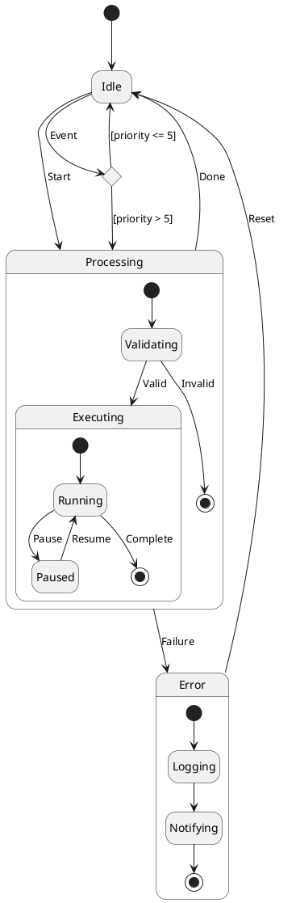

# State Diagram Syntax Reference

## Basic States

```plantuml
[*] --> State1                    ' [*] = initial/final pseudostate
State1 --> [*]                    ' transition to end
State1 : description line         ' add description to state
State1 : another line             ' multiple description lines
State1 -> State2                  ' shorter arrow (horizontal preference)
State1 --> State2                 ' longer arrow (vertical preference)
```

## State Declaration

```plantuml
state "Long State Name" as S1     ' named state with alias
state S1 : description            ' state with inline description

hide empty description            ' render states as simple boxes
```

## Transitions

```plantuml
State1 --> State2                 ' basic transition
State1 --> State2 : event         ' transition with label
State1 --> State2 : event / action  ' event with action
State1 --> State2 : event [guard] / action  ' with guard condition
```

### Arrow Direction

```plantuml
-up->     or  -u->                ' upward
-down->   or  -d->                ' downward (default for -->)
-left->   or  -l->                ' leftward
-right->  or  -r->                ' rightward (default for ->)
```

### Arrow Color and Style

```plantuml
S1 -[#red]-> S2
S1 -[#blue,dashed]-> S2
S1 -[dotted]-> S2
S1 -[#green,bold]-> S2
```

## Composite / Nested States

```plantuml
state OuterState {
  [*] --> InnerState1
  InnerState1 --> InnerState2
  InnerState2 --> [*]
}
```

Nested composites:

```plantuml
state A {
  state B {
    state C
  }
}
```

Sub-state to sub-state transitions:

```plantuml
state A {
  state X
}
state B {
  state Z
}
X --> Z
```

## Concurrent / Orthogonal States

Use `--` (horizontal) or `||` (vertical) to separate concurrent regions:

```plantuml
state Active {
  [*] -> NumLockOff
  NumLockOff --> NumLockOn : EvNumLockPressed
  NumLockOn --> NumLockOff : EvNumLockPressed
  --
  [*] -> CapsLockOff
  CapsLockOff --> CapsLockOn : EvCapsLockPressed
  CapsLockOn --> CapsLockOff : EvCapsLockPressed
}
```

## History States

```plantuml
State2 --> [H]           ' shallow history (resumes last active substate)
State2 --> State3[H*]    ' deep history (resumes full nested state)
```

## Fork and Join

```plantuml
state fork_state <<fork>>
state join_state <<join>>

[*] --> fork_state
fork_state --> State2
fork_state --> State3

State2 --> join_state
State3 --> join_state
join_state --> State4
```

## Conditional / Choice

```plantuml
state c <<choice>>

Idle --> c
c --> MinorId : [Id <= 10]
c --> MajorId : [Id > 10]
```

## Stereotypes

```plantuml
state start1  <<start>>
state choice1 <<choice>>
state fork1   <<fork>>
state join1   <<join>>
state end1    <<end>>
state hist    <<history>>
state dhist   <<history*>>
```

### Entry/Exit Points

```plantuml
state Somp {
  state entry1 <<entryPoint>>
  state exitA  <<exitPoint>>
  entry1 --> sin
  sin --> exitA
}
[*] --> entry1
exitA --> Foo
```

### Input/Output Pins

```plantuml
state entry1 <<inputPin>>
state exitA  <<outputPin>>
```

## Notes

```plantuml
note left of Active : short note
note right of Inactive
  A note on
  several lines
end note

note "Floating note" as N1        ' standalone floating note

' Note on a transition
[*] -> State1
State1 --> State2
note on link
  this is a state-transition note
end note
```

## Inline Colors

```plantuml
state CurrentSite #pink {
  state HardwareSetup #lightblue {
    state Site #brown
  }
}
```

Inline style: `state s2 #pink;line:red;line.bold;text:red : desc`

## Example


