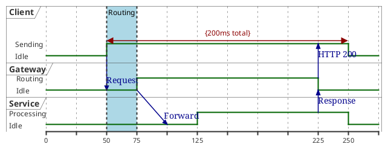

# Timing Diagram Syntax Reference

## Participant Types

```plantuml
robust "Name" as R                ' multi-state signal with transitions
concise "Name" as C               ' simplified signal for data/messages
binary "Name" as B                ' two-state signal (high/low)
clock "Name" as CLK with period 50            ' clock signal
clock "Name" as CLK with period 50 pulse 15 offset 10  ' with pulse/offset
analog "Name" as A                ' continuous analog signal
```

## State Changes

### By Absolute Time

```plantuml
@0
WU is Idle
WB is Idle

@100
WU is Waiting
WB is Processing
```

### By Relative Time

```plantuml
@+100                             ' relative to previous time
WU is Waiting

@+200
WB is Processing
```

### Participant-Oriented

```plantuml
@WB
0 is idle
+200 is Processing
+100 is Waiting

@WU
0 is Waiting
+500 is ok
```

### By Clock Reference

```plantuml
clock "clk" as clk with period 50

@clk*0
S1 is 0
@clk*1
S1 is 1
```

## Binary Signal

```plantuml
binary "Enable" as EN

@0
EN is low
@5
EN is high
@10
EN is low
```

## Analog Signal

```plantuml
analog "Analog" as A

@0
A is 0
@100
A is 3
@300
A is 1
```

### Scaling Analog

```plantuml
analog "Voltage" between 0 and 5 as V    ' set min-max range
V ticks num on multiple 1                 ' tick marks
V is 200 pixels height                    ' custom height
```

## Robust Signal State Order

```plantuml
robust "Flow rate" as rate
rate has high,low,none                    ' define state order
rate has "35 gpm" as high                 ' with label
```

## Messages / Constraints / Anchors

```plantuml
WU -> WB : URL                            ' message at a time point
WB -> DNS@+50 : Resolve URL               ' message arriving at offset
WB@0 <-> @50 : {50 ms lag}               ' constraint between times
@0 as :start                              ' named anchor point
@:start
EN is low
```

## Highlights and Notes

```plantuml
highlight 200 to 450 #Gold;line:DimGrey : Caption text
note top of WU : note text                ' for concise/binary only
note bottom of WU : second note
D is low: idle                            ' inline state annotation
```

## Special States

```plantuml
WB is Initializing                        ' initial state (before @time)
WU is {hidden}                            ' hidden segment
WU is {-}                                 ' undefined/blank segment
S1 is {0,1} #SlateGrey                   ' intricated/multi state
```

## Time Axis

```plantuml
hide time-axis                            ' remove the time axis
manual time-axis                          ' show labels only at state changes
```

## Scale

```plantuml
scale 100 as 50 pixels                   ' map time units to pixels
scale 5 as 150 pixels                    ' for digital timing

' for date-based:
scale 2592000 as 50 pixels               ' 30 days = 50 pixels
```

## Date/Time Support

```plantuml
@2019/07/02
WU is Idle
@2019/07/04
WU is Waiting

' time format:
@1:15:00
WU is Idle

' custom format:
use date format "YY-MM-dd"
```

## Compact Mode

```plantuml
mode compact                              ' global compact mode

' or per-participant:
compact robust "Web Browser" as WB
compact concise "Web User" as WU
```

## Other

```plantuml
title My Timing Diagram
header: some header
footer: some footer
```

## Example


