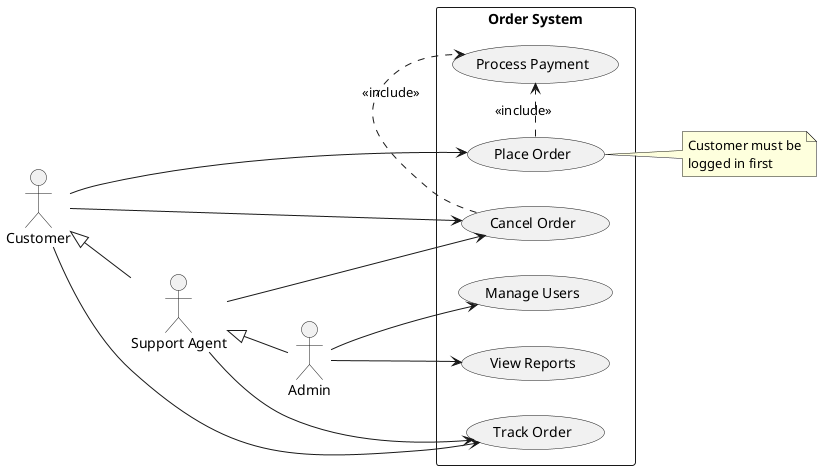

# Use Case Diagram Syntax Reference

## Actors

```plantuml
:Actor Name:                      ' colon syntax
actor ActorName                   ' keyword syntax
actor "Long Name" as A1           ' with alias
actor :Last Actor: as Person1     ' colon + alias
```

### Actor Styles

```plantuml
skinparam actorStyle awesome      ' filled person icon
skinparam actorStyle hollow       ' hollow person icon
' default: stick figure
```

### Business Actors

```plantuml
:Business Actor:/                 ' trailing / for business
actor/ Woman3
```

## Use Cases

```plantuml
(Use Case Name)                   ' parentheses syntax
usecase UC1                       ' keyword syntax
usecase "Manage Users" as UC2     ' with alias
usecase (Last\nUsecase) as UC4    ' multiline name
```

### Business Use Cases

```plantuml
(Business Usecase)/               ' trailing / for business
usecase/ UC3
```

### Use Case Descriptions

```plantuml
usecase UC1 as "First line
Second line
--
Separator section
==
Double separator
..Title..
Titled section"
```

## System Boundary

```plantuml
rectangle "System Name" {
  usecase "Use Case 1" as UC1
  usecase "Use Case 2" as UC2
}
```

Also supported: `package` (different visual style).

```plantuml
package "System" {
  (Use Case 1)
  (Use Case 2)
}
```

## Relationships / Arrows

### Basic Connections

```plantuml
User -> (Use Case)                ' single dash = horizontal preference
User --> (Use Case)               ' double dash = vertical preference
User ---> (Use Case)              ' longer arrow
```

### Arrow Direction

```plantuml
:user: -left-> (Left UC)
:user: -right-> (Right UC)
:user: -up-> (Up UC)
:user: -down-> (Down UC)
' shorthand: -l->, -r->, -u->, -d->
```

### Include and Extend

```plantuml
(Checkout) .> (Payment) : <<include>>
(Help) .> (Checkout) : <<extend>>

' alternate notation
(Checkout) .> (Payment) : include
(Help) .> (Checkout) : extends
```

### Generalization / Inheritance

```plantuml
User <|-- Admin                   ' actor inheritance
(Start) <|-- (Use)                ' use case inheritance
```

### Arrow Styles

```plantuml
foo --> (bar) : normal
foo --> (bar1) #line:red;line.bold;text:red : red bold
foo --> (bar2) #green;line.dashed;text:green : green dashed
foo --> (bar3) #blue;line.dotted;text:blue : blue dotted
```

## Notes

```plantuml
note right of Admin : This is a note.

note right of (Use)
  A note can also
  be on several lines
end note

note "Floating note" as N2        ' standalone note
(Start) .. N2                     ' link note to element
N2 .. (Use)                       ' link to multiple elements

note left of Actor : text
note top of (UseCase) : text
note bottom of (UseCase) : text
```

## Stereotypes

```plantuml
User << Human >>
:Main Database: as MySql << Application >>
(Start) << One Shot >>
(Use the application) as (Use) << Main >>
```

## Layout

```plantuml
left to right direction            ' horizontal layout (often better)
top to bottom direction            ' vertical layout (default)
```

## Element Styling

```plantuml
actor a
actor b #pink;line:red;line.bold;text:red
usecase c #palegreen;line:green;line.dashed;text:green
```

## Skinparam (Common)

```plantuml
skinparam packageStyle rectangle

skinparam usecase {
  BackgroundColor DarkSeaGreen
  BorderColor DarkSlateGray
  ArrowColor Olive
  ActorBorderColor black
  ActorFontName Courier
}
```

## Example


