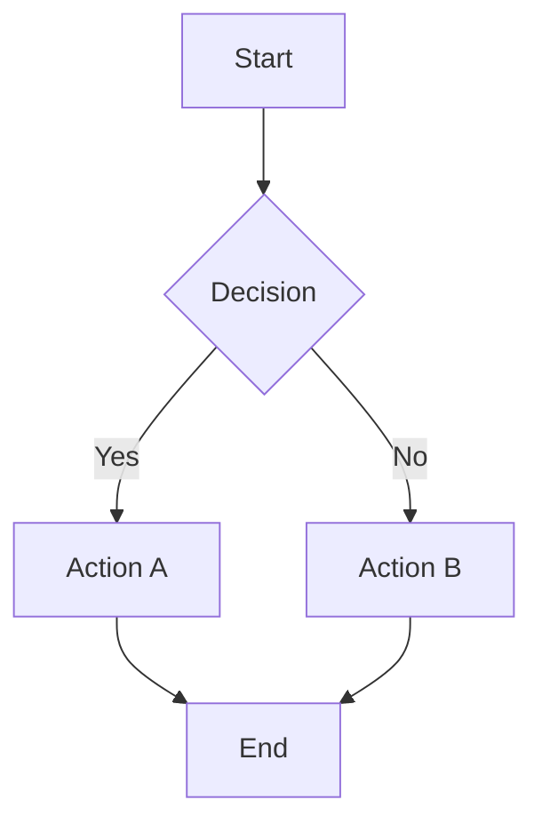
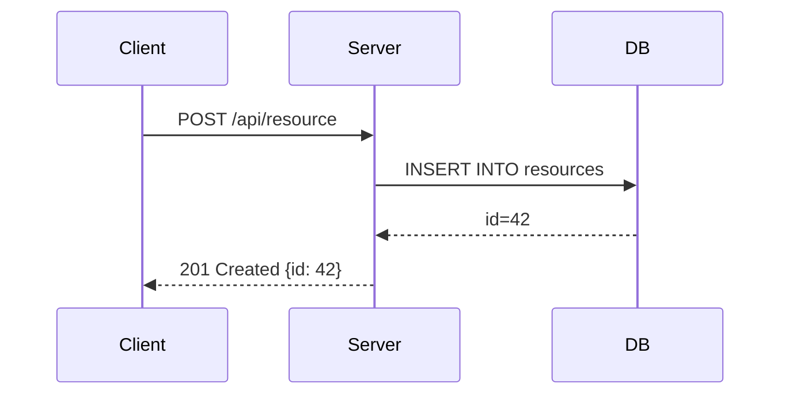
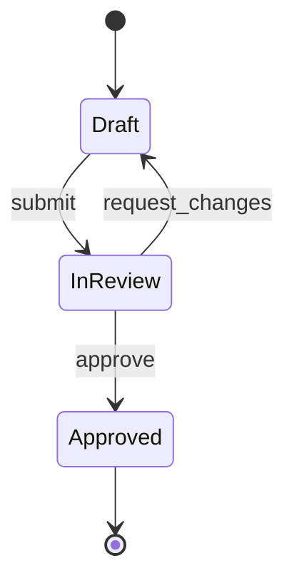
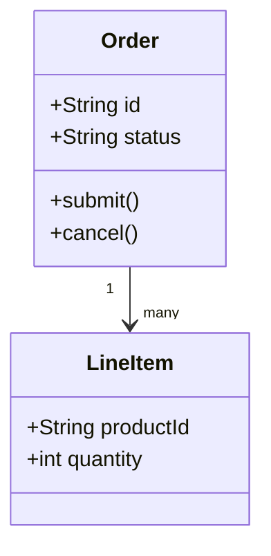
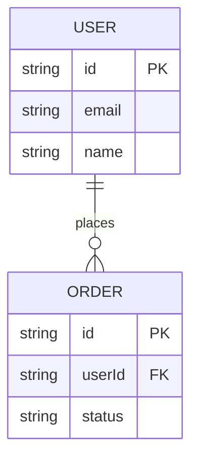

The mermaid-diagram skill helps you add, update, and reason about Mermaid diagrams in
spec markdown files (requirements.md, design.md, tasks.md, etc.). Diagrams are rendered
inline by the Spec Browser when viewing those files.

## Supported Diagram Types

The most common diagram types for spec documents:

- **flowchart** -- decision flows, process steps, branching logic
- **sequenceDiagram** -- request/response flows, API interactions, multi-actor choreography
- **classDiagram** -- data models, class hierarchies, interface contracts
- **stateDiagram-v2** -- state machines, lifecycle transitions
- **erDiagram** -- database schemas, entity relationships
- **gitGraph** -- branch strategies, release flows
- **C4Context / C4Container** -- C4 architecture diagrams (via Mermaid C4 support)

## Syntax Reference

### Flowchart



### Sequence Diagram



### State Diagram



### Class Diagram



### ER Diagram



## When to Use Each Type

| Goal | Use |
|------|-----|
| Show a process or algorithm | flowchart |
| Show API call chain or protocol | sequenceDiagram |
| Show data model or domain objects | classDiagram or erDiagram |
| Show state transitions | stateDiagram-v2 |
| Show system components and boundaries | flowchart with subgraphs |

## Placement in Spec Documents

- **requirements.md** -- rarely needs diagrams; use for complex conditional flows
- **design.md** -- primary home for architecture, sequence, and data model diagrams
- **tasks.md** -- avoid diagrams; tasks are a checklist, not a design doc

For design.md, place diagrams directly under the relevant section heading:

````markdown
## Component Interaction

The following sequence shows how the auth middleware interacts with the token store.

```mermaid
sequenceDiagram
    ...
```

Descriptions go above the diagram, not below.
````

## Instructions for Claude

When asked to "add a diagram", "add a sequence diagram", "visualize X", or similar:

1. Identify the correct diagram type from the goal (see table above).
2. Read the relevant section of the design doc to understand what to diagram.
3. Generate the Mermaid source using the correct syntax for that type.
4. Place the fenced code block in the appropriate section with a one-sentence intro above it.
5. Use only ASCII characters in diagram labels (no Unicode arrows or symbols).
6. Keep node labels concise -- one line, under 40 characters.
7. After inserting, tell the user the diagram is in `design.md` under `<section>` and will render in the Spec Browser.
