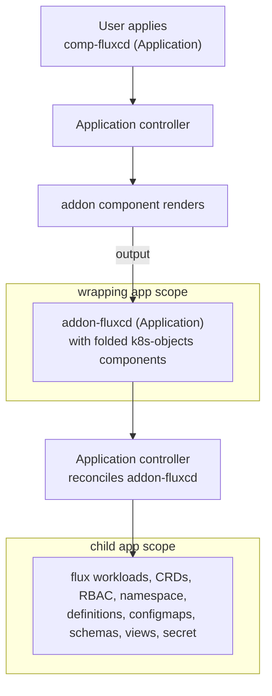
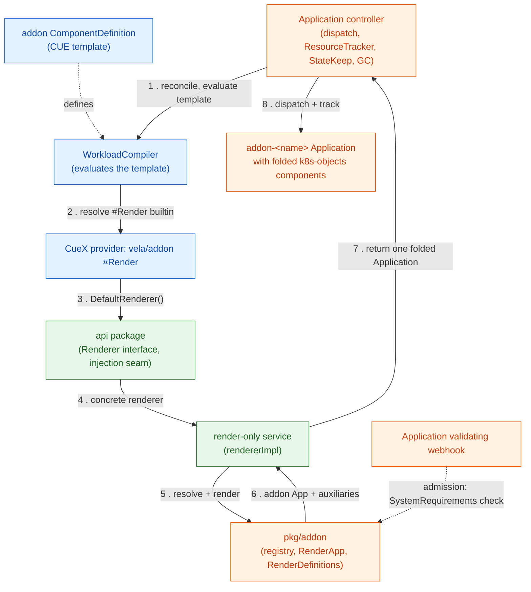
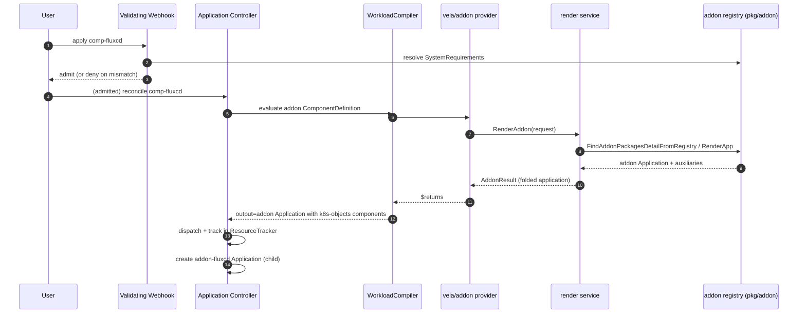

# Addon as Component: High-Level Design (HLD)

## 1. Summary

Today a KubeVela addon is installed either through the imperative CLI
(`vela addon enable <name>`) or a dedicated Addon flow. This feature lets an
addon be declared as an ordinary OAM **component** of `type: addon` inside a
normal `Application`:

```yaml
apiVersion: core.oam.dev/v1beta1
kind: Application
metadata:
  name: comp-fluxcd
  namespace: vela-system
spec:
  components:
    - name: fluxcd
      type: addon
      properties:
        version: "3.0.2"
```

Applying this Application makes the standard Application controller resolve the
addon from the registry, render the addon's **own** Application plus its
auxiliaries (definitions, config templates, schemas, views, secret), and manage
all of it through the existing Application machinery: ResourceTracker, StateKeep
(self-healing), garbage collection, and revisioning.

## 2. Motivation

`vela addon enable` is imperative and lives outside the Application lifecycle.
Modelling an addon as a component changes that in three ways. The addon becomes a
declarative manifest you can commit to Git, so it fits a GitOps workflow. It
reuses the Application controller, which already handles dispatch, ResourceTracker
tracking, StateKeep healing, garbage collection, and multi-cluster topology, so
none of that has to be reimplemented in an addon-specific controller. And because
it is a normal component, it can sit alongside other components in the same
Application and take part in the same workflow.

This does not replace the addon registry format, change addon package contents,
or remove the imperative CLI. Both paths converge on the same observable object,
an `addon-<name>` Application in `vela-system`.

## 3. Core idea: two-level Applications

A `type: addon` component's rendered `output` **is itself an Application
manifest**. Before it is returned, the renderer folds addon definitions, config
templates, schemas, views, secrets, and template-provided auxiliaries into
`k8s-objects` components of that inner Application. So one applied Application
produces a second one:



- **Wrapping app** (`comp-fluxcd`): its versioned ResourceTracker records one
  rendered `Application/addon-fluxcd`.
- **Inner app** (`addon-fluxcd`): reconciles both the addon workloads and the
  folded auxiliary `k8s-objects` components. Its root/versioned ResourceTrackers
  retain raw desired manifests for both groups according to the GC policy.

In the verified/default GC configuration shown here, one `kubectl apply` yields
**2 Applications** and **3 ResourceTrackers** (wrapping versioned RT + inner root
RT + inner versioned RT). The inner root tracker is conditional: it is created
only when the inner Application's GC policy assigns resources to it. The
relationship is expressed by rendering and tracking, not output ownership or
Kubernetes owner references.

**Component installs opt into StateKeep.** Rendered addon Applications carry an
explicit disabled `apply-once` policy unless the addon package declares its own.
This bypasses the legacy addon-label fallback, retains raw desired manifests in
the inner ResourceTracker, and lets periodic StateKeep heal deleted auxiliaries.
Imperative addon installs keep their legacy behavior.

## 4. Component landscape

The diagram below follows one render, top to bottom, in eight numbered steps. The
webhook (dotted) is a separate admission-time path, not part of the render. Colors
group the pieces by layer: blue is the definition/CUE layer, green is the addon
service, orange is existing KubeVela.



Key pieces (details in the LLD):

| Layer | Artifact | Responsibility |
|-------|----------|----------------|
| Definition | `vela-templates/definitions/internal/component/addon.cue` | Maps component parameters to `addon.#Render`; exposes the inner Application as `output`. |
| CUE provider | `pkg/cue/cuex/providers/addon/{addon.go,addon.cue}` | The `vela/addon` `#Render` builtin; calls the service. |
| Injection seam | `pkg/addon/service/api/api.go` | Leaf package (stdlib only) holding the `Renderer` interface + `SetDefaultRenderer`/`DefaultRenderer`, breaking the import cycle. |
| Service | `pkg/addon/service/renderer.go` | Resolves the addon from the registry and renders Application + auxiliaries; caches; sanitizes manifests. |
| Compiler wiring | `pkg/cue/cuex/compiler.go`, `pkg/workflow/providers/compiler.go` | Register the provider on the workload compiler (render) and the workflow compiler (schema gen). |
| Startup wiring | `cmd/core/app/server.go` | Blank import triggers `init()` → `SetDefaultRenderer`. |
| Admission | `pkg/webhook/.../application/validation.go` | Validates the addon's SystemRequirements at admission. |

## 5. End-to-end flow (high level)



## 6. Version selection

`properties.version` is optional. If it is omitted or empty, the renderer asks
the configured registry for the latest stable addon package: versioned
registries are sorted descending and prerelease versions are skipped. If
`properties.version` is set, the current implementation treats it as an exact
version pin, with only a leading `v` normalized during lookup. It does not
evaluate semver range expressions.

## 7. Key design decisions

1. **Render-only service, not a dispatcher.** The service resolves and renders;
   it never talks to the cluster to create resources. Dispatch is left to the
   Application controller, so we inherit RT/StateKeep/GC unchanged.

2. **Leaf `api` package to break an import cycle.** The provider must call the
   service, but the service imports `pkg/addon`, which (transitively) imports the
   CUE compiler, which imports the provider. A tiny stdlib-only `api` package
   holding the interface + a `DefaultRenderer()` seam breaks the cycle:
   provider → `api` ← service.

3. **Startup injection via blank import + `init()`.** `cmd/core` blank-imports
   the service; its `init()` registers the concrete renderer. The provider reads
   it lazily through `api.DefaultRenderer()`.

4. **Two compiler registrations for two purposes.** The provider is registered on
   the `WorkloadCompiler` (used at render/reconcile time) and on the workflow
   `DefaultCompiler` (used by schema generation). Registering on the wrong one
   either breaks rendering or breaks schema gen for ~20 unrelated workflowstep
   definitions.

5. **Admission-time compatibility check.** A validating webhook resolves the
   addon's SystemRequirements and denies incompatible Applications up front,
   honoring a `skipVersionValidate` escape hatch and failing open on registry
   errors.

6. **StateKeep and annotation safeguards.** The renderer adds a disabled
   `apply-once` policy only when the addon package has not authored one. This
   overrides the legacy addon-label fallback without changing an addon-authored
   policy. It also sets `app.oam.dev/last-applied-configuration: skip` on the
   inner Application. The sentinel independently prevents the dispatch-time
   annotation copy from exceeding Kubernetes' 256 KiB annotation limit; it is
   separate from ResourceTracker size management. (Full behavior in the LLD.)

## 8. Comparison with `vela addon enable`

| Aspect | `vela addon enable` (imperative) | `type: addon` component (this feature) |
|--------|----------------------------------|----------------------------------------|
| Trigger | CLI | Declarative Application |
| Creates `addon-<name>` App | Yes, via `client.Create` | Yes, via OAM applicator (as component output) |
| Lifecycle tracking | The addon Application itself | The wrapper tracks the inner Application; the inner Application tracks workloads and folded auxiliaries |
| System requirements check | In-cluster, at enable time | At admission (webhook) + at render time |
| GitOps | No | Yes |
| Convergent object | `addon-<name>` Application in `vela-system` | Same |

## 9. Differential validation snapshot

The all-addons differential run on 2026-07-09 covered 36 catalog addons with
Cluster B using `skipVersionValidate: true` because the feature controller was
running out of cluster. Results:

| Result class | Count |
|--------------|-------|
| PASS / PASS | 25 |
| FAIL / FAIL | 5 |
| TIMEOUT / FAIL discrepancies | 6 |

The six actionable discrepancies were `cloudshell`,
`flink-kubernetes-operator`, `kube-state-metrics`, `model-serving`, `rollout`,
and `vela-core-shard-manager`; in each case the imperative baseline timed out
while the addon-as-component path failed fast.

## 10. Risks and mitigations

The registration is fragile in one specific way. An IDE "optimize imports" pass
can drop the blank import in `cmd/core`, which silently disables the renderer and
every addon then fails with `addon renderer not initialized`. The test harness
guards against this with a build-time symbol check, and the docs call it out.

Addons with large CRDs, such as fluxcd, are still sizeable even after the fix.
The `last-applied-configuration: skip` sentinel avoids the independent 256 KiB
annotation limit. If raw ResourceTrackers approach API or etcd limits,
`ZstdResourceTracker` is the existing mitigation. Metadata-only tracking is not
an acceptable size fallback because it disables StateKeep healing.

When vela-core runs outside the cluster, its SystemRequirements check cannot read
the in-cluster vela-core version, so the check behaves differently than it does
in-cluster. The `skipVersionValidate` escape hatch covers that case and mirrors
the imperative `--skip-version-validating` flag.

## 11. Migrating existing component-installed addons

An already completed wrapper can retain a durable ApplicationRevision containing
the pre-fix rendered inner Application. `vela workflow restart` alone reuses that
revision and does not rerender current code. Operators must make a real component
spec revision to create a current-code revision.

For the verified Terraform migration, restoring the byte-identical original spec
reused `comp-terraform-aws-v1` again. The retained
`properties.addon: terraform-aws` field is semantically equal to the component
name default, but anchored a current-code revision. Treat that explicit field as
one-time migration and operational guidance for existing Applications, not a
permanent renderer requirement for newly created apps.
