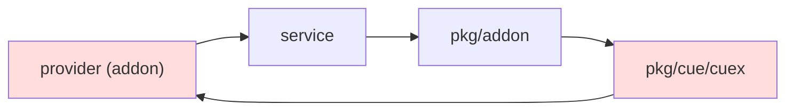
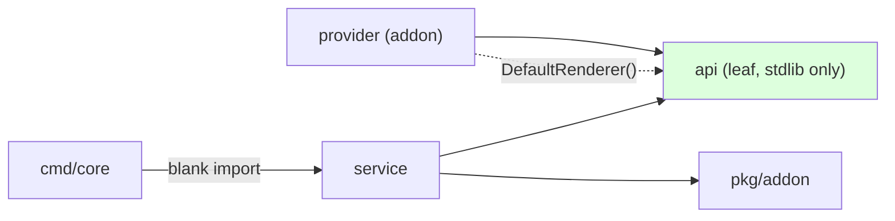
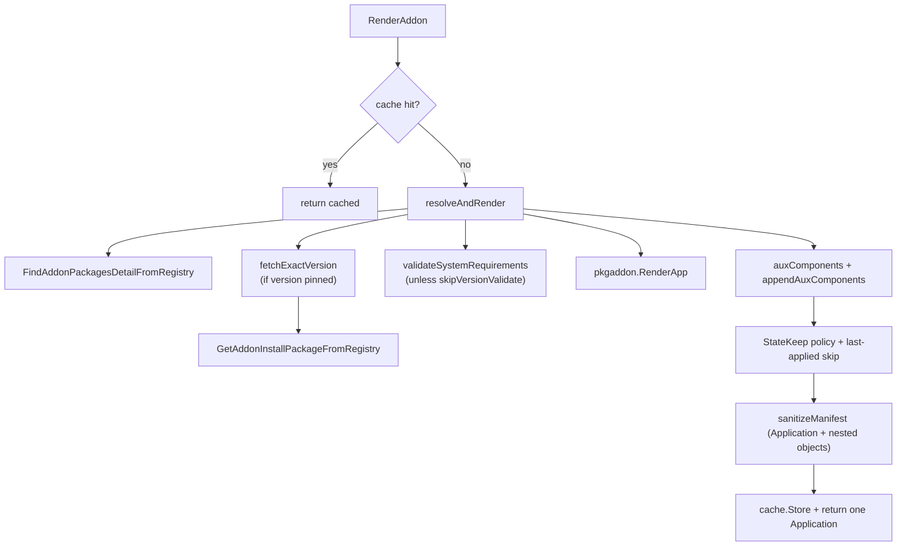
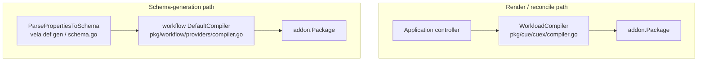
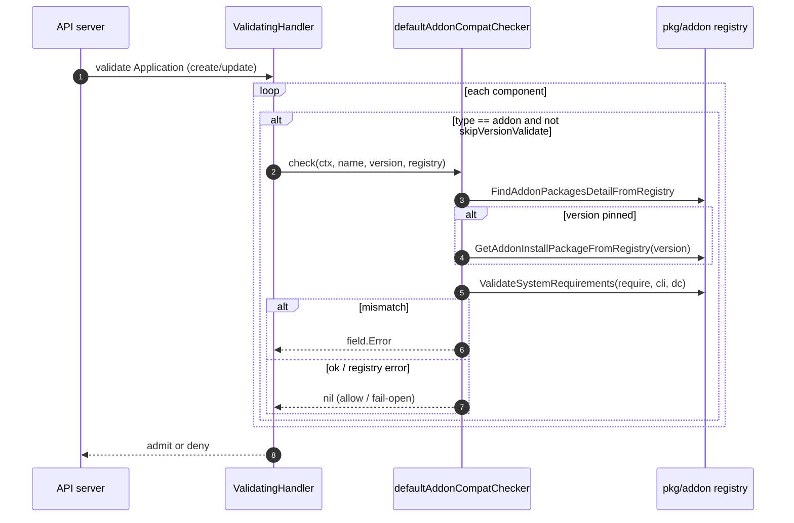
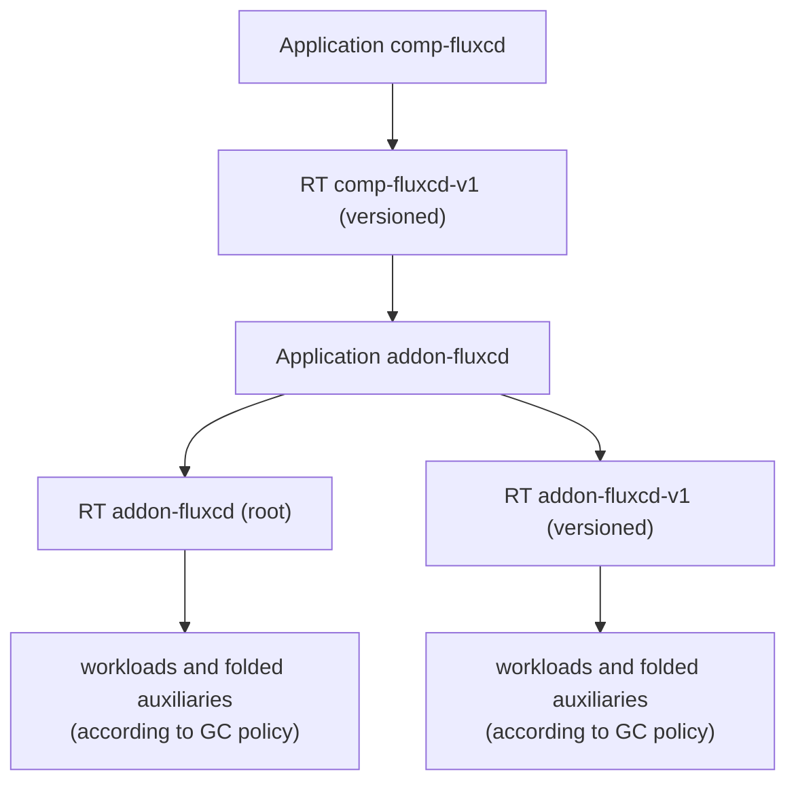

# Addon as Component: Low-Level Design (LLD)

This document is the implementation-level companion to the HLD. It covers the
exact files, types, method signatures, control flow, and the two subtle bugs the
feature had to solve (import cycle and ResourceTracker bloat).

---

## 1. File map

| File | Kind | Responsibility |
|------|------|----------------|
| `vela-templates/definitions/internal/component/addon.cue` | CUE | The `addon` ComponentDefinition. Maps parameters → `addon.#Render`, wires the folded inner Application to `output`. |
| `charts/vela-core/templates/defwithtemplate/addon.yaml` | YAML | Generated packaged form of the definition (shipped in the chart). |
| `pkg/cue/cuex/providers/addon/addon.go` | Go | The `vela/addon` CueX provider: `Render()`, `RenderVars`/`ResultVars`, `Package`. |
| `pkg/cue/cuex/providers/addon/addon.cue` | CUE | The `#Render` schema (`$params`/`$returns`). |
| `pkg/addon/service/api/api.go` | Go | Leaf package: `Renderer` interface, `AddonRequest`/`AddonResult`, `SetDefaultRenderer`/`DefaultRenderer`. |
| `pkg/addon/service/renderer.go` | Go | `rendererImpl`: resolve + render + cache + sanitize. |
| `pkg/cue/cuex/compiler.go` | Go | Registers `addon.Package` on the `WorkloadCompiler` (render path). |
| `pkg/workflow/providers/compiler.go` | Go | Registers `addon.Package` on the workflow `DefaultCompiler` (schema-gen path). |
| `cmd/core/app/server.go` | Go | Blank import of the service → `init()` registration. |
| `pkg/webhook/core.oam.dev/v1beta1/application/validation.go` | Go | `validateAddonComponents`, `defaultAddonCompatChecker`. |
| `pkg/addon/helper.go` | Go | `ValidateSystemRequirements`, `GetAddonInstallPackageFromRegistry`. |
| `apis/types/types.go` | Go | `DefaultFilterAnnots` (the RT-bloat fix). |
| `pkg/appfile/appfile.go` | Go | `filterAndSetAnnotations` (annotation propagation + sentinel preservation). |

---

## 2. The definition layer

`vela-templates/definitions/internal/component/addon.cue`:

```cue
import ("vela/addon")

"addon": {
    attributes: workload: type: "autodetects.core.oam.dev"
    type: "component"
}

template: {
    _render: addon.#Render & {
        $params: {
            addon:               parameter.addon
            version:             parameter.version
            registry:            parameter.registry
            properties:          parameter.properties
            skipVersionValidate: parameter.skipVersionValidate
        }
    }
    output: _render.$returns.application            // the folded addon's Application
    parameter: {
        addon:   *context.name | string              // defaults to component name
        version: *"" | string                        // exact pin; empty = latest stable
        registry: *"" | string
        properties: *{} | {...}
        skipVersionValidate: *false | bool
    }
}
```

- `workload.type: autodetects.core.oam.dev`: the workload kind is detected from
  the rendered `output` (an Application), not fixed ahead of time.
- `output` is the inner Application. The renderer has already appended each
  auxiliary category as a `k8s-objects` component in that Application, so the
  wrapping Application dispatches and tracks one resource.
- `addon` defaults to `context.name`, so `name: fluxcd` implies addon `fluxcd`.
- `version` is either empty or an exact pin. Empty selects the latest stable
  version from a versioned registry; a non-empty value is matched exactly after
  ignoring a leading `v`. Semver range expressions are not evaluated.

---

## 3. The CueX provider (`vela/addon`)

`pkg/cue/cuex/providers/addon/addon.cue` declares the builtin resolved by CueX:

```cue
#Render: {
    #do: "render"
    #provider: "addon"
    $params: { addon: string, version: *"" | string, registry: *"" | string,
               properties: {...}, skipVersionValidate: *false | bool }
    $returns?: { resolvedVersion: string, registry: string,
                 application: {...}, ... }
}
```

`pkg/cue/cuex/providers/addon/addon.go` implements it:

```go
type RenderVars struct {                    // $params
    Addon, Version, Registry string
    Properties map[string]interface{}
    SkipVersionValidate bool
}
type ResultVars struct {                    // $returns
    ResolvedVersion, Registry string
    Application map[string]interface{}
}

func Render(ctx context.Context, params *RenderParams) (*RenderReturns, error) {
    r := api.DefaultRenderer()
    if r == nil { return nil, fmt.Errorf("addon renderer not initialized") }
    res, err := r.RenderAddon(ctx, api.AddonRequest{ /* map params */ })
    if err != nil { return nil, err }
    return &RenderReturns{Returns: ResultVars{ /* map result */ }}, nil
}

var Package = runtime.Must(cuexruntime.NewInternalPackage(ProviderName, template,
    map[string]cuexruntime.ProviderFn{
        "render": cuexruntime.GenericProviderFn[RenderParams, RenderReturns](Render),
    }))
```

Note the provider imports only `pkg/addon/service/api`, never the service or
`pkg/addon`. That is what keeps the compiler's dependency graph acyclic.

---

## 4. The injection seam (import-cycle avoidance)

The naive dependency would be:



That is a cycle (`provider → service → pkg/addon → cuex → provider`). The fix is
a leaf package `pkg/addon/service/api` that depends on nothing but the standard
library:

```go
type Renderer interface {
    RenderAddon(ctx context.Context, req AddonRequest) (*AddonResult, error)
}
var (mu sync.RWMutex; defaultR Renderer)
func SetDefaultRenderer(r Renderer) { mu.Lock(); defaultR = r; mu.Unlock() }
func DefaultRenderer() Renderer     { mu.RLock(); defer mu.RUnlock(); return defaultR }
```

Now the graph is acyclic:



- The provider depends on the **interface**, resolved at call time.
- The service depends on `pkg/addon` and, in its `init()`, registers itself.
- `cmd/core` blank-imports the service so `init()` runs. If that import is
  dropped, `DefaultRenderer()` is nil and `Render()` fails with
  `addon renderer not initialized`.

---

## 5. The render service

`pkg/addon/service/renderer.go`.

### 5.1 Struct and construction

```go
type rendererImpl struct {
    cli    client.Client     // injected in tests; nil in prod
    config *rest.Config      // injected in tests; nil in prod
    cache  sync.Map          // cacheKey -> *api.AddonResult
    resolveFn func(ctx, req) (*api.AddonResult, error)  // test seam
    // test seam: supplies packages without registry I/O
    findPackagesFn func(context.Context, client.Client, []string, []string) ([]*pkgaddon.WholeAddonPackage, error)
}
func NewRenderer() api.Renderer { return &rendererImpl{} }
func init() { api.SetDefaultRenderer(NewRenderer()) }

func (r *rendererImpl) client() client.Client {
    if r.cli != nil { return r.cli }
    return singleton.KubeClient.Get()          // kubevela-pkg singleton
}
func (r *rendererImpl) restConfig() *rest.Config {
    if r.config != nil { return r.config }
    return singleton.KubeConfig.Get()
}
```

Production reads the client/config from kubevela-pkg singletons lazily, so there
is no startup ordering constraint. Tests inject fakes via the struct fields.

### 5.2 Public entry + cache

```go
func (r *rendererImpl) RenderAddon(ctx, req api.AddonRequest) (*api.AddonResult, error) {
    key := cacheKey(req)
    if cached, ok := r.cache.Load(key); ok { return cached.(*api.AddonResult), nil }
    res, err := r.resolveAndRender(ctx, req)   // resolveFn seam in tests
    if err != nil { return nil, err }
    r.cache.Store(key, res)
    return res, nil
}

func cacheKey(req) string   // "name|version|registry|skipValidate|sha256(properties)"
func hashProperties(map) string  // canonical (key-sorted) JSON → sha256
```

The cache key includes every input, so a version or property change is just a new
key and no invalidation is needed. The durable pin is the ApplicationRevision the
controller records.

### 5.3 Resolve and render

```go
func (r *rendererImpl) resolveAndRender(ctx, req) (*api.AddonResult, error) {
    findPackages := r.findPackagesFn
    if findPackages == nil {
        findPackages = pkgaddon.FindAddonPackagesDetailFromRegistry
    }
    pkgs, err := findPackages(ctx, r.client(), []string{req.Name}, regs)
    installPkg := &pkgs[0].InstallPackage; registryName := pkgs[0].RegistryName

    if req.Version != "" && req.Version != installPkg.Version {   // exact pin
        installPkg = r.fetchExactVersion(ctx, registryName, req.Name, req.Version)
    }
    if !req.SkipVersionValidate {                                 // SystemRequirements
        r.validateSystemRequirements(ctx, req.Name, installPkg)
    }
    app, aux := pkgaddon.RenderApp(ctx, installPkg, r.client(), req.Properties)
    groups := r.auxComponents(ctx, installPkg, req.Properties)
    groups = append(groups, auxComponent{name: "addon-auxiliaries", objects: aux})
    appMap := toUnstructured(app)
    appendAuxComponents(appMap, groups)
    ensureAddonComponentStateKeepPolicy(appMap)
    sanitizeManifest(appMap)
    suppressLastAppliedConfig(appMap)
    return &api.AddonResult{Application: appMap}
}
```

Sub-steps:

- `fetchExactVersion` delegates to the shared
  `pkgaddon.GetAddonInstallPackageFromRegistry(ctx, cli, registry, name, version)`
  (also used by the webhook).
- Empty `version` keeps the package returned by
  `FindAddonPackagesDetailFromRegistry`, which is the latest stable version for
  a versioned registry. Non-empty `version` fetches an exact version only; the
  lower-level registry matcher ignores a leading `v` but does not parse range
  constraints.
- `validateSystemRequirements` builds a discovery client from the rest config and
  calls `pkgaddon.ValidateSystemRequirements`. If no rest config (unit tests),
  it logs and skips.
- `auxComponents` calls the existing `pkgaddon.Render{Definitions,
  ConfigTemplates,DefinitionSchema,Views}` and `RenderArgsSecret`, keeping each
  category together. `appendAuxComponents` omits empty categories, sanitizes
  every nested object, and appends non-empty groups as `k8s-objects` components.

### 5.4 StateKeep and annotation safeguards

The renderer runs two independent safeguards after it has folded auxiliaries
into the inner Application:

```go
ensureAddonComponentStateKeepPolicy(appMap)
suppressLastAppliedConfig(appMap)
```

`ensureAddonComponentStateKeepPolicy` adds the generated policy below only when
the addon package has not authored an `apply-once` policy:

```yaml
- name: addon-component-state-keep
  type: apply-once
  properties:
    enable: false
```

The ResourceKeeper retains the legacy fallback for addon-labeled Applications:

```go
if h.applyOncePolicy == nil && metav1.HasLabel(h.app.ObjectMeta, oam.LabelAddonName) {
	h.applyOncePolicy = &v1alpha1.ApplyOncePolicySpec{Enable: true}
}
```

The explicit `enable: false` prevents that fallback. It also keeps `Dispatch`
from applying `MetaOnlyOption` and keeps `StateKeep` from returning early, so the
inner tracker retains raw desired data and periodic StateKeep can recreate a
deleted folded auxiliary.

Any package-authored `apply-once` policy is authoritative and preserved
unchanged. This includes policies with `enable: true`, policies with
`enable: false`, rules-only policies that omit `enable`, and malformed policies.
Malformed content is left for normal Application validation; the renderer does
not normalize it or inject the generated policy over or alongside it. For
example, FluxCD authors `not-keep-CRD` with CRD rules and omits `enable`; the
`PolicyDefinition` default is `false`, so the renderer preserves that policy
instead of injecting the generated one.

`suppressLastAppliedConfig` sets
`app.oam.dev/last-applied-configuration: skip` on the rendered inner
Application. This sentinel independently prevents the dispatch-time copy of the
large folded Application from exceeding Kubernetes' 256 KiB annotation limit.
It is not a ResourceTracker size fallback.

### 5.5 Manifest sanitization (why it exists)

```go
func sanitizeManifest(m map[string]interface{}) {
    delete(m, "status")            // status is not desired state
    stripCreationTimestamp(m)      // recursive: metadata.creationTimestamp
}
```

A rendered manifest marshalled from a typed object carries
`metadata.creationTimestamp: null`, which CUE treats as an incomplete value
(`_`) and rejects when the manifest becomes a component `output`. Stripping it
(recursively, including nested objects and array items) plus the root `status`
lets the manifest complete as CUE.

### 5.6 Service call graph



---

## 6. Compiler registration (two paths, two purposes)



- **WorkloadCompiler** compiles component/trait templates at reconcile time. The
  `addon` definition's `import "vela/addon"` is resolved here.
- **workflow DefaultCompiler** is used by `pkg/schema` and `pkg/definition` when
  generating parameter schemas. Without `addon.Package` here, schema generation
  fails with `builtin package "vela/addon" undefined`. Registering the provider
  on the *WorkloadCompiler* for schema gen would instead break ~20 workflowstep
  definitions, so each path registers where it is actually needed.

---

## 7. Admission webhook

`pkg/webhook/core.oam.dev/v1beta1/application/validation.go`.



Behavior contract:

- `skipVersionValidate: true` → the component is skipped entirely.
- Registry/resolve/discovery errors → **fail open** (return nil, allow). Only a
  concrete `ValidateSystemRequirements` mismatch denies.
- A pinned `version` is resolved to that exact package's `SystemRequirements`
  (not the latest), so a valid pin is not falsely denied.
- Empty `version` validates the latest stable package selected by the registry.
- The seam `addonCompatChecker` lets tests inject a fake checker.

---

## 8. Differential validation

The all-addons differential report from 2026-07-09 tested 36 catalog addons with
the imperative `vela addon enable` path as baseline and the `type: addon`
component path as the feature path. Cluster B used `skipVersionValidate: true`
because an out-of-cluster core cannot satisfy the in-cluster
SystemRequirements lookup.

| Outcome | Count | Meaning |
|---------|-------|---------|
| PASS / PASS | 25 | Both paths installed successfully. |
| FAIL / FAIL | 5 | Both paths failed consistently. |
| TIMEOUT / FAIL | 6 | Baseline timed out; component path failed fast after apply/render failure. |

The discrepant addons were `cloudshell`, `flink-kubernetes-operator`,
`kube-state-metrics`, `model-serving`, `rollout`, and
`vela-core-shard-manager`.

---

## 9. ResourceTracker data and size controls

The wrapping Application tracks exactly one rendered inner Application. The
inner Application tracks addon workloads and the folded `k8s-objects`
components, retaining raw desired manifests where StateKeep needs them. It does
not use output ownership or Kubernetes owner references to establish that model.

The verified FluxCD installation had a 140,946-byte inner tracker with 33
raw-backed managed resources, while its wrapping tracker was 949,640 bytes. The
raw inner Application stored in that wrapping tracker was 281,284 compact JSON
bytes; the live inner Application was 832,271 bytes. The
`last-applied-configuration: skip` sentinel prevented a separate 256 KiB
annotation failure while those raw manifests were retained.

Raw desired data is necessary for healing. When a raw tracker approaches API or
etcd limits, use the existing `ZstdResourceTracker` mitigation. Do not switch to
metadata-only tracking as a size fallback: `MetaOnlyOption` omits raw data, and
StateKeep skips entries without it.

---

## 10. Object model recap (what lands in the cluster)

For `comp-fluxcd`:



- The wrapping app's versioned RT records one child Application.
- The inner app's root/versioned trackers contain both workloads and folded
  auxiliaries according to its garbage-collection policy.

---

## 11. Method reference

| Symbol | File | Signature (abridged) |
|--------|------|----------------------|
| `Render` | provider/addon.go | `func(ctx, *RenderParams) (*RenderReturns, error)` |
| `Renderer.RenderAddon` | service/api/api.go | `RenderAddon(ctx, AddonRequest) (*AddonResult, error)` |
| `SetDefaultRenderer` / `DefaultRenderer` | service/api/api.go | `func(Renderer)` / `func() Renderer` |
| `rendererImpl.resolveAndRender` | service/renderer.go | `func(ctx, AddonRequest) (*AddonResult, error)` |
| `rendererImpl.fetchExactVersion` | service/renderer.go | `func(ctx, registry, name, version) (*InstallPackage, error)` |
| `sanitizeManifest` / `stripCreationTimestamp` | service/renderer.go | `func(map[string]interface{})` / `func(interface{})` |
| `ValidateSystemRequirements` | pkg/addon/helper.go | `func(ctx, *SystemRequirements, client, *DiscoveryClient) error` |
| `GetAddonInstallPackageFromRegistry` | pkg/addon/helper.go | `func(ctx, client, registry, name, version) (*InstallPackage, error)` |
| `ValidatingHandler.defaultAddonCompatChecker` | webhook/validation.go | `func(ctx, name, version, registry) *field.Error` |

---

## 12. Error handling and edge cases

- **Renderer not registered** → `addon renderer not initialized` (blank import
  dropped). Build-time symbol check catches it.
- **Addon not in registry** → `resolveAndRender` returns `addon %q not found`.
- **CUE incomplete value** → prevented by `sanitizeManifest`.
- **System requirements unmet** → render error (render path) or admission deny
  (webhook path), unless `skipVersionValidate`.
- **Out-of-cluster core** → no discovery client / no in-cluster version;
  `skipVersionValidate: true` is the escape hatch.
- **Large addons** → the `skip` sentinel avoids the annotation-size limit;
  `ZstdResourceTracker` protects raw ResourceTrackers without disabling healing.
