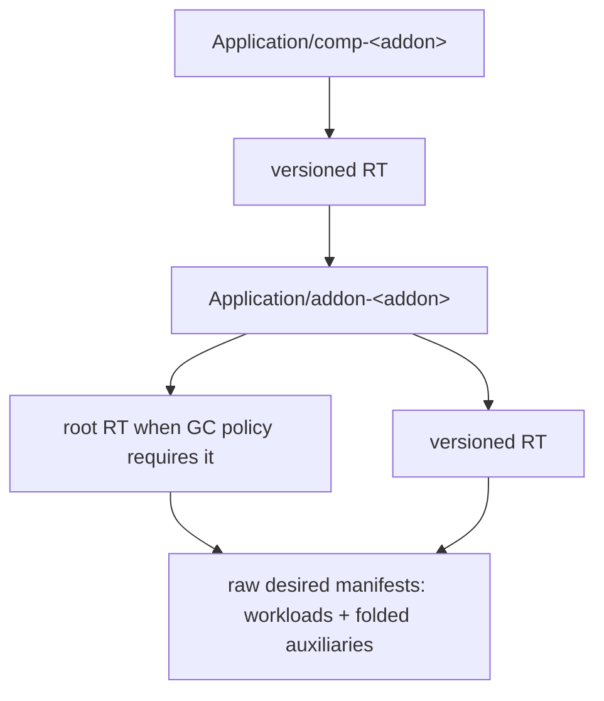

# Addon as Component: ResourceTracker Walkthrough

This document records the verified ResourceTracker model and measurements for
addons installed through `type: addon` components. The controller used a
20-second Application re-sync interval during the verification.

## Ownership and flow

```text
comp-<addon> versioned RT -> Application/addon-<addon>
Application/addon-<addon> -> addon workloads + auxiliary k8s-objects components
inner root/versioned RTs -> raw desired manifests for both groups
```

| Owner | Tracker | Contents |
|-------|---------|----------|
| Wrapping `comp-<addon>` Application | versioned RT | One rendered inner addon Application |
| Inner `addon-<addon>` Application | root/versioned RTs according to GC policy | Addon workloads plus folded auxiliary resources, stored with raw desired data |

The renderer folds package definitions, config templates, schemas, views,
secrets, and template-provided auxiliaries into `k8s-objects` components in the
inner Application. The wrapping tracker therefore contains the one inner
Application; the inner Application's trackers contain the workloads and folded
auxiliaries. This is tracking and rendering behavior, not Kubernetes owner
reference behavior.



## StateKeep preserves raw data

Component-installed addons receive this generated policy only when the package
does not author its own `apply-once` policy:

```yaml
- name: addon-component-state-keep
  type: apply-once
  properties:
    enable: false
```

The explicit disabled policy bypasses the legacy addon-label `apply-once`
fallback. It prevents `Dispatch` from selecting metadata-only tracking and
allows StateKeep to use raw desired manifests to recreate deleted resources.
Imperative addon installs retain their legacy behavior.

FluxCD demonstrates preservation of addon-authored policy content. It authors
`not-keep-CRD` with CRD rules and omits `enable`; the `apply-once`
PolicyDefinition supplies the default `enable: false`. The renderer preserves
that policy rather than adding the generated policy. `FindStrategy` returns
before evaluating rules when `enable` is false, so the authored CRD rule remains
intact in the rendered Application but is inactive and does not exempt CRDs from
StateKeep.

## Verified Terraform AWS evidence

The current Terraform inner tracker was
`addon-terraform-aws-v2-vela-system`:

| Measurement | Value |
|-------------|-------|
| API-response bytes | 197,540 |
| Managed resources | 70 |
| `aws-mq` raw compact JSON bytes | 1,060 |

The wrapping tracker `comp-terraform-aws-v4-vela-system` measured 159,716
API-response bytes.

With the configured 20-second re-sync interval, deleting `aws-mq` recreated it
in 10 seconds. The old UID was `94d40fa9-baf1-4b04-89ab-239e259f3e7d`; the new
UID was `e5df5b0e-0e93-4b6c-a56e-9eaf7d495b69`. The final inner tracker retained
the raw-backed `aws-mq` entry.

## Verified FluxCD evidence

The FluxCD inner tracker measured 140,946 API-response bytes and had 33 managed
resources, all raw-backed. The wrapping tracker measured 949,640 API-response
bytes. Its raw inner Application was 281,284 compact JSON bytes, and the live
inner Application was 832,271 bytes.

The large wrapped Application carried
`app.oam.dev/last-applied-configuration: skip`. This sentinel independently
prevents the 256 KiB annotation failure caused by recording a second
dispatch-time copy of the folded Application. It does not trade away raw
ResourceTracker data.

## Size mitigation

Raw desired data is required for StateKeep healing. If measured raw trackers
approach API or etcd limits, use the existing `ZstdResourceTracker` mitigation.
Metadata-only tracking is not an acceptable size fallback: it disables healing
because StateKeep skips tracker entries that do not retain raw desired manifests.

## Migration guidance

A workflow restart alone can reuse a completed wrapper's stale
ApplicationRevision, such as `comp-terraform-aws-v1`, and therefore does not
rerender current code. Existing wrappers require a real component spec revision
to create a current-code revision.

During the Terraform migration, restoring the byte-identical original spec
reused `v1` again. The retained `properties.addon: terraform-aws` field is
semantically equal to the component-name default, but anchors the current-code
revision for that existing Application. This is one-time migration and
operational guidance, not a permanent renderer requirement for newly created
apps.
