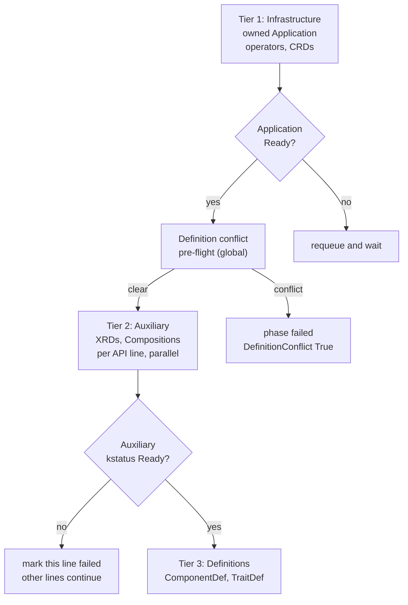
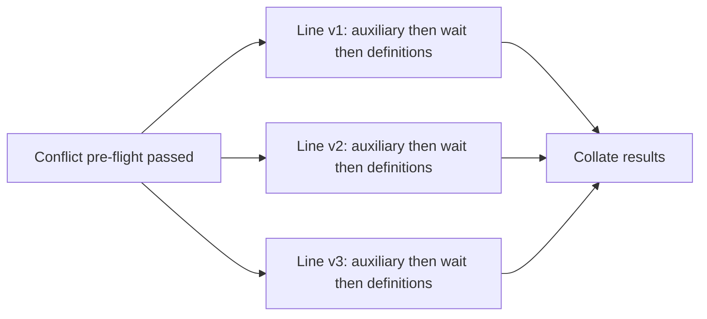
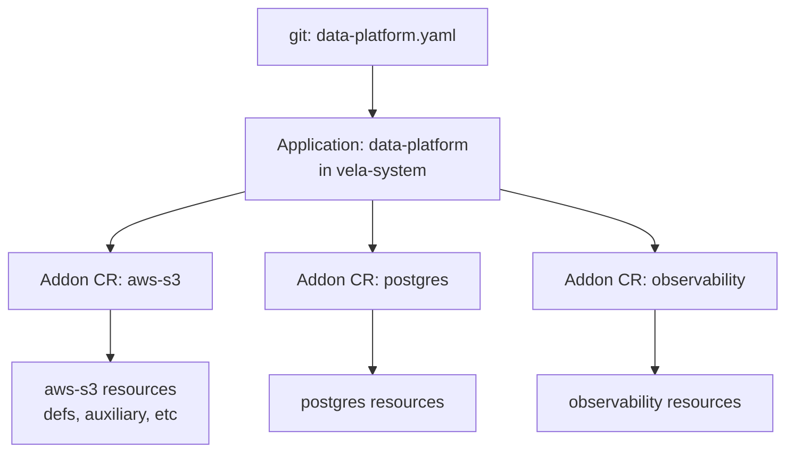
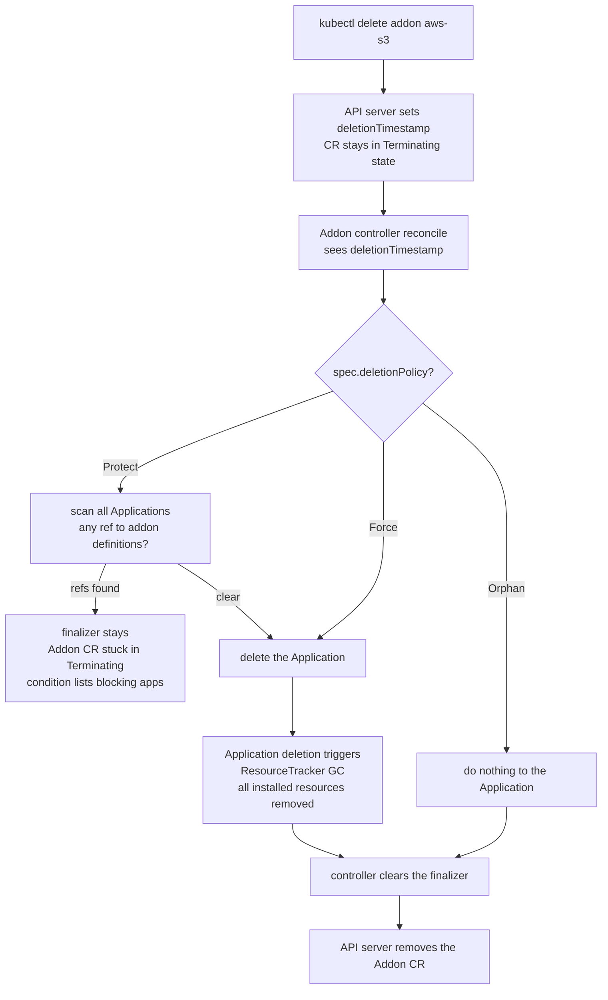

# KEP-2.13 (Declarative Addon Lifecycle) — Learning Notes

Source: https://github.com/guidewire-oss/kubevela/blob/021a233691e4f03f264a15a988783ad8e2a8213f/design/vela-core/keps/2.13-addons/README.md

Vishal's questions while reading the KEP, with verbatim answers from the chat.

---

## Contents

1. [Q1 — Problem and Goals](#q1-explain-the-problem-and-goals-sections-in-simple-terms-grounded-in-kubevela-knowledge)
2. [Q2 — "line" terminology and `_version.cue`](#q2-what-does-line-refer-to-in-different-places-and-what-is-_versioncue)
3. [Q3 — Does KubeVela have `modules/` and `_version.cue` today?](#q3-as-of-today-does-kubevela-already-have-this-structure-for-addons-modules-and-_versioncue)
4. [Q4 — Backwards Compatibility / inheriting old-CLI addons](#q4-explain-the-backwards-compatibility-goal--how-does-the-new-controller-pick-up-old-cli-addons-without-reinstall)
5. [Q5 — Overview and Declarative Addon CR](#q5-explain-the-overview-and-declarative-addon-cr-sections)
6. [Q6 — Module versioning (publication vs API line); auxiliary resources](#q6-when-a-person-ships-a-module-does-it-contain-only-one-version-like-v1-or-can-it-have-many-versions-v1-v2-inside-and-what-is-an-auxiliary-resource)
7. [Q7 — Reference a published module vs. inline definitions](#q7-explain-the-two-ways-an-addon-can-get-its-definitions--reference-a-published-module-vs-inline-and-what-does-modules-and-addons-can-sit-in-different-registries-mean)
8. [Q8 — Reconciliation semantics (three tiers, 9 steps, diagrams)](#q8-explain-reconciliation-semantics-in-detail-with-diagrams)
9. [Q9 — Definition conflict pre-flight check](#q9-what-is-the-pre-flight-check-between-tiers-1-and-2-actually-doing-it-said-not-about-timing-about-ownership)
10. [Q10 — Phase-setting as the first reconcile step](#q10-does-the-phase-setting-happen-as-soon-as-we-create-the-addon-cr-is-set-status-basically-the-first-line-of-the-reconcile-logic)
11. [Q11 — Building cluster context from Config resources](#q11-explain-step-3--building-addon-context-from-config-resources-labelled-addonoamdevcluster-context-true)
12. [Q12 — Version selection (pinned, tracking, omitted)](#q12-explain-the-version-selection-section--pinned-mode-tracking-manual--auto-and-version-omitted)
13. [Q13 — Ownership Model and Addon-of-Addons](#q13-explain-the-ownership-model-and-addon-of-addons-composition-sections-in-detail)
14. [Q14 — Why deletion isn't cascading (finalizer pattern)](#q14-the-addon-cr-can-be-deleted-without-automatically-deleting-everything-else-whether-the-installed-resources-go-away-or-stay-depends-on-specdeletionpolicy-not-on-a-kubernetes-cascade-graph--explain)
15. [Q15 — When is a finalizer added to a CR?](#q15-when-is-a-finalizer-added-to-a-cr)
16. [Q16 — Kubernetes-built-in finalizers (PVC, GC, Namespace, LB)](#q16-in-normal-kubernetes-scenarios-when-does-k8s-itself-add-a-finalizer-without-anyone-writing-a-custom-controller)
17. [Q17 — Five patterns for adding finalizers](#q17-so-different-controllers-add-finalizers-at-different-times-in-code-or-reconcile-flow)
18. [Q18 — Where the Application reconciler adds its finalizer](#q18-in-kubevelas-application-reconciler-where-is-the-finalizer-added)
19. [Q19 — What happens if you delete the addon's Application](#q19-what-happens-if-we-manually-delete-the-application-that-the-addon-cr-is-creating-will-the-next-reconcile-recreate-it)
20. [Q20 — How the Protect check scans for blockers](#q20-how-does-the-protect-check-actually-scan-for-applications-using-the-addons-definitions)
21. [Q21 — CLI commands](#q21-explain-the-cli-commands-section)
22. [Q22 — API changes (Spec / Status / Conditions)](#q22-explain-the-api-changes-section)
23. [Q23 — Which resources carry the addon label (two layers)](#q23-does-that-mean-every-single-resource-the-addon-creates-auxiliary-definitions-deployments-anything-carries-the-addon-label)
24. [Q24 — Implementation Location, Security, Cross-KEP refs](#q24-explain-the-final-sections--implementation-location-implementation-philosophy-backwards-compatibility-security-and-cross-kep-references)
25. [Q25 — Lookup-before-create: how the controller finds existing Applications](#q25-so-before-applying-the-new-application-for-an-addon-cr-the-controller-first-looks-for-an-existing-application)

---

## Q1. Explain the Problem and Goals sections in simple terms, grounded in KubeVela knowledge.

### The Problem — what's broken about addons today

Today you install a KubeVela addon by running `vela addon enable foo`. That's a one-shot CLI call. It fetches the addon source, renders it, applies stuff to the cluster, then exits. Nobody is sitting there afterwards making sure what got applied stays applied.

Here's where it gets messy. An addon installs two kinds of things:

- A bag of infrastructure under `resources/` (operator deployments, CRDs, etc.). This part gets wrapped inside an OAM Application. The Application controller watches that Application, so if someone deletes a Deployment, it comes back. Drift correction works here.
- Everything else: ComponentDefinitions, TraitDefinitions, VelaQL Views, ConfigTemplates, UI schemas. These get applied as side outputs, *outside* `spec.components` of any Application. Nothing reconciles them. If a teammate runs `kubectl delete componentdefinition webservice`, it's just gone. No alarm, no self-heal.

That's the core complaint behind bullet one. The API surface that platform teams care most about lives outside the only thing that does drift correction.

The rest of the bullets are variations on the same theme:

**No GitOps support.** You can't write a YAML file that says "aws-s3 v1.2.0 should be installed" and check it into git for Flux or Argo to reconcile. There's no Addon CR. The install is a verb, not a noun. Teams who run everything from git can't represent addons the way they represent everything else.

**No context-aware installation.** An addon can't say "only install my AWS line if the cluster has the AWS provider." If you want that today, you wrap `vela addon enable` in shell scripts. The addon itself has no way to gate parts of itself on what the cluster looks like.

**Monolithic disable.** `vela addon disable foo` rips out everything in one shot, definitions included. If Applications are still consuming those definitions, they break the moment you run the command. There's no "stop offering it, let consumers migrate, then clean up" path.

**Updates are dangerous.** Picture this: addon author bumps a ComponentDefinition and renames a parameter from `image` to `containerImage`. Operator runs `vela addon upgrade`. Every Application using that definition either fails to render or starts rendering different YAML. There's no coexistence window where the old and new versions both exist. The change just lands on everyone at once.

**No composition.** You can't say "give me crossplane plus postgres plus s3, with these specific versions, in this order." You install them one at a time and hope you got the ordering right.

**No versioned API delivery.** This is the bridge to KEP-2.20. KEP-2.20 wants definitions to be versioned per API line, with deprecation and migration windows. That whole model only works if a controller is continuously enforcing it. A one-shot CLI can't run a deprecation lifecycle.

### The Goals — what 2.13 is adding

The fix is to turn addon installation into a Kubernetes-native, declarative thing.

1. **Make `Addon` a CR.** Same shape as every other resource in the cluster: you write desired state, a controller drives the cluster toward it. The CLI sticks around but it just writes the CR for you.

2. **Reconcile continuously.** The Addon controller runs on changes and on a 5-minute periodic tick. Drift gets corrected, GitOps tools can drive it.

3. **Heal definitions too.** Definitions move back inside the protective umbrella. Delete a ComponentDefinition by hand and it comes back next cycle.

4. **Context-aware lines.** Use CueX expressions in `_version.cue` so the addon itself can say "this v2 line is enabled if the cluster has feature X." No more wrapper tooling outside.

5. **Compose addons via OAM.** A new `addon` component type. Drop several of them into one Application, declare `dependsOn` relationships, and the existing OAM workflow engine handles ordering. A single Application becomes a "platform bundle."

6. **Backwards compatible.** Clusters already running addons installed by the old CLI keep working. On startup, the new controller scans `vela-system` for Applications with the `addons.oam.dev/name` label, finds the ones without a matching Addon CR, and reconstructs the CR from labels and the parameter Secret already on disk. Nothing has to be reinstalled.

The whole point is to take the existing "install once and walk away" model and put a continuously reconciled, declarative layer on top of it — without throwing away the Application-as-payload mechanism that already works.

---

## Q2. What does "line" refer to in different places? And what is `_version.cue`?

Good catch. "Line" means the same thing both times. It's a KubeVela term from KEP-2.20 — short for **API line**. Let me ground it.

### What an "API line" actually is

In the new addon model, a single capability (say `aws-s3/bucket`) can ship as multiple coexisting versions: `v1`, `v2`, `v3`. Each of those versions is an **API line**. Different Applications on the cluster can be bound to different lines at the same time. App-A uses `aws-s3/v1/bucket`, App-B uses `aws-s3/v2/bucket`, both work, both definitions exist side by side.

So "line" is just "one version of a module's API, with all the stuff that goes with it."

The addon directory looks roughly like this:

```
my-addon/
  modules/
    aws-s3/                 <-- module
      v1/                   <-- API line v1
        _version.cue
        definitions/        <-- ComponentDefinitions for this line
        auxiliary/
```

*(Answer was interrupted by the next question before completing — see Q3 for the continuation of the directory structure discussion.)*

---

## Q3. As of today, does KubeVela already have this structure for addons (`modules/` and `_version.cue`)?

Correct. Today's addons don't have `modules/` or `_version.cue`. Those are both new, introduced by KEP-2.20 (the partner KEP).

What addons look like today:

```
my-addon/
  metadata.yaml
  template.cue           <-- or template.yaml, defines the Application
  resources/             <-- becomes the Application's components
  definitions/           <-- ComponentDefinitions, TraitDefinitions, etc.
  schemas/               <-- UI form schemas (for VelaUX)
  views/                 <-- VelaQL views
  config-templates/      <-- config metadata
  parameter.cue          <-- addon's input parameters
```

No `modules/`, no per-version subdirs, no `_version.cue`. A definition lives in `definitions/webservice.cue` and there's only one of it; if you change it, every Application picks up the change immediately. That's why the "addon updates are dangerous" complaint exists.

What KEP-2.20 + 2.13 are adding on top:

```
my-addon/
  modules/
    aws-s3/                 <-- a module
      v1/                   <-- one API line
        _version.cue        <-- describes this line: enabled, source, etc.
        definitions/
        auxiliary/
      v2/                   <-- another API line, coexists with v1
        _version.cue
        definitions/
        auxiliary/
  _module.cue               <-- module-level metadata (cluster context, instance, etc.)
  definitions/              <-- old-style path still works
  resources/                <-- unchanged
```

So:
- `modules/<name>/<version>/` — new. Each version subdir is one "API line."
- `_version.cue` — new. Per-line file that says whether this line is enabled (the CueX expression that can read cluster context), where its source comes from if it's referencing a published module, etc.
- `_module.cue` — new, module-level (not per-line).
- `definitions/` — still works, kept as a permanent path. Not a migration target. If you don't need versioned lines, you never touch `modules/`.

The current addons in `kubevela-contrib/catalog` all use the old `definitions/` shape. The `modules/` structure won't show up in real addons until 2.20 lands and authors start using it.

---

## Q4. Explain the Backwards Compatibility goal — how does the new controller pick up old-CLI addons without reinstall?

The basic idea: when you upgrade KubeVela to a version that ships the new Addon controller, you don't have to rerun `vela addon enable` for every addon you'd already installed. The controller picks them up automatically. This works because the old CLI already stamps enough info onto the cluster that the new controller can rebuild a CR from what's there.

### What the old CLI leaves behind

When you ran something like `vela addon enable fluxcd --version v1.2.0 --set syncRepo=foo` on the old setup, two things got created in `vela-system`:

**An Application** named `addon-fluxcd`, carrying labels:
```
addons.oam.dev/name:     fluxcd
addons.oam.dev/version:  v1.2.0
addons.oam.dev/registry: KubeVela
```

**A Secret** named `addon-secret-fluxcd`, with the `--set` parameters JSON-encoded inside (under the key `AddonParameterDataKey` in the code).

That's it. No Addon CR existed in the old model.

### What the new controller does on startup

The "inheritance sweep" runs once when the controller boots:

1. `kubectl get applications -n vela-system -l addons.oam.dev/name` — list every Application that was installed by the old addon system.
2. For each one, check if there's already an Addon CR with the same name. If yes, skip — somebody (the upgrade tool, the user, GitOps) already created the CR.
3. If no CR exists, build one from the data already there:
   - `spec.version` from the `addons.oam.dev/version` label
   - `spec.registry` from the `addons.oam.dev/registry` label
   - `spec.parameters` by reading the matching `addon-secret-{name}` Secret and decoding the JSON
   - `spec.deletionPolicy` defaults to `Protect` (can't be reconstructed; safest default)
4. Create the CR.
5. From the next reconcile onward, the new controller treats the existing Application as the CR's payload. It writes its `addon-uid` annotation onto the Application and that Application is now under management.

Nothing on disk has to change. The same Application keeps running, the same definitions stay installed, the same parameter Secret keeps holding the values. The cluster just gains an `Addon` CR that didn't exist before.

### Why this matters

If they didn't do this, upgrading KubeVela would mean every operator on every cluster has to manually disable and re-enable every addon they'd ever installed. For clusters running 10+ addons, that's a real outage risk — definitions get torn down during the disable, Applications break, and you're hand-rolling order-of-operations to recover.

The inheritance sweep makes the upgrade boring instead.

### Caveats the KEP itself flags

A few things worth testing against real clusters before trusting the sweep:

- Addons installed without `--registry` (the default registry was assumed; need to confirm a label was still written).
- Parameter Secrets that got hand-edited after install.
- Very old CLI versions that may have written labels under different keys than today's.

For a typical cluster these should be fine, but it's the kind of thing you only learn by running it on something messy.

---

## Q5. Explain the Overview and Declarative Addon CR sections.

### The Overview — the end-to-end picture

The Overview lays out the lifecycle. Two authoring roles, two registries, one cluster.

#### Two authoring roles

**Module authors** package a versioned chunk of API: a set of definitions plus the auxiliary resources they need (Crossplane XRDs, Compositions, KRO ResourceGraphDefinitions, etc.). They publish it to a registry. Each module gets its own version, independent of any addon. This is the KEP-2.20 world.

**Addon authors** bundle stuff together (operator manifests, modules, schemas, views, configuration) and publish *that* to a registry too. An addon can get its definitions in one of two ways:

- **Reference** a published module: point at `some-module@v1.2.0` via the `source` field in `_version.cue`, and the controller pulls the module's contents into the addon at install time.
- **Write definitions inline**: skip the modules layer and drop CUE files into the addon's `definitions/` directory. This is what every addon does today, and it stays fully supported.

So a module is a versioned API artifact; an addon is a versioned delivery bundle. They can sit in different registries.

#### What happens when an addon installs

1. Operator creates an `Addon` CR (either via `vela addon enable` or by committing YAML to git for Flux/Argo).
2. The Addon controller fetches the addon source from the registry.
3. It creates an owned **Application** in `vela-system` for the infrastructure under `resources/` (operators, CRDs, the heavy stuff).
4. It applies **auxiliary resources** (XRDs, Compositions) via server-side apply.
5. Once auxiliary resources are ready, it applies the **X-Definitions** (ComponentDefinition, TraitDefinition, etc.). These are what platform teams actually consume.

The ordering matters. By the time a ComponentDefinition becomes usable on the cluster, the operator running it and the compositions it depends on are already in place. No API surface is exposed before its backing infrastructure is real.

#### The two-layer split (the key idea)

Two things to keep separate in your head:

- **Addon CR** is the *declarative interface*. It says "I want aws-s3 v1.2.0 installed with these parameters." That's all. This is what GitOps tools see.
- **Application in `vela-system`** is the *payload representation*. It's a normal OAM Application that actually owns the deployed resources via ResourceTracker GC. This is the pre-existing addon vehicle, kept as-is.

The **Addon controller** is the bridge. Every reconcile cycle, it reads the CR, re-renders the addon source, and brings the Application plus auxiliary plus definitions in line with what the CR declares.

That split is what "wrap, don't replace" means concretely. They're not throwing away the existing `pkg/addon/` install logic. They're keeping the Application as the runtime vehicle and adding a CR-shaped declarative layer on top.

### Declarative Addon CR

#### Scope: cluster-scoped, not namespaced

The Addon CR is **cluster-scoped**. Reasoning: an addon installs cluster-wide capabilities. A ComponentDefinition is visible to every namespace, an XRD is global. Scoping the desired-state declaration to one namespace would misrepresent what's actually being installed.

The generated Application, on the other hand, is namespaced to `vela-system`. Applications have always been namespaced in KubeVela, so this preserves the existing model.

#### What's in the spec

Walking through the example:

```yaml
apiVersion: core.oam.dev/v1beta1
kind: Addon
metadata:
  name: aws-s3
spec:
  version: v1.2.0        # exact tag = pinned mode
  registry: my-registry
  parameters:
    region: us-east-1
    enableV2: true
  clusters:
    - local
  overrideDefinitions: false
  skipVersionCheck: false
```

- `version` — exact tag (pinned, recommended for GitOps) or a semver constraint like `">=1.2.0"` (tracking mode). The example uses pinned.
- `registry` — which registry to pull the addon source from. Maps to a registry already registered with KubeVela.
- `parameters` — what you used to pass via `--set` on the CLI. The controller injects these into the addon's `parameter.cue` at render time.
- `clusters` — which clusters to deploy the addon's Application to (in a multi-cluster KubeVela setup). Omit to deploy to all registered clusters. Only takes effect for addons that actually declare a `clusters` input parameter.
- `overrideDefinitions` — what to do if a definition this addon would install is already owned by another addon. Default `false` makes the install fail loudly with a `DefinitionConflict` condition instead of stomping on it.
- `skipVersionCheck` — bypass the `minKubeVelaVersion` compatibility check in the addon's metadata. Use cautiously; you're saying "trust me, this addon works against this KubeVela version."

#### CLI as a CR writer

The relationship to the CLI shifts. Old model:

```
vela addon enable aws-s3 → CLI runs the install logic
```

New model:

```
vela addon enable aws-s3 → CLI writes Addon CR → controller runs the install logic
```

That's what "CLI and GitOps workflows are interchangeable" means. They both produce the same Addon CR. Whether you run a CLI command or commit YAML to git, you're feeding the same controller.

#### Pausing reconciliation

If you want to halt reconciliation for an addon temporarily (debugging, manual surgery, testing a fix), set the label:

```
controller.core.oam.dev/pause: "true"
```

on the Addon CR. The controller sees the label and skips the reconcile loop. Same convention as pausing an Application today.

---

## Q6. When a person ships a module, does it contain only one version (like v1) or can it have many versions (v1, v2) inside? And what is an auxiliary resource?

Good two-parter. Let me untangle them, because module versioning has a confusing wrinkle.

### Module versioning has two version axes

There are actually two kinds of "version" floating around when you talk about a module.

#### 1. The module's *publication* version

When a module author runs `vela module publish aws-s3 --version v1.0.0`, they're cutting one tagged release of the `aws-s3` module to a registry. Each publication is one immutable artifact: `aws-s3@v1.0.0`, `aws-s3@v1.1.0`, `aws-s3@v2.0.0`, etc.

This is like a Go module's `v1.2.3` tag, or a Helm chart version. One published artifact = one publication version.

#### 2. The *API lines* inside a module

But inside a single published module, the source tree can contain multiple API lines:

```
aws-s3/                       <-- the module
  v1/                         <-- API line v1
    _version.cue
    definitions/bucket.cue    <-- exposes "aws-s3/v1/bucket"
    auxiliary/
  v2/                         <-- API line v2
    _version.cue
    definitions/bucket.cue    <-- exposes "aws-s3/v2/bucket"
    auxiliary/
```

These are versions of the *API contract* the module exposes. When `aws-s3@v2.0.0` is installed, both `v1` and `v2` lines can live on the cluster at the same time. App-A keeps using `aws-s3/v1/bucket`, App-B starts using `aws-s3/v2/bucket`. They coexist. That's the whole point of API lines.

#### How the two axes relate

|  | Publication version | API line |
|---|---|---|
| What it is | The release tag of the module package | A stable API contract inside the module |
| One per | Publication artifact | Subdirectory inside the module source |
| Changes when | Author cuts a new release | Author wants to ship a new API shape without breaking existing consumers |
| Visible as | The `--version` flag on `vela module publish` | The version segment in definition names (`aws-s3/v1/bucket`) |

#### Walking through the lifecycle

- **Day 1**: author ships `aws-s3@v1.0.0`. Source tree contains only `v1/`. One API line, one publication.
- **Day 30**: author adds bug fixes, ships `aws-s3@v1.1.0`. Still only `v1/` inside. One API line, two publications.
- **Day 90**: author wants to redesign the `bucket` API. Adds a `v2/` directory alongside the existing `v1/`. Ships `aws-s3@v2.0.0`. Now: two API lines, three publications. v1 consumers are not broken. New consumers can opt into v2.
- **Day 180**: author marks `v1` as deprecated (a flag in `_version.cue`). Existing v1 users keep working but get a deprecation warning. New Applications referencing `aws-s3/v1/bucket` are blocked by the admission webhook.

So the short answer: a single *published module artifact* has one version (its publication tag), but it *can contain* multiple API lines internally. Most modules will have one or two API lines at any given time; you only add a new line when you need to break the API for new consumers without forcing existing ones to migrate.

### Auxiliary resources

These are the non-definition supporting resources that an API line needs to actually function. They live in the `auxiliary/` directory of each API line:

```
v1/
  definitions/
    bucket.cue           <-- the user-facing API (ComponentDefinition)
  auxiliary/
    bucket-xrd.yaml      <-- Crossplane CompositeResourceDefinition
    bucket-comp.yaml     <-- Crossplane Composition
```

Examples of what goes in `auxiliary/`:

- **Crossplane XRDs** (CompositeResourceDefinitions) — the schema for a custom API type that Crossplane will manage.
- **Crossplane Compositions** — the recipe that says "when a user creates a Bucket claim, render these underlying AWS resources."
- **KRO ResourceGraphDefinitions** — KRO's equivalent of a Composition.
- Anything else the definition's render relies on at runtime.

#### Why this split exists

It's clearer once you trace what a user actually sees:

1. App author writes an Application using `type: aws-s3/v1/bucket`. That references a **ComponentDefinition** (the definition).
2. The ComponentDefinition's CUE renders into a Crossplane Claim (e.g. `kind: XBucket`).
3. The Claim is recognized by Crossplane because the matching **XRD** exists on the cluster (auxiliary).
4. Crossplane uses the **Composition** to materialize actual AWS resources behind it (auxiliary).

The app author only sees and writes the definition. The XRD and Composition are plumbing. They have to be installed and *ready* on the cluster before the definition becomes visible, otherwise apps could reference a type whose backing machinery isn't operational yet.

That's the whole reason for the three-tier reconcile ordering laid out earlier in the KEP:

1. Infrastructure first (Crossplane operator running)
2. Auxiliary second (XRDs and Compositions installed and reporting Ready via kstatus)
3. Definitions last (the user-visible API surface goes live)

Auxiliary is the middle tier — the bridge between operators (infrastructure) and the definitions (the API).

---

## Q7. Explain the two ways an addon can get its definitions — reference a published module vs. inline. And what does "modules and addons can sit in different registries" mean?

### Two ways for an addon to get its definitions

This is one of the more important distinctions in the new model. An addon is the *delivery bundle*, but the API contract inside it can come from two places.

#### Path A: Reference a published module

The addon source tree contains a `modules/<name>/<version>/_version.cue` file that says "the definitions and auxiliary resources for this API line live in module X at version Y, in registry Z." Like this:

```cue
// modules/aws-s3/v1/_version.cue
version: "v1.0.0"
enabled: true
source: {
    module:   "aws-s3"
    version:  "v1.0.0"
    registry: "guidewire-modules"
}
```

The addon's own source tree contains *no definition files* for this API line. They're not committed to the addon repo. When the Addon controller installs this addon, it sees the `source` field in `_version.cue`, fetches `aws-s3@v1.0.0` from the `guidewire-modules` registry, and pulls in the module's `definitions/` and `auxiliary/` content.

#### Path B: Write definitions inline

The addon source tree contains the CUE files directly. Either in the legacy spot:

```
my-addon/
  definitions/
    webservice.cue           <-- the actual CUE source
    sidecar.cue
```

or inside an inline module layout:

```
my-addon/
  modules/
    my-stuff/
      v1/
        _version.cue          <-- no `source` field
        definitions/
          thing.cue           <-- definition CUE lives right here
        auxiliary/
```

There's no `source` field in `_version.cue`, so the controller doesn't go pull anything from another registry. The definitions are already in the addon source tree; the controller just renders and applies them.

#### Why both paths exist

Inline is the simpler model. You write everything in one repo, version it as one unit, ship it as one artifact. This is what every existing KubeVela addon does. If your addon is small and self-contained, bundling a single capability that no other addon shares, there's no reason to add the module indirection.

Reference makes sense when:

- **The same API is consumed by several addons.** Example: `crossplane-aws` provides the `aws-s3/v1/bucket` API. Both the `data-platform` addon and the `analytics-platform` addon want it. Both reference `aws-s3@v1.0.0` from the module registry, instead of duplicating the CUE in each addon.
- **The module has its own release cadence.** The API contract for `bucket` doesn't change on every addon release. The module can sit at v1.0.0 for months while the addon ships v1.5, v1.6, v1.7 with operator updates and config tweaks.
- **Different teams own different layers.** The platform team owns the module (the API contract); the addon team owns the bundle (which operator versions, which configs, which clusters).

Small one-team addon → inline. Multi-team setup or shared API surface → reference.

#### "Different registries" is not a contradiction

The line "they can sit in different registries" sometimes confuses people, because the same OCI server can serve both. The point is just that they're independent things:

- A **module registry** holds module artifacts. Each artifact at `aws-s3@v1.0.0` contains the CUE source for one published module.
- An **addon registry** holds addon artifacts. Each artifact at `data-platform@v2.3.0` contains the CUE source for one published addon.

They can be the same OCI server with different repository paths, or they can be physically separate servers. The Addon CR's `spec.registry` field points at the *addon* registry. The `source.registry` field in `_version.cue` points at the *module* registry. The two are resolved independently at install time.

#### What's actually new vs. what exists today

The reference-a-module path is new, introduced by KEP-2.20 + 2.13. Today's addons can only do the inline path (and only via the flat `definitions/` directory, since there's no `modules/` layer yet).

After 2.13/2.20 lands, both paths work side by side. The same addon can mix them: some API lines inline, some pulled from modules. No forced migration; just a richer set of options for addon authors.

---

## Q8. Explain Reconciliation Semantics in detail with diagrams.

This is the meat of the KEP. The reconciliation loop is what makes everything else work.

### The 30-second version

Every 5 minutes, *and* every time the Addon CR changes, the controller does this:

1. Look at what's declared (`spec`).
2. Look at what's on the cluster.
3. Make the cluster match the spec, in a specific order so nothing blows up.
4. Record what was applied so it can detect drift next cycle.

The "specific order" is where most of the design complexity lives.

### The three-tier ordering — and why

The controller never throws everything at the cluster at once. It applies things in tiers, gated on the tier below being healthy:



Why the order:

- **Tier 1 is infrastructure.** The operator that runs the API has to be alive. If you applied a `ComponentDefinition` for `aws-s3/bucket` before Crossplane was running, the definition would render Claims that hit a CRD that doesn't exist, and Applications would fail in confusing ways.
- **Tier 2 is auxiliary.** The XRD has to exist before the Composition can reference it; the Composition has to exist before a Claim can match it. Once auxiliary is ready, the definition can render output that *works*.
- **Tier 3 is definitions.** Applying a definition is the "go-live" moment. The instant a `ComponentDefinition` is on the cluster, every App author on every namespace can reference it. The ordering guarantees that when that moment happens, everything backing it is real.

The pre-flight check between tiers 1 and 2 is a separate guardrail. It's not about timing; it's about ownership. The controller looks ahead at what definitions it would install and refuses to proceed if any are already managed by a different addon.

### Walking through the 9 steps

#### Step 1: Set the phase, then fetch source smartly

If `spec.version != status.installedVersion`, set `phase: upgrading`. If `installedVersion` is empty, set `phase: installing`. This happens *before* any real work, so anything watching status sees a meaningful in-progress state.

This is also where the source fetch happens. Two subtleties:

**Rendered output is never cached.** The CUE has to be re-evaluated every cycle because the cluster context might have changed (a new Config was added, parameters were tweaked).

**Raw source uses digest-based change detection.** The controller asks the registry "what's your current digest?" cheaply — an OCI HEAD request or `git ls-remote`. If the digest matches `status.resolvedSourceDigest`, it skips the full download and re-renders from a local copy.

**If the registry is unreachable:** set `SourceResolved=false`, back off (30s → 10m exponential). Do not apply stale output. The Addon phase stays at whatever it was (not `failed`) so a 30-second OCI hiccup doesn't trigger a wave of false alerts. Only persistent failure beyond the max backoff window flips to `phase: failed`.

#### Step 2: Resolve the source

Take `spec.registry` and `spec.version`, hand them to the registry resolver. Out the other end comes the actual addon source files (CUE templates, `resources/` tree, etc.) ready to render.

#### Step 3: Build addon context

Before rendering CUE, the controller has to know what's in the cluster context. It queries all `Config` resources in `vela-system` that carry the label `addon.oam.dev/cluster-context: "true"`, merges their values, and makes them available to CUE evaluation.

This is what powers "context-aware lines." A `_version.cue` can write `enabled: context.cluster.hasAWSProvider` and the value comes from these Configs.

#### Step 4: Apply addon-wide assets

Now rendering happens. The output is:

- An **Application** in `vela-system` (rendered from `resources/`). This is the payload vehicle.
- A bunch of **ConfigTemplates** (config metadata).
- A bunch of **VelaQL Views** (query templates).
- A bunch of **UI Schemas** (form definitions for VelaUX).

Everything is applied via server-side apply, with field manager `addon.oam.dev/controller`.

#### Step 5: Check Application health

One of the two genuinely new things this controller does (the old CLI didn't wait). It inspects the Application's `status.conditions` for a `Ready` condition:

| Application state | Action |
|---|---|
| `Ready=True` | Healthy. Move on. |
| `status.phase` is `workflowFailed` / `workflowTerminated` | Addon `phase: failed`, `ApplicationHealthy=false`. |
| Any component has an error condition | Same as above. |
| Still `rendering` or `running` but not yet `Ready` | Requeue and wait. |

No definitions are applied until this gate passes. The whole point of tier 1 is to refuse to expose any API surface until the operator running it is actually alive.

#### Step 6: Definition conflict pre-flight (global)

If `spec.overrideDefinitions: false` (the default), check every definition this addon would install. For each one:

- Does it already exist on the cluster?
- If yes, who owns it (which addon's `addons.oam.dev/name` label)?
- Is that owner this addon, a different addon, or no owner at all?

If any check turns up a definition owned by a different addon (or unowned), reconciliation stops:

- `phase: failed`
- `DefinitionConflict=True`
- Condition message lists every conflicting definition + its current owner

This is **global and all-or-nothing**. One conflict blocks the entire addon, not just the line that contains it. To unstick: either remove the conflicting definition, transfer ownership, or set `spec.overrideDefinitions: true`.

Why all-or-nothing: partial installs are worse than no install. If line v1 has a conflict but v2 doesn't, installing v2 alone leaves you in a broken halfway state with no easy diagnosis.

#### Step 7: Per-line work, in parallel

For each enabled API line, in parallel:

1. Apply that line's `auxiliary/` resources via SSA.
2. Poll for kstatus readiness: each resource needs a `Ready` or `Established` condition with `status: True`.
3. Resources that don't expose kstatus conditions (bare Crossplane `Composition` objects, for instance) are considered ready as soon as the API server accepts them. Best-effort: the gate can't verify they're truly functional.
4. Once auxiliary is ready, apply the line's definitions.

Lines run independently. If line v1's auxiliary never becomes ready, v2 and v3 keep going. Failures are recorded per line in the `AuxiliaryReady` or `ModulesSynced` conditions.



#### Step 8: Module path vs. definitions path

If the addon has a `modules/` directory, the per-line work in step 7 runs the KEP-2.20 module lifecycle. If it has a flat `definitions/` directory, those get applied at the end of step 7 after the Application gate and conflict check. Both can coexist in the same addon. Neither is being deprecated.

#### Step 9: Staleness diff + cleanup

Compare what *was* installed (`status.installedResources` from the previous cycle) against what *is* installed (the freshly rendered set). The diff produces three categories:

| Resource type | Action on staleness |
|---|---|
| **Views, ConfigTemplates, Schemas** | Hard delete immediately. Metadata only, no runtime dependency. Leaving them around pollutes the catalogue (ghost VelaQL queries, phantom config types in the UI). |
| **Definitions** | Skip deletion. Applications bind to definitions by type; deleting a definition breaks every Application using it. Removal goes through the deprecation lifecycle (KEP-2.20). |
| **Auxiliary** | Skip deletion. Compositions and XRDs back active Crossplane Claims; deleting them breaks running infrastructure. Removal also via deprecation lifecycle. |

After cleanup, write the current applied set into `status.installedResources` and set `phase: running`.

### The label-vs-inventory subtlety

Worth pinning down because the KEP calls it out explicitly.

There are two ways the controller could figure out "what's installed":

- **Re-query labels every reconcile.** Run the cluster equivalent of `kubectl get all -l addons.oam.dev/name=fluxcd` and treat that as the inventory.
- **Use the previous cycle's `status.installedResources` as the inventory.**

The KEP picks option 2. Reason: option 1 always reflects "right now," which can't be diffed against itself. You need a stable past snapshot to compare against.

Trade-off: the inventory is always one cycle behind. A resource applied in cycle N appears in the diff in cycle N+1. So if you removed a Schema from the addon source between N and N+1, the cleanup happens in N+1 (one reconcile period of lag).

Labels still get used — to *populate* `status.installedResources` at the end of each cycle. They're just not used for the staleness diff itself.

### What's actually new

The KEP explicitly calls out two things the current `pkg/addon/` code doesn't do:

1. **The Application health gate** (step 5). The old CLI sequenced everything immediately; if the operator was still starting, definitions could land before it was ready.
2. **Post-install resource collection + staleness diff** (step 9). The old installer is purely additive. Upgrading from v1.0.0 to v1.1.0 never removes resources that were in v1.0.0 but aren't in v1.1.0. The new controller fixes this for metadata; for definitions and auxiliary it defers to the deprecation lifecycle.

Everything else (source loading, rendering, applying) reuses the existing logic. The controller wraps it with phase management and these two new steps. "Wrap, don't replace" in practice.

### Event-to-action table

| Event | What the controller does |
|---|---|
| Addon CR created | Run the full 9-step loop from scratch. |
| Addon CR updated | Same loop. Server-side apply is idempotent, so re-applying unchanged things is a no-op. |
| `spec.version` changed | Same loop. The version bump triggers a re-fetch and re-render; SSA produces the diff. |
| Addon CR deleted | Finalizer runs. Behaviour depends on `spec.deletionPolicy` (Protect / Force / Orphan, covered in the ownership section). |
| 5-minute periodic tick | Same loop. Idempotent SSA means "nothing changed" is cheap. |

The finalizer is named `addon.oam.dev/cleanup` and exists to make cleanup happen in the right order on delete.

### A note on kstatus (since the KEP keeps using the term)

**kstatus** is a Kubernetes standard library from the Kustomize project for resource status reporting. Resources that follow it expose conditions like:

- `Ready` (True / False / Unknown)
- `Established` (for CRDs)
- `Reconciling`

kstatus has a function that takes a resource and tells you "is this Ready, Failed, or InProgress?" That function is what the controller uses for the tier-2 readiness gate.

The limitation: not every Kubernetes resource follows the kstatus convention. Bare Crossplane Compositions, for instance, don't. For those, the controller falls back to "did the API server accept the apply?" — which doesn't actually mean operational. That's the "best-effort gate" the KEP warns about. Addon authors who care about strict readiness should make sure their auxiliary resources expose kstatus-compatible conditions.

---

## Q9. What is the pre-flight check between tiers 1 and 2 actually doing? It said "not about timing, about ownership."

The pre-flight check is one of those design decisions that makes way more sense once you see the failure it prevents.

### What problem it actually solves

Two addons can ship a definition with the same name. Concrete scenario:

- `fluxcd` addon ships a `helm-release` ComponentDefinition.
- `crossplane-helm` addon also ships a `helm-release` ComponentDefinition.

Without any check, this is what would happen today:

1. You install `fluxcd`. Its `helm-release` definition lands on the cluster, labeled `addons.oam.dev/name: fluxcd`.
2. You install `crossplane-helm`. Its `helm-release` definition gets server-side-applied on top of the existing one. The label flips to `addons.oam.dev/name: crossplane-helm`.
3. Applications that used the fluxcd-flavored `helm-release` start rendering the crossplane-flavored output. Silent breakage.
4. Later you uninstall `crossplane-helm`. ResourceTracker GC deletes the `helm-release` definition entirely. Apps that thought they were getting the fluxcd version are now broken because the definition is just gone.

The pre-flight check refuses to install over a definition owned by someone else. The conflict gets surfaced explicitly instead of being a silent stomp.

### How it works mechanically

After the Application health gate (tier 1) passes, before tier 2 starts, the controller does this:

1. Render the addon source (without applying anything).
2. Collect the list of every definition the render would produce: `(name, kind)` pairs like `(helm-release, ComponentDefinition)`.
3. For each one, query the cluster:
   - Does a definition with that name and kind already exist?
   - If yes, what does its `addons.oam.dev/name` label say?
4. Sort each definition into one of four buckets:

| State | Action |
|---|---|
| Doesn't exist on the cluster | Fine. Will be created in tier 3. |
| Exists, label says this addon | Fine. This is a re-apply or upgrade. |
| Exists, label says a different addon | **Conflict.** |
| Exists, no `addons.oam.dev/name` label at all | **Conflict.** (Unowned definitions count too.) |

5. If *any* conflicts, stop:
   - `phase: failed`
   - `DefinitionConflict=True` condition
   - Message lists every conflicting definition + its current owner

No auxiliary applied, no definitions applied, no per-line work. Done.

### Why between tier 1 and tier 2 specifically

The placement isn't arbitrary.

**Why not before tier 1?** The controller needs the addon source fetched and rendered to know what definitions it would install. By the time we reach tier 1 we've already got that. Running the check before Application health would also be wasteful — if the operator isn't running yet, why care about API conflicts?

**Why not after tier 2?** Tier 2 applies auxiliary resources (XRDs, Compositions) per API line. Those have their own potential side effects. Applying them, then bailing at the definition stage, would leave the cluster in a half-applied state: the XRDs and Compositions are there, but the definitions consumers would use never went live. Catching the conflict *before* tier 2 means nothing gets applied unless the whole install can succeed.

So the order is: prove the operator is alive (tier 1), check ownership won't collide (pre-flight), apply the rest (tiers 2 and 3).

### Why all-or-nothing across lines

The KEP makes a point of saying "a single conflict blocks the entire addon, not just the affected line." Even if only line v1 has a conflict and line v2 is conflict-free, the addon fails as a whole.

Reason: partial installs are debugging nightmares. If you let v2 install but block v1, you've created an addon that's half-live. Applications using v2 work, the v1 line shows as failed, the addon's overall status is ambiguous. It's much easier to reason about "this addon is broken until you resolve the conflict" than "this addon is partially broken in a way that depends on which lines you actually use."

### How to resolve a conflict

When the pre-flight fires, the operator has three options:

1. **Remove the conflicting definition.** `kubectl delete componentdefinition helm-release`. Next reconcile re-runs the pre-flight, finds no conflict, proceeds.
2. **Transfer ownership.** Relabel the existing definition: `kubectl label componentdefinition helm-release addons.oam.dev/name=crossplane-helm --overwrite`. Now the pre-flight sees it as already-owned-by-me and proceeds. Rarely the right move — usually one of the two addons should just win cleanly.
3. **Force override.** Set `spec.overrideDefinitions: true` on the Addon CR. The pre-flight skips the check. The new definition stomps the old one. Use cautiously: you're explicitly accepting that whoever owned the definition before is about to lose it.

### How this differs from today

The current addon system just blindly applies things. If two addons ship the same-named definition, second one wins, no warning. Apps using the first definition break silently. The pre-flight is one of the genuinely new safety guarantees the new controller adds — it's not just wrapping existing behavior.

---

## Q10. Does the phase-setting happen as soon as we create the Addon CR? Is "set status" basically the first line of the reconcile logic?

Yes, basically. The phase update is one of the first writes the reconcile loop does, before any of the heavier work (source fetch, render, apply). It's a deliberate pattern.

### The actual reconcile flow

`Reconcile()` gets triggered whenever the Addon CR changes (or the 5-minute periodic tick fires). The skeleton roughly looks like:

```
1. Read the Addon CR from the cluster.
2. Check pause label — if set, requeue and exit.
3. Check finalizer / deletion timestamp — if being deleted, go to the cleanup path.
4. Compare spec.version against status.installedVersion → decide the phase.
5. Write status (status update #1: phase set to installing/upgrading).
6. Do the actual work: fetch source, render, apply, health-wait, etc.
7. Write status again (status update #2: phase running, installedVersion set, installedResources populated).
```

User-visible effect:

- Operator runs `vela addon enable aws-s3 --version v1.0.0`. CLI writes the Addon CR.
- Within a fraction of a second, the controller's reconcile is triggered.
- The first status write happens almost immediately: `kubectl get addon aws-s3` now shows `phase: installing`.
- The slow work (registry fetch, render, application apply, definition apply, health waits) happens after that.
- When it all completes, a second status write flips to `phase: running` and records `installedVersion: v1.0.0`.

So yes, the very first meaningful thing the controller does (after the cheap boilerplate of reading the CR and checking pause/finalizer) is set the phase and commit it.

### Why this pattern matters

Two reasons it's worth doing this way:

1. **Observability during a long reconcile.** Fetching a source artifact from an OCI registry, applying an Application, waiting for it to become healthy, applying auxiliary, waiting for kstatus — this can easily take minutes. If status weren't set early, anyone running `kubectl get addon` mid-install would see nothing useful. Setting the phase up front means status reflects "the controller has seen this CR and is working on it" even when the work is still in progress.

2. **Crash safety.** If the controller dies halfway through (pod crash, node failure), the status from a previous reconcile (or empty status) doesn't tell the next controller what happened. With the phase committed early, when the controller comes back and runs another reconcile, kubectl already shows `installing` or `upgrading` and you can tell something is in progress even before the second controller writes its own status.

### Special case: the very first reconcile

On the very first reconcile (Addon CR just got created):

- `status.installedVersion` is `""` (empty, the field has never been written).
- The check `spec.version != status.installedVersion` would technically succeed (because `"v1.0.0" != ""`).
- But the KEP explicitly distinguishes: if `installedVersion` is empty, set `phase: installing`, not `upgrading`.

So the actual logic is closer to:

```
if installedVersion == "":
    phase = installing
elif spec.version != installedVersion:
    phase = upgrading
else:
    no phase change (already running, this is a periodic reconcile)
```

### Where source fetching fits in

The source fetch happens *after* the phase is set, in the same reconcile cycle. The order is:

```
set phase: installing → write status → fetch source (cheap digest check, or full fetch) → render → tier-1 work → ...
```

If the source fetch fails (registry unreachable), the controller writes `SourceResolved=false` as a condition and requeues with exponential backoff. The phase stays at `installing` — the KEP is explicit that transient registry failures should not flip the phase to `failed`. So during a long backoff, status still shows `installing` plus a condition saying "I can't reach the registry." Only persistent failure (beyond the max 10-minute backoff window) escalates to `phase: failed`.

---

## Q11. Explain step 3 — building addon context from Config resources labelled `addon.oam.dev/cluster-context: "true"`.

### The problem this solves

Some addons need to behave differently depending on the cluster they land on. Examples:

- "Install my AWS line only if Crossplane's AWS provider is already installed."
- "Skip my GKE-specific stuff on EKS clusters."
- "Use config values from my org's central platform team."

Today this is impossible. Addons render against their own parameters only, with no awareness of the cluster around them. Step 3 is the mechanism that adds that awareness.

### What "Config" means here

KubeVela already has a `Config` CRD (`apiVersion: config.oam.dev/v1alpha1, kind: Config`). It's used today for storing reusable configuration values: registry credentials, cloud provider credentials, helm repo settings, etc. A Config has a `properties` field with arbitrary key-value data.

The new piece in this KEP: Configs that carry a specific label get treated as **cluster context** input to CUE evaluation. The label is:

```
addon.oam.dev/cluster-context: "true"
```

Configs without that label are still regular Configs and aren't part of the addon context. The label is the opt-in signal that says "I want this Config to influence addon rendering."

### The flow

Before evaluating any `_version.cue` or `_module.cue`:

1. Controller runs the equivalent of:
   ```
   kubectl get configs.config.oam.dev -n vela-system -l addon.oam.dev/cluster-context=true
   ```
2. For each matched Config, it reads `properties`.
3. Merges all of them into a single structure.
4. Injects that structure into the CUE evaluation as part of the shared context (exact binding name is defined in KEP-2.20).
5. Now any CUE file in the addon can reference those values during rendering.

### Concrete example

A platform team creates a Config that describes which Crossplane providers the cluster has:

```yaml
apiVersion: config.oam.dev/v1alpha1
kind: Config
metadata:
  name: installed-providers
  namespace: vela-system
  labels:
    addon.oam.dev/cluster-context: "true"
spec:
  template:
    name: cluster-info
  properties:
    crossplane:
      aws: true
      gcp: false
    helm: true
```

A module author writes a `_version.cue` that uses it:

```cue
// modules/aws-s3/v1/_version.cue
version: "v1.0.0"
enabled: cluster.crossplane.aws  // or whatever path KEP-2.20 defines
```

When the addon installs on a cluster *with* AWS Crossplane, that expression resolves to `true`, the line is enabled, and the v1 API for `aws-s3/bucket` becomes live. On a cluster without AWS Crossplane, `enabled` is `false`, and the controller skips the whole line: no auxiliary applied for that line, no definitions applied for that line.

### Merging behaviour

If multiple Configs are labelled as cluster context, they all contribute:

```yaml
# Config A
properties:
  crossplane:
    aws: true

# Config B
properties:
  observability:
    prometheus: true
```

They get merged into a single structure:

```
crossplane:
  aws: true
observability:
  prometheus: true
```

Exact merge rules (last-write-wins on key collisions, deep merge, error on conflict, etc.) are defined in KEP-2.20. The point is that multiple platform-team Configs can each contribute slices of the cluster context without needing to coordinate with each other.

### Why use Config instead of inventing a new CRD

Configs already exist in KubeVela and have an established story:

- Platform operators can apply them via `kubectl apply`.
- They can be managed via GitOps.
- Who can create them is constrained by Kubernetes RBAC.
- Other tooling (VelaUX, CLI) already understands them.

Inventing a new "ClusterContext" CRD just for addon rendering would duplicate all that infrastructure. The label-based opt-in is the lightweight way to repurpose existing machinery.

### Step 3 runs every reconcile

Important point: this happens on *every* reconcile cycle, not just on first install. So if a platform team applies a new Config (or updates an existing one) to flip `crossplane.aws` from `false` to `true`, the next reconcile sees the new value, evaluates `_version.cue` against it, and may decide to enable a line that was previously skipped.

That's what "context-aware" actually means at runtime: the effective shape of an installed addon can change just because the cluster context did, without anyone editing the Addon CR itself.

### What this replaces

Without this, the only way to make an addon conditional on cluster features was wrapper tooling. You'd write a shell script that ran `kubectl get crd | grep crossplane-aws`, set environment variables, then conditionally ran `vela addon enable --set` with different parameters. The addon itself was completely dumb about its environment.

Now the addon source declares "I depend on cluster context X" and the controller handles the rest. Wrapper tooling goes away.

---

## Q12. Explain the Version Selection section — pinned mode, tracking (Manual / Auto), and version omitted.

### Three modes, four behaviours

Read the section carefully and there are really three modes:

1. **Pinned** — `spec.version: v1.2.0` (exact tag)
2. **Tracking** — `spec.version: ">=1.2.0"` (semver constraint)
3. **Omitted** — no `spec.version` at all

Tracking mode has two sub-flavours (Manual / Auto), so the practical decision is between four behaviours.

### Pinned mode (the default)

```yaml
spec:
  version: v1.2.0
```

The controller installs exactly v1.2.0 and never touches the version field again. To upgrade, you change `spec.version` in git, commit, push, let your CD tool apply it. The controller picks up the new value on its next reconcile and runs the upgrade path.

`upgradePolicy` is ignored in this mode. The controller doesn't need to consult it because there's nothing to decide — the version is unambiguous.

**Why this is recommended:** GitOps is built on the premise that what's in git == what's running on the cluster. With pinned versions, that's always true. Any drift between the two is a bug. Audit logs are easy (`git diff` between two commits tells you the version change). Rollbacks are easy (revert the commit).

This is the equivalent of pinning a Helm chart version in a values file. Boring and predictable, which is what production wants.

### Tracking mode with Manual policy

```yaml
spec:
  version: ">=1.2.0"
  upgradePolicy: Manual  # this is the default when you use a constraint
```

The `version` field is now a semver constraint, not a literal tag. Same syntax as Go modules, npm, etc.:

- `>=1.2.0` — any v1.2.0 or later
- `~1.2.0` — any v1.2.x but not v1.3.x
- `^1.0.0` — any v1.x.x but not v2.x.x

On every reconcile, the controller asks the registry "what's the highest version that satisfies this constraint?" If that version is *newer* than `status.installedVersion`, the controller:

1. Writes the new version to `status.availableUpgrade`.
2. Sets the `UpgradeAvailable` condition.
3. **Does not install anything.**

The operator sees the notification:

```yaml
# kubectl get addon aws-s3 -o yaml
status:
  installedVersion: v1.3.0
  availableUpgrade: v1.4.0
  conditions:
    - type: UpgradeAvailable
      status: "True"
      message: v1.4.0 is available (constraint: >=1.2.0)
```

To take the upgrade, the operator either runs `vela addon upgrade aws-s3 --version v1.4.0` or, more typically, updates `spec.version` to `v1.4.0` in git and lets Flux/Argo apply it.

**Why this preserves GitOps:** the spec stays under git's control. The cluster never upgrades autonomously. The constraint acts more like "give me a friendly nudge when something new ships" than like actual automation. Think Renovate or Dependabot opening a PR, except the PR is a `status.availableUpgrade` field plus a condition. You still review and apply manually.

### Tracking mode with Auto policy

```yaml
spec:
  version: ">=1.2.0"
  upgradePolicy: Auto
```

Same as Manual *except* the controller upgrades immediately when a newer matching version is found. No operator action required.

**The git divergence problem:** here's the kicker. `spec.version` is not mutated by the upgrade. So git still says `version: ">=1.2.0"`. The cluster might be running v1.2.0 today, v1.4.0 next week, v1.7.0 a month later, and *none of those changes are visible in git*.

The actual running version lives only in `status.installedVersion`. Status is meant for "what is" reporting, not "what should be" declaration. With Auto, you've made the cluster the source of truth, not git. That breaks the GitOps model.

Consequences the KEP explicitly calls out:

- **Definitions can change on any reconcile cycle.** A `ComponentDefinition` schema in v1.4.0 may differ from v1.3.0. Applications consuming v1.3.0 may render differently (or break) the moment v1.4.0 lands.
- **Major version bumps may break consumers.** A constraint like `>=1.0.0` allows v2.0.0 to satisfy it. A v2.0.0 release is typically a breaking change. Auto deploys it anyway.
- **No audit trail in git.** "Why did the cluster start using v1.7.0?" — git can't answer. You have to dig through controller logs and status snapshots.

**When Auto might actually be acceptable:**

- A canary or dev cluster where breakage is fine.
- A trusted internal addon where you genuinely want to track latest (rare).
- A scenario where the registry itself is the operating source of truth (also rare and unusual).

For production platform APIs, the KEP explicitly recommends *against* Auto.

### Version omitted

```yaml
spec: {}  # no version field at all
```

On the first reconcile, the controller resolves to the latest available version, installs it, and records the result in `status.installedVersion`. After that, it treats the empty `version` field as "no constraint, no change required" and does not re-resolve on later reconciles.

Effective behaviour: a **one-time implicit pin** to whatever was latest at install time.

This has the same git divergence problem as Auto, but worse. There's not even a constraint in git to give you a hint about what version *might* be installed. The spec is totally silent about the running version.

The KEP labels this "not recommended for GitOps." For ad-hoc dev clusters where you just want the latest and don't care about reproducibility, fine. For anything you'd actually rely on, set a version.

### Decision table

| `spec.version` | `spec.upgradePolicy` | Behaviour |
|---|---|---|
| Exact tag (`v1.2.0`) | (ignored) | Pinned. Never changes on its own. |
| Semver constraint (`>=1.2.0`) | `Manual` (default) | Resolves each reconcile. Writes candidate to `status.availableUpgrade`. Does not upgrade. |
| Semver constraint | `Auto` | Resolves each reconcile. Upgrades immediately on a newer match. Not visible in git. |
| Omitted | (ignored) | Resolves latest at install time. Behaves as a pin after that. |

### Practical recommendation

For 95% of production cases: **pinned mode**. Declare what you want, see what you have, upgrade via explicit version bumps in git.

If you want a notification mechanism: **tracking + Manual**. You get the heads-up about new releases, you stay in control of when to apply them.

If you want curated continuous delivery and you've vetted that all matching versions are safe: **tracking + Auto**. Only when the team knows what they're signing up for.

Never **omit** the version in anything that matters.

---

## Q13. Explain the Ownership Model and Addon-of-Addons Composition sections in detail.

### Ownership Model — mental model in one line

**The Addon CR doesn't own anything. The Application owns everything.**

That's the surprising twist. When you create an Addon CR, you might assume it would own all the resources it caused to be installed (via Kubernetes `ownerReferences`, the standard pattern). It doesn't. Resources point at the Application instead.

Why this matters: the Addon CR can be deleted without automatically deleting everything else. Whether the installed resources go away or stay depends on `spec.deletionPolicy`, not on a Kubernetes-cascade graph.

### The three actors

```
Addon CR ──(finalizer gates deletion of)──► Application ──(ResourceTracker GC)──► Definitions
                                                                                    Auxiliary
                                                                                    Views / Schemas / ConfigTemplates
```

**Addon CR — the lifecycle gate.** Its only structural responsibility is to hold a finalizer called `addon.oam.dev/cleanup`. When you delete an Addon CR, the API server marks it with `deletionTimestamp` but won't actually remove it until that finalizer is released. The controller decides when to release based on `spec.deletionPolicy`. The Addon CR doesn't own anything directly.

**Application in `vela-system` — the structural owner.** Every resource the addon installs has its `ownerReferences` set to the Application (`addOwner()` in `pkg/addon/addon.go`). This is the *existing* KubeVela mechanism, not new.

When the Application is deleted, the Application controller's **ResourceTracker GC** kicks in. ResourceTracker is KubeVela's home-grown engine for tracking child resources and deleting them explicitly. It walks the tracker, deletes every tracked resource, including cluster-scoped ones like `ComponentDefinition`.

**Addon controller — the reconciliation engine.** Re-renders the source every cycle, server-side-applies things, and hard-deletes stale metadata via the staleness diff (Views/ConfigTemplates/Schemas only). It never deletes the Application directly except through the finalizer path on Addon CR deletion.

### Why ResourceTracker instead of Kubernetes' built-in GC

Kubernetes' built-in garbage collector works like this: if resource A has an `ownerReference` to resource B, and B is deleted, A is also deleted (cascade). But there's a restriction:

> A namespace-scoped resource cannot own a cluster-scoped resource.

The Application lives in `vela-system` (namespaced). `ComponentDefinition`, `TraitDefinition`, and CRDs are cluster-scoped. So if KubeVela relied on Kubernetes' GC, deleting an Application would never automatically delete the definitions it installed. The cluster-scoped resources would orphan.

ResourceTracker GC works around this. It's an explicit-delete engine: instead of relying on Kubernetes to cascade, the Application controller walks its own tracker on deletion and issues `delete` calls on each child resource individually. Works regardless of scope.

The chain is:

```
Addon CR deleted
  → finalizer evaluates deletionPolicy
  → if cleared, finalizer deletes Application
  → Application's own deletion triggers ResourceTracker GC
  → ResourceTracker explicitly deletes every tracked resource
```

### Cleanup: two paths, different scopes

| Path | When it runs | What it cleans |
|---|---|---|
| **Terminal — ResourceTracker GC** | Application deletion | Everything: definitions, auxiliary, Views, Schemas, ConfigTemplates |
| **Incremental — staleness diff** | Every reconcile cycle | Only metadata: Views, Schemas, ConfigTemplates |

Definitions and auxiliary resources are never hard-deleted by the staleness diff. Reason: runtime dependency. An Application uses a `ComponentDefinition` by type name; if the controller silently removed it during an upgrade, every Application using it would break on next render. Same for auxiliary — Compositions/XRDs back active Crossplane Claims, deleting them mid-flight breaks running infrastructure.

For those, removal goes through the **deprecation lifecycle** in KEP-2.20: mark with `definition.oam.dev/deprecated: "true"`, let consumers migrate, actual deletion only happens when the Application is eventually deleted. KEP-2.13 itself doesn't manage that lifecycle.

### Ownership metadata: labels vs annotations

**Labels on every installed resource:**
- `addons.oam.dev/name: {addon-name}` — who owns this resource
- `addons.oam.dev/version: {version}` — which version installed it

These let the controller run a label selector to fetch "everything installed by addon X" in one query. That's how `status.installedResources` gets populated.

**Annotations on the Application:**
- `addon.oam.dev/componentDefinitions: web,sidecar,cron`
- `addon.oam.dev/traitDefinitions: scaler,affinity`
- `addon.oam.dev/workflowStepDefinitions: ...`
- `addon.oam.dev/policyDefinitions: ...`

These are comma-separated lists of the definition names this addon created. They're on the Application so that the `Protect` deletion policy can do its job efficiently: when someone tries to delete the Addon CR, the controller scans all Applications on the cluster and asks "does this Application use any of *my* definitions?" Pre-recorded string lists make it a fast lookup rather than a render-and-inspect.

### The three deletion policies, in practice

#### Protect (default)

The finalizer blocks deletion until no Application references any of this addon's definitions.

"References" means: the controller scans all Applications cluster-wide, and for each one, checks whether any component, trait, workflow step, or policy uses one of the names in this addon's annotation set.

- If any do: finalizer stays, Addon CR sits in `Terminating` state. The condition message tells you which Applications are blocking. Operator either migrates those Applications off the addon's definitions, or escalates to Force.
- If none do: finalizer releases, Application gets deleted, ResourceTracker GC removes everything.

This is the safest default. You can't accidentally break running applications.

#### Force

Finalizer releases immediately on Addon CR deletion. No reference check. Application is deleted, ResourceTracker GC removes every definition + auxiliary + metadata, and any Application that was using those definitions breaks on its next reconcile (definition no longer exists → render fails).

Use for cluster teardown, emergency cleanup, or when you've already verified manually that nothing depends on the addon.

#### Orphan (the dangerous one)

Finalizer releases without deleting the Application. The Addon CR is gone, but the Application stays, and all the installed resources stay with it.

This puts the cluster into a strange state: the resources are still there, still owned by the Application, ResourceTracker still tracks them. But there's no Addon CR to reconcile them, no controller checking for drift, no protection if someone deletes the Application.

The KEP calls this the "orphan policy gap" and is explicit about it: if anyone (a human, GitOps tool, accidental `kubectl delete app`) deletes the Application later, ResourceTracker GC will explicitly delete every tracked definition with zero warning. Applications consuming them will break.

Intended use case: you're decommissioning the addon-management story but want to keep the installed capabilities running. You're explicitly accepting that you're now responsible for what happens to those resources from here on.

### Deprecation vs deletion

The KEP draws a hard line: KEP-2.13 doesn't manage deprecated-but-retained state. To this controller, a definition is either present or absent. If you want a definition to be available-but-marked-deprecated during a migration window, that's a KEP-2.20 concern.

Addon authors can't say "remove this definition next reconcile" through KEP-2.13 alone. They have to go through the API line deprecation lifecycle in 2.20.

---

### Addon-of-Addons Composition — the shape

A new built-in `addon` component type. Drop several into a single Application and that Application becomes a "platform bundle":

```yaml
apiVersion: core.oam.dev/v1beta1
kind: Application
metadata:
  name: data-platform
  namespace: vela-system
spec:
  components:
    - name: aws-s3
      type: addon
      properties:
        version: v1.3.0
        parameters:
          region: us-east-1
    - name: postgres
      type: addon
      properties:
        version: v2.1.4
        include:
          resources: false   # skip operator install for this one
    - name: observability
      type: addon
      properties:
        version: v3.0.1
        parameters:
          retention: 30d
```

What this actually does: the Application controller renders each `type: addon` component into an `Addon` CR. So this single Application creates three Addon CRs:

```
Addon/aws-s3         (cluster-scoped)
Addon/postgres
Addon/observability
```

Each is then reconciled independently by the Addon controller. The outer Application gates the lifecycle of all three.



A single git artifact becomes the entire platform.

### Dependencies between addon components

The composition leverages the existing OAM workflow's `dependsOn` model. Any component (including a `type: addon` component) can declare it depends on other components. The Application workflow won't advance to a dependent component until its dependencies report healthy.

```yaml
components:
  - name: crossplane
    type: addon
    properties:
      version: v1.5.0

  - name: crossplane-aws
    type: addon
    dependsOn:
      - crossplane
    properties:
      version: v2.0.0

  - name: aws-s3
    type: addon
    dependsOn:
      - crossplane-aws
    properties:
      version: v1.3.0
```

Execution: install crossplane first, wait for its Addon CR to reach `phase: running`, then install crossplane-aws, wait for *its* Addon CR to be running, then install aws-s3.

### Health propagation

The `addon` component type translates the inner Addon CR's state into something the OAM workflow understands:

- Addon CR phase `installing` or `upgrading` → component reports unhealthy → workflow waits.
- Addon CR phase `running` with `Ready=True` → component reports healthy → workflow proceeds.
- Addon CR phase `failed` → component reports failed → workflow halts at this step.

So `dependsOn: [crossplane]` works because the crossplane addon component won't be marked healthy in the workflow until its Addon CR is fully running. There's no separate dependency engine — it's the existing OAM workflow with the `addon` component type plugging into it.

### Recursive composition

An addon can *itself* be an addon-of-addons. The `crossplane` addon might look like a single Addon CR from the consumer's perspective, but internally its `resources/` tree could contain another Application with components `crossplane-operator`, `crossplane-aws`, `crossplane-gcp`, each as `type: addon`.

This means:

- Platform consumers see "crossplane" as one thing.
- The crossplane addon author owns the internal decomposition.
- Layers can be added or removed without consumers needing to change anything.

It's a fractal structure. Bundles can contain bundles can contain bundles.

### Addon CR naming

Important detail that's easy to miss: **the Addon CR name = the component's `name` field, full stop.**

If two Applications both contain a `type: addon` component named `aws-s3`, they don't create two separate Addon CRs. They both write to the same `aws-s3` Addon CR. Last writer wins, and the writes happen on every reconcile:

```yaml
# Application data-platform-A
components:
  - name: aws-s3
    type: addon
    properties:
      version: v1.3.0

# Application data-platform-B
components:
  - name: aws-s3
    type: addon
    properties:
      version: v1.4.0
```

If both Applications are reconciling, the `aws-s3` Addon CR flips between v1.3.0 and v1.4.0 every time one reconciles. Bad state.

For the foreseeable future, an addon should appear at most once across your cluster's GitOps sources. **Multi-instance addons** (same addon installed twice with different parameters under different names) are deferred to KEP-2.22, which adds an `instance` field to derive distinct Addon CR names. Not in scope for the initial KEP-2.13/2.20 delivery.

### The `include` field — a useful escape hatch

The `postgres` component in the example sets `include.resources: false`:

```yaml
- name: postgres
  type: addon
  properties:
    version: v2.1.4
    include:
      resources: false
```

What this does: the addon has a `resources/` directory (where its operator manifests live). Normally, those get rendered into the owned Application in `vela-system` and installed. `include.resources: false` skips that. The addon's definitions and auxiliary still get installed, but the operator does not.

When would you want this? When the operator is already installed by some other means (Helm chart, a separate addon, manual `kubectl apply`). You just want the API definitions and Crossplane Compositions from this addon, not the operator runtime.

The full `AddonInclude` knobs (`definitions`, `configTemplates`, `views`, `schemas`, `packages`, `resources`, `auxiliary`) let you cherry-pick exactly which categories of asset get installed. Default is all true. Each false flag turns off one category.

---

## Q14. "The Addon CR can be deleted without automatically deleting everything else. Whether the installed resources go away or stay depends on `spec.deletionPolicy`, not on a Kubernetes-cascade graph." — explain.

This is the crucial design choice that makes the whole ownership model work.

### The standard Kubernetes cascade pattern (what you'd expect)

In most Kubernetes setups, a controller that creates child resources sets up `ownerReferences` like this:

```yaml
metadata:
  ownerReferences:
    - apiVersion: example.com/v1
      kind: Parent
      name: my-parent
      uid: ...
      controller: true
```

When you `kubectl delete parent my-parent`, Kubernetes' built-in garbage collector sees that child resources point at the parent and deletes them too. Cascade. Automatic. Unconditional.

That's the standard pattern. It's what a `Deployment` does with `ReplicaSet` and `Pod`, what `Job` does with `Pod`, what most controllers do.

The Addon controller could have done this:

- Addon CR is the parent.
- Application has `ownerReferences` pointing to the Addon CR.
- All installed resources have `ownerReferences` pointing to the Application.
- Deleting the Addon CR cascades down.

It deliberately doesn't. The KEP says so explicitly:

> No owner reference is set from the Application to the Addon CR. Owner references would cause Kubernetes GC to cascade-delete the Application when the Addon CR is deleted, bypassing the finalizer and making `Orphan` deletion policy unimplementable.

### Why the KEP rejects that pattern

Cascade GC is unconditional. Once you've wired up owner references, the cascade just happens. There's no "delete this parent but conditionally keep its children" knob.

KEP-2.13 wants three different behaviours:

- **Protect:** delete only if it's safe (no Application references).
- **Force:** delete immediately.
- **Orphan:** delete the Addon CR but keep the Application running.

Owner references can't express any of those. They can only express "cascade." So the KEP chooses a different mechanism: a finalizer.

### How finalizers actually work

A finalizer is a string in `metadata.finalizers`. Meaning: "this resource cannot be removed from the API server until this finalizer is cleared."

When you run `kubectl delete addon aws-s3`:

1. The API server checks: does this resource have finalizers? Yes (`addon.oam.dev/cleanup`).
2. Instead of removing it, the API server sets `metadata.deletionTimestamp` and returns success to `kubectl`.
3. The Addon CR is now "Terminating": present on the cluster, but marked for deletion.
4. The Addon controller's next reconcile sees `deletionTimestamp != nil` and branches into the cleanup path.
5. The cleanup path reads `spec.deletionPolicy` and decides what to do.
6. Eventually, the controller decides "cleanup is done" and removes its finalizer from the list.
7. Only then does the API server actually delete the Addon CR.

So `kubectl delete addon aws-s3` doesn't immediately remove anything. It signals "I want this gone" and lets the controller decide how to honour that.

### What literally happens in each policy

#### Protect

```
kubectl delete addon aws-s3
  → API server marks deletionTimestamp on Addon CR
  → Addon CR shows "Terminating"
  → controller's next reconcile sees deletion is pending
  → controller scans all Applications cluster-wide
  → for each, checks: any component/trait/policy uses a definition this addon installed?
  → if yes: STOP. Set condition "blocked by Application X". Finalizer stays. Addon CR remains Terminating until refs clear.
  → if no: delete the Application in vela-system
  → Application's own deletion triggers its own finalizer / ResourceTracker GC
  → ResourceTracker walks the tracker, deletes every definition, auxiliary, View, etc.
  → once Application is gone, controller clears the addon.oam.dev/cleanup finalizer
  → API server finally removes the Addon CR
```

The cluster ends up clean. Nothing was deleted unsafely.

#### Force

```
kubectl delete addon aws-s3
  → API server marks deletionTimestamp
  → controller's next reconcile sees deletion pending + policy is Force
  → controller skips the reference check
  → controller deletes the Application
  → ResourceTracker GC removes all tracked resources
  → controller clears the finalizer
  → Addon CR is removed
```

If Applications were using those definitions, they break on next render. That's the operator's problem; they chose Force.

#### Orphan

```
kubectl delete addon aws-s3
  → API server marks deletionTimestamp
  → controller's next reconcile sees deletion pending + policy is Orphan
  → controller does NOTHING with the Application
  → controller just clears its finalizer
  → Addon CR is removed
  → Application stays. All installed resources stay. Nothing reconciles them anymore.
```

The Application becomes an orphan: alive but with no parent gating its lifecycle. ResourceTracker still tracks the resources, but no Addon CR controls when cleanup runs. Any future delete of the Application (manual `kubectl delete`, GitOps tool, accident) triggers the full ResourceTracker GC with no warning.

### The flow visually



### The bigger lesson

Most Kubernetes controllers use owner references and let cascade GC handle cleanup. Simple, but the cleanup is hardcoded: delete the parent, all children go. No conditions, no alternatives.

If you want different deletion behaviours depending on context (safe-mode, force-mode, keep-the-children mode), you have to take the cleanup logic out of Kubernetes' hands and into your own controller. Finalizers are the mechanism for that. KEP-2.13 uses them deliberately.

The cost: more controller code, more failure modes (what if the controller crashes mid-cleanup? what if the reference check has a bug?). The benefit: nuanced deletion semantics that match what platform teams actually need. For something as load-bearing as "an addon that ships APIs the rest of the cluster depends on," the trade is clearly worth it.

---

## Q15. When is a finalizer added to a CR?

Finalizers are added by the **controller itself**, on its **first reconcile** of the CR — before doing any real work. Standard controller-runtime pattern.

### The flow

1. User creates the CR (say `kubectl apply -f addon.yaml`). The CR has no finalizer yet.
2. The API server stores it, fires a `create` event.
3. The informer sees it, the controller's `Reconcile()` gets called.
4. The reconciler checks: does our finalizer (`addon.oam.dev/cleanup`) exist on this CR?
5. If no: add it, patch the CR, return early (or continue, depending on the pattern). The patch round-trips through the API server.
6. If yes: proceed with the normal reconcile flow.

```go
// Roughly what every controller does
func (r *AddonReconciler) Reconcile(ctx context.Context, req ctrl.Request) (ctrl.Result, error) {
    addon := &v1beta1.Addon{}
    if err := r.Get(ctx, req.NamespacedName, addon); err != nil {
        return ctrl.Result{}, client.IgnoreNotFound(err)
    }

    // Handle deletion path
    if !addon.DeletionTimestamp.IsZero() {
        return r.handleDeletion(ctx, addon)
    }

    // Ensure finalizer is present
    if !controllerutil.ContainsFinalizer(addon, "addon.oam.dev/cleanup") {
        controllerutil.AddFinalizer(addon, "addon.oam.dev/cleanup")
        if err := r.Update(ctx, addon); err != nil {
            return ctrl.Result{}, err
        }
        // Often return here — the update triggers another reconcile
        return ctrl.Result{Requeue: true}, nil
    }

    // ... rest of the reconcile (set phase, fetch source, etc.)
}
```

`controllerutil` is from `sigs.k8s.io/controller-runtime/pkg/controller/controllerutil`. It has helpers like `AddFinalizer`, `RemoveFinalizer`, `ContainsFinalizer`. They handle the "is it already in the list" check for you.

### Why add it that early

The finalizer is the only thing that guarantees the cleanup path runs. If the controller does real work (creates an Application, applies definitions) before adding the finalizer, and the user `kubectl delete`s the CR in that window, the API server removes the CR immediately with no controller intervention. The Application gets orphaned with no Addon CR to gate it.

So: add finalizer first, then do anything that could leak resources. The order matters.

### A small race the pattern handles

There's a subtle race: between the user creating the CR and the controller adding the finalizer, someone could call `kubectl delete addon foo`. Kubernetes deletes it before the controller has a chance to add a finalizer.

This is unavoidable with the in-reconcile pattern. Most controllers accept it as a corner case — if you delete a CR before the controller has even seen it, there's nothing to clean up anyway (no resources have been created yet).

If you want to close this race, you use a **mutating admission webhook** that adds the finalizer at create time, before the resource is even stored. KubeVela doesn't appear to do this for the Addon CR; the in-reconcile pattern is fine for this use case because the cleanup work only matters after install has actually started.

### When is it removed?

The mirror image. When the CR is being deleted:

1. User runs `kubectl delete addon foo`.
2. API server sets `deletionTimestamp` but keeps the CR alive because the finalizer is still in the list.
3. Controller's reconcile sees `deletionTimestamp != nil`, branches into the cleanup path.
4. Controller runs the cleanup logic (the `Protect` / `Force` / `Orphan` switch we covered).
5. Once cleanup is complete, controller calls `controllerutil.RemoveFinalizer(addon, "addon.oam.dev/cleanup")` and patches the CR.
6. API server now sees `deletionTimestamp` set + empty finalizer list → actually deletes the resource.

The finalizer's whole lifecycle is: added on first reconcile, removed on successful cleanup. Both ends are managed by the controller.

---

## Q16. In normal Kubernetes scenarios, when does K8s itself add a finalizer (without anyone writing a custom controller)?

Several common cases where built-in Kubernetes controllers add finalizers automatically.

### 1. PV / PVC protection (most common)

The kube-controller-manager has built-in PV and PVC controllers. They automatically add finalizers to prevent accidental data loss.

When you create a PersistentVolumeClaim:

```yaml
apiVersion: v1
kind: PersistentVolumeClaim
metadata:
  name: my-pvc
spec:
  resources:
    requests:
      storage: 1Gi
```

The PVC controller sees it and patches in:

```yaml
metadata:
  finalizers:
    - kubernetes.io/pvc-protection
```

If you then `kubectl delete pvc my-pvc` while a Pod is still using it, the API server marks `deletionTimestamp` but doesn't actually delete it. The PVC stays in "Terminating" until the Pod is gone, then the PVC controller removes the finalizer.

Same pattern for PersistentVolumes with `kubernetes.io/pv-protection`.

You see this all the time: "my PVC is stuck Terminating!" — almost always because a Pod is still bound to it and the finalizer is doing its job.

### 2. Foreground cascade deletion

When you delete with `propagationPolicy=Foreground`:

```bash
kubectl delete deployment my-app --cascade=foreground
```

Kubernetes' garbage collector adds a finalizer called `foregroundDeletion` to the Deployment before deleting children:

```yaml
metadata:
  finalizers:
    - foregroundDeletion
```

Semantics: "don't actually remove me until all my children (ReplicaSets, Pods) are gone." The GC adds it, watches the children disappear, then clears the finalizer.

By contrast, the default `propagationPolicy=Background` deletes the parent immediately and reaps children in the background, so no finalizer is needed.

### 3. Orphan deletion

When you delete with `propagationPolicy=Orphan`:

```bash
kubectl delete deployment my-app --cascade=orphan
```

The GC adds an `orphan` finalizer to the resource. Same shape: API server keeps it around briefly while the GC removes owner references from the children. Once cleared, the resource is deleted; children stay alive without their parent.

### 4. Namespaces

Namespaces have a special finalizer called `kubernetes` baked in:

```bash
kubectl get namespace my-ns -o yaml | grep -A 2 finalizers
# spec:
#   finalizers:
#   - kubernetes
```

Note: this one is in `spec.finalizers`, not `metadata.finalizers`. Namespaces predate the metadata-level finalizer mechanism and use their own field. The namespace controller in kube-controller-manager handles "make sure all resources in this namespace are deleted before letting the namespace itself go."

That's why deleted namespaces sometimes get stuck in Terminating: usually a CRD/custom resource in the namespace has its own finalizer that isn't being cleared.

### 5. Services with LoadBalancers

For `type: LoadBalancer` Services, the service controller adds:

```yaml
metadata:
  finalizers:
    - service.kubernetes.io/load-balancer-cleanup
```

So when you delete the Service, the controller can deprovision the cloud LB (AWS ELB, GCP LB, etc.) before the Service object goes away. Without it, you'd delete the Service from Kubernetes' view but leave a dangling cloud resource costing you money.

### Summary table

| Trigger | Finalizer | Added by |
|---|---|---|
| Create a PVC | `kubernetes.io/pvc-protection` | PVC controller |
| Create a PV | `kubernetes.io/pv-protection` | PV controller |
| `kubectl delete --cascade=foreground` | `foregroundDeletion` | Garbage collector |
| `kubectl delete --cascade=orphan` | `orphan` | Garbage collector |
| Create a Namespace | `kubernetes` (in `spec.finalizers`) | Namespace API |
| Create a LoadBalancer Service | `service.kubernetes.io/load-balancer-cleanup` | Service controller |

The pattern: a built-in controller decides "I need to do cleanup work before this can really be deleted" and patches a finalizer onto the resource. Same mechanism as custom controllers. There's nothing special about built-in ones; they just happen to ship with kube-controller-manager.

### For "normal" CRs you create

If you `kubectl apply` a Deployment, ConfigMap, Secret, or any other vanilla resource that doesn't fit one of the patterns above, **Kubernetes does not add a finalizer**. There's no global mechanism that slaps a finalizer on everything. Finalizers are opt-in, added by specific controllers for specific reasons. If you write a Deployment YAML and never give it a finalizer, no finalizer ever appears on it.

---

## Q17. So different controllers add finalizers at different times in code or reconcile flow?

Yes — different controllers add finalizers at different points depending on what they're trying to protect against. There are roughly five patterns.

### Pattern 1: At the top of the first reconcile (most custom CRDs)

The Addon controller, and most controllers you'd write yourself, follow this:

```go
func (r *AddonReconciler) Reconcile(ctx, req) {
    // 1. fetch the CR
    // 2. if not being deleted, add finalizer if missing  ← here
    // 3. do real work
}
```

The finalizer is added before any resources get created on the cluster. This protects against "user creates CR, controller starts work, user deletes CR mid-work."

Used by: Addon controller, Crossplane managed resource controllers, most operator-sdk / kubebuilder controllers.

### Pattern 2: Watched at create (PV / PVC protection)

The PVC protection controller doesn't really have a "reconcile loop with phases." It just watches PVCs and patches finalizers onto them as they appear:

```
PVCProtectionController:
  watch PVCs
  on Add event:
    if PVC doesn't have kubernetes.io/pvc-protection finalizer:
      patch it onto the PVC
  on Update/Delete event:
    if deletionTimestamp set AND PVC not in use:
      remove the finalizer
```

Finalizer goes on basically immediately after the PVC is created. Not gated on any phase or condition — every PVC gets one.

Used by: PVC controller, PV controller. Both ship as part of kube-controller-manager.

### Pattern 3: Lazy / conditional (Service LoadBalancer)

The service controller only adds the finalizer when there's actually something to clean up later. For a `type: ClusterIP` Service, no finalizer is added — no cloud LB to deprovision. For `type: LoadBalancer`, the controller adds the finalizer as part of the same reconcile that provisions the LB:

```go
func (s *ServiceController) reconcile(svc) {
    if svc.Spec.Type == LoadBalancer {
        // ensure finalizer is set
        // create or update the cloud LB
    }
}
```

This avoids slapping a finalizer on every Service in the cluster when most don't need one.

Used by: service controller (cloud LB cleanup), some ingress controllers, anything that has external resources tied to specific Kubernetes resource shapes.

### Pattern 4: At delete time (garbage collector)

`foregroundDeletion` is interesting. It's added by the API server / GC *at the moment of deletion*, not earlier. Flow:

```
kubectl delete deployment my-app --cascade=foreground
  → API server intercepts the DELETE request
  → adds 'foregroundDeletion' finalizer to my-app
  → sets deletionTimestamp
  → returns success to kubectl
  → GC sees the finalizer + deletionTimestamp
  → GC starts deleting children first
  → once all children are gone, GC removes the foregroundDeletion finalizer
  → API server removes my-app
```

The Deployment doesn't carry this finalizer during normal operation. It only appears for the duration of the cascade-delete operation.

Used by: garbage collector for `--cascade=foreground` and `--cascade=orphan`.

### Pattern 5: Baked in at creation (Namespaces)

Namespaces are unusual: the `kubernetes` finalizer is part of the resource's `spec` from the moment of creation. The API server itself adds it; it's not added by a separate controller after the fact.

This is the most aggressive form. There's literally no window where the resource exists without the finalizer.

Used by: Namespaces (legacy mechanism, predates the `metadata.finalizers` pattern).

### Why the timing differences matter

The general principle: **add the finalizer before any work that needs cleanup happens. Remove it after cleanup is done.**

What changes between patterns is the answer to "when does work that needs cleanup happen?":

| Pattern | Work that needs cleanup | When the finalizer goes on |
|---|---|---|
| Custom CRD reconciler | Whatever the controller installs | First reconcile, before any installs |
| PVC protection | The bound Pod / data on disk | Immediately on create (every PVC) |
| LB Service | Cloud LB allocation | When LB is provisioned (only LB-type Services) |
| `foregroundDeletion` | Cascade-deletion of children | At the moment of the delete request |
| Namespace | All resources inside the namespace | At creation, baked in |

The right timing depends on what the controller is trying to guarantee. The Addon controller can't add the finalizer before its CR exists, but it adds one before installing anything. The GC can't anticipate cascade-deletes in advance, so it adds the finalizer when the delete request arrives.

### For your own custom CRDs

Pattern 1 is the right answer almost every time. `controllerutil.AddFinalizer` plus a deletion-timestamp check at the top of reconcile is enough. You don't need a webhook or anything fancy. The minor race (user deletes CR before first reconcile) is acceptable for most use cases because the controller hasn't done any work yet anyway.

KubeVela's Addon controller is pattern 1.

---

## Q18. In KubeVela's Application reconciler, where is the finalizer added?

Confirmed from the actual code — Application controller is **Pattern 1** (top-of-reconcile, before real work), same as the Addon controller.

### Where exactly in `application_controller.go`

The finalizer is added inside `handleFinalizers()`, called from the main `Reconcile()` function:

`application_controller.go:170` — sits in the reconcile flow:

```
Reconcile(ctx, req)
  ├─ setup: logger, context, vela version
  ├─ NewAppHandler(...)                           // line 162
  ├─ handleWorkflowRestartAnnotation(...)         // line 168 — quick annotation check
  ├─ handleFinalizers(...)                        // line 170 ← FINALIZER WORK HAPPENS HERE
  ├─ ApplyApplicationScopeTransforms(...)         // line 182 — first real work
  └─ ... rest of reconcile (parse, render, dispatch, etc.)
```

So it sits after minimal setup (parsing, logger), but before anything that actually touches the cluster.

### What `handleFinalizers` actually does

`application_controller.go:506`:

```go
func (r *Reconciler) handleFinalizers(ctx, app, handler) (bool, ctrl.Result, error) {
    if app.DeletionTimestamp == nil {
        // App is NOT being deleted — add finalizer if missing
        if !meta.FinalizerExists(app, oam.FinalizerResourceTracker) {
            meta.AddFinalizer(app, oam.FinalizerResourceTracker)
            return r.result(r.Client.Update(ctx, app)).end(true)  // requeue
        }
    } else {
        // App IS being deleted — run cleanup, then remove finalizer
        if slices.Contains(app.GetFinalizers(), oam.FinalizerResourceTracker) {
            // ... do ResourceTracker GC ...
            meta.RemoveFinalizer(app, oam.FinalizerResourceTracker)
            meta.RemoveFinalizer(app, oam.FinalizerOrphanResource)
            r.Client.Update(ctx, app)
        }
    }
}
```

Classic add/remove pattern in one function, branching on `DeletionTimestamp`.

### The finalizer names

There are actually two finalizers in play, both defined in `pkg/oam/labels.go:250-254`:

| Constant | String value | Purpose |
|---|---|---|
| `FinalizerResourceTracker` | `app.oam.dev/resource-tracker-finalizer` | The main one. Held while ResourceTracker GC runs to clean up child resources. |
| `FinalizerOrphanResource` | `app.oam.dev/orphan-resource` | Added when the Application's GC policy is configured to orphan resources rather than delete them. |

The standard "every Application" finalizer is `app.oam.dev/resource-tracker-finalizer`. The orphan one is conditional, added based on the Application's `gcPolicy` configuration.

### Symmetry with the Addon CR pattern

| Concept | Addon CR | Application |
|---|---|---|
| Finalizer name | `addon.oam.dev/cleanup` | `app.oam.dev/resource-tracker-finalizer` |
| When added | First reconcile, top of loop | First reconcile, top of loop (after minimal setup) |
| What it guards | Application deletion (which then triggers cleanup) | ResourceTracker GC of all child resources |
| When removed | After deletion policy logic completes | After ResourceTracker GC finishes |

Both follow Pattern 1. Both add the finalizer before doing anything that creates resources. Both remove it only after their cleanup work is verified done. The Addon controller layers *on top of* the Application controller: its finalizer gates the deletion of the Application, whose own finalizer then gates the deletion of all the tracked resources.

When an Addon CR is deleted under `Protect`, the chain is:

```
Addon CR finalizer (addon.oam.dev/cleanup) blocks
  → controller decides Application should go
  → deletes Application
  → Application's finalizer (app.oam.dev/resource-tracker-finalizer) blocks
  → ResourceTracker GC walks tracker, deletes children
  → Application controller removes its finalizer
  → API server removes Application
  → Addon controller sees Application gone, removes its finalizer
  → API server removes Addon CR
```

Two layered finalizers, each from a Pattern-1 controller.

---

## Q19. What happens if we manually delete the Application that the Addon CR is creating? Will the next reconcile recreate it?

Yes, the next reconcile recreates it. This is the headline drift-correction story KEP-2.13 is selling. But the recreate isn't instant, and during the gap things get ugly.

### Step 1: The manual delete

```bash
kubectl delete application addon-aws-s3 -n vela-system
```

The Application's own finalizer (`app.oam.dev/resource-tracker-finalizer`) catches the deletion. The Application controller's ResourceTracker GC kicks in.

ResourceTracker walks through every tracked child resource and explicitly deletes each one. For an addon's Application, that means:

- All ComponentDefinitions the addon installed
- All TraitDefinitions
- All XRDs and Compositions in `auxiliary/`
- All VelaQL Views
- All ConfigTemplates
- All UI Schemas

Once the children are gone, the Application's finalizer is removed, and the API server actually deletes the Application object.

**The cluster is now in an inconsistent state:**

- The Addon CR `aws-s3` still exists with `phase: running`, `status.installedVersion: v1.0.0`.
- The Application it claimed to own is gone.
- Every resource the Application owned is gone too.
- Any other Application on the cluster that was using those definitions just broke (render fails: definition not found).

### Step 2: Some time passes

How much depends on what triggers reconciliation:

- If the Addon controller watches the Application as a child resource (informer-based), the next reconcile fires almost immediately.
- If it only watches the Addon CR + periodic tick, the next reconcile fires within 5 minutes.

The KEP doesn't pin this down explicitly, but well-written controllers usually watch their owned resources for exactly this kind of drift. Worst case: 5 minutes.

### Step 3: Next reconcile

When the Addon controller runs again:

1. Reads the Addon CR. Still has `phase: running`, no `deletionTimestamp`.
2. Confirms finalizer present.
3. Phase check: `spec.version == status.installedVersion`, so no phase change needed. Stays at `running`. The controller still proceeds with the full reconcile because the tick fired.
4. Re-fetches source from the registry.
5. Re-builds cluster context (Configs labelled `addon.oam.dev/cluster-context`).
6. **Step 4 of the reconcile flow: apply addon-wide assets.** Renders the Application from `resources/` and applies via SSA. Since the Application doesn't exist, SSA creates a new one.
7. Application health gate: waits for the new Application to become `Ready`. New Application means new components rolling out, new operators starting up.
8. Definition conflict pre-flight: clean (the addon used to own these definitions, and they're all gone now).
9. Per-line auxiliary resources: re-applied via SSA.
10. Definitions: re-applied via SSA.
11. Stale resource cleanup: nothing stale (everything was deleted, so the new render set is the full set, no removals needed).
12. Status update: `phase: running`, `installedResources` populated with the new resource references.

Cluster is back to where it was.

### The disruption window

Between deletion and the next reconcile, the cluster is *actually broken*, not just "in a weird state":

- Applications consuming the addon's definitions render with "definition not found" errors on their next reconcile.
- VelaUX no longer shows the addon's UI schemas — forms break.
- VelaQL queries against the addon's Views return nothing.
- If the addon installed an operator, all Crossplane Compositions / KRO graphs / whatever else lived under `auxiliary/` are gone — running Claims may go unhealthy.

This window is the cost of the manual delete. If the controller watches the Application, it's seconds. If it only ticks every 5 minutes, it's up to 5 minutes. The healing always happens, but the brief window of breakage during the heal is unavoidable.

### An important nuance: `deletionPolicy: Protect` doesn't help here

It's tempting to think "well, `Protect` deletion policy will save me." It won't. `Protect` is on the *Addon CR*, not on the Application. If you go straight to `kubectl delete application addon-aws-s3 -n vela-system`, you bypass the Addon CR's protection entirely. The Application's own finalizer doesn't have a "Protect" mode equivalent — it just does ResourceTracker GC.

So:

- `kubectl delete addon aws-s3` → Addon CR's finalizer engages, `deletionPolicy` controls what happens. Safe path.
- `kubectl delete application addon-aws-s3 -n vela-system` → goes straight to ResourceTracker GC. No protection. Cluster breaks until the next reconcile heals.

The right operational rule is: never delete the addon-managed Application directly. Always go through the Addon CR.

### Contrast with the old CLI

Pre-2.13, this scenario was a *permanent* break. `vela addon enable` was a one-shot. If someone deleted the Application after install, there was no controller running periodically to recreate it. You'd have to manually re-run `vela addon enable` to get the addon back.

That's exactly the "imperative and one-shot" problem the KEP lists in the Problem section. Continuous reconciliation is what fixes it. The recreate-on-next-reconcile behaviour isn't a side effect; it's a primary design goal.

---

## Q20. How does the Protect check actually scan for Applications using the addon's definitions?

The Protect check is a string-match scan against every Application on the cluster.

### What the controller has to find

Given the `addon-fluxcd` Application's annotations:

```yaml
metadata:
  annotations:
    addon.oam.dev/componentDefinitions: helm-release,git-source
    addon.oam.dev/traitDefinitions: notification
```

The controller needs to answer: "Is any Application on the cluster currently using `helm-release`, `git-source`, or `notification` as a component or trait type?"

### How it actually scans

It lists every Application on the cluster, then for each one walks the spec looking for matches:

```
For each Application app:
  for each component in app.spec.components:
    if component.type in {helm-release, git-source}:
      → BLOCKER

    for each trait in component.traits:
      if trait.type in {notification}:
        → BLOCKER

  for each step in app.spec.workflow.steps:
    if step.type in (addon's workflowStepDefinitions):
      → BLOCKER

  for each policy in app.spec.policies:
    if policy.type in (addon's policyDefinitions):
      → BLOCKER
```

Pure string matching against the type names from the annotation. No CUE rendering, no extra cluster API lookups beyond the initial Application list.

### Concrete example

Suppose your cluster has these Applications:

```yaml
# production/my-app
spec:
  components:
    - name: api
      type: webservice          # not in addon-fluxcd's list
    - name: chart
      type: helm-release        # ← MATCH (componentDefinition)
      traits:
        - type: scaler          # not in our list

# dev/hello-world
spec:
  components:
    - name: web
      type: webservice          # no match anywhere

# production/frontend
spec:
  components:
    - name: ui
      type: webservice
      traits:
        - type: notification    # ← MATCH (traitDefinition)

# vela-system/addon-fluxcd        # skipped, this is the addon's own Application
```

When you run `kubectl delete addon fluxcd`, the controller scans these and finds two blockers:

- `production/my-app` (uses `helm-release` component type)
- `production/frontend` (uses `notification` trait type)

The Addon CR stays in `Terminating` with a condition like:

```yaml
status:
  conditions:
    - type: Ready
      status: "False"
      reason: BlockedByReferences
      message: |
        cannot delete: 2 Applications still reference addon-fluxcd definitions:
          - production/my-app uses ComponentDefinition helm-release
          - production/frontend uses TraitDefinition notification
```

### To get unstuck

Three options:

1. **Edit those Applications** to stop using the addon's definitions (migrate to alternatives).
2. **Delete those Applications** entirely.
3. **Bypass Protect** by patching the Addon CR to `spec.deletionPolicy: Force`, then re-running the delete.

On the next reconcile after the situation is resolved, the controller re-runs the scan, finds zero blockers, releases the finalizer, and the Application + ResourceTracker GC chain proceeds as normal.

### Why scan instead of something more reactive

You could imagine a more elaborate design: every time an Application is created or updated, mark the addon's Application with which Applications reference its definitions, and check that index at delete time. The KEP doesn't do that. Reason: the scan only runs at delete time, not every reconcile, so an O(n Applications) scan is acceptable. Keeping reference tracking simple beats maintaining a derived index.

---

## Q21. Explain the CLI Commands section.

### The big shift: CLI as a thin client

The headline change: `vela addon enable` no longer installs anything. It writes (or patches) an `Addon` CR. The controller does the actual install work.

```
Old model:
  vela addon enable aws-s3 → CLI runs install logic → cluster changes

New model:
  vela addon enable aws-s3 → CLI writes Addon CR → controller runs install logic → cluster changes
```

This is what makes "CLI and GitOps interchangeable" real. Whether you type a CLI command or commit a YAML file to git, you're producing the same Addon CR. The cluster only knows about the CR, not how it got there.

### Standard commands — what each one writes

#### `vela addon enable`

```bash
vela addon enable aws-s3 --version v1.2.0 --registry my-registry --set region=us-east-1
```

CLI writes:

```yaml
apiVersion: core.oam.dev/v1beta1
kind: Addon
metadata:
  name: aws-s3
spec:
  version: v1.2.0
  registry: my-registry
  parameters:
    region: us-east-1
```

CLI exits immediately. Doesn't wait for the install to complete. If the addon already exists, CLI patches the spec (so this is also the "update parameters" path).

#### `vela addon disable`

```bash
vela addon disable aws-s3
```

CLI does two things:

1. Patches `spec.deletionPolicy` on the existing Addon CR (defaults to Protect if unset).
2. Calls `kubectl delete addon aws-s3`.

Under Protect, the delete is blocked by the finalizer if other Applications still reference the addon's definitions. Important detail: the CLI surfaces the blocking condition rather than hanging waiting for it to clear. You see something like:

```
Error: cannot disable aws-s3
  Reason: BlockedByReferences
  Message: cannot delete: 2 Applications still reference aws-s3 definitions:
    - production/my-app uses ComponentDefinition aws-s3-bucket
    - dev/staging-app uses ComponentDefinition aws-s3-bucket
```

Override with explicit policy:

```bash
vela addon disable aws-s3 --deletion-policy Force
```

That patches `deletionPolicy: Force` and re-deletes. No reference check, definitions get torn down, downstream apps break on next render. Use carefully.

#### `vela addon upgrade`

```bash
vela addon upgrade aws-s3 --version v1.3.0
```

Patches `spec.version` on the existing CR. That's it. The controller sees the spec change on its next reconcile, notices `spec.version != status.installedVersion`, sets `phase: upgrading`, and runs the upgrade path.

The CLI doesn't carry separate "upgrade" logic from "enable" — they're both patches against the same field. The verb just makes the intent clear at the command line.

#### `vela addon list`

```bash
vela addon list
```

Lists all Addon CRs cluster-wide with their phase and conditions. Output is essentially a formatted `kubectl get addon` with status columns picked out.

#### `vela addon status`

```bash
vela addon status aws-s3
```

Detailed view of one addon: phase, conditions, which API lines are installed, which references are blocking (if any). This is your debugging tool for "why isn't my addon Ready?"

### The async pattern

Because `vela addon enable` doesn't block waiting, you need a separate command to observe progress. Two options:

```bash
vela addon status aws-s3
```

or the Kubernetes-native way:

```bash
kubectl wait addon/aws-s3 --for=condition=Ready --timeout=10m
```

`kubectl wait` plays well with CI pipelines. If you need a "install and confirm" flow:

```bash
vela addon enable aws-s3 --version v1.2.0 \
  && kubectl wait addon/aws-s3 --for=condition=Ready --timeout=5m
```

The KEP keeps the CLI async on purpose. Installs can take minutes (fetch from registry, wait for operator to be Ready via tier-1 gate, wait for kstatus on auxiliary, etc.). A blocking CLI would mean your terminal hangs for minutes while the controller works.

### Local development mode

This is the inner-loop tool for addon authors:

```bash
vela addon apply --local ./my-addon
```

Apply the full addon directly to the current kubectl context. **No Addon CR is created.** No controller is involved. The CLI itself does the apply, following the same ordering the controller would use (Application first, wait healthy, conflict pre-flight, auxiliary per line, wait ready, definitions last).

#### Why this is separate from `enable`

The KEP makes a point that this is intentionally separate. Reason: the boundary between "I'm testing this locally" and "I'm declaring this is what my cluster should run" is important.

- `vela addon enable` says "this addon should be installed and reconciled forever." The Addon CR is the contract.
- `vela addon apply --local` says "I want these resources on the cluster right now to see if they work." No contract, no reconciliation, no drift correction.

Once you `vela addon apply --local`, the resources sit on the cluster as **unmanaged**. If you delete one, nothing recreates it. If the underlying source changes, the cluster doesn't update. It's a static snapshot of one moment in time.

That's exactly what you want for development: fast iteration without a reconciler fighting your manual edits.

#### Sub-commands

```bash
# Apply only one module (faster iteration on a specific capability)
vela addon apply --local ./my-addon --module aws-s3

# Apply one API line within one module (even tighter)
vela addon apply --local ./my-addon --module aws-s3 --line v1

# Dry run — see what would happen without touching the cluster
vela addon apply --local ./my-addon --dry-run
```

### `vela addon apply --local` vs `vela module deploy`

The KEP draws a line between these two:

| Tool | Aimed at | Scope |
|---|---|---|
| `vela addon apply --local` | Addon authors | The full addon (resources/, definitions/, schemas/, views/, modules/) — testing the end-to-end installation |
| `vela module deploy` (KEP-2.20) | Module authors | A single module within a larger addon tree — testing definitions and auxiliary in isolation |

Practical difference: if you're building an addon that bundles three modules and an operator, you want `apply --local` to validate the whole thing works. If you're iterating on a single module's `bucket.cue` definition without caring about the surrounding addon, `module deploy` is the tighter loop.

Both produce unmanaged resources on the cluster; neither leaves an Addon CR behind.

---

## Q22. Explain the API Changes section.

### Application labels and annotations on the owned Application

The Application in `vela-system` carries metadata for two different purposes.

**Labels** (for selection/grouping):

```
addons.oam.dev/name:     {addon-name}
addons.oam.dev/version:  {installed-version}
addons.oam.dev/registry: {registry-name}
```

These are labels because you'll want to do `kubectl get ... -l addons.oam.dev/name=fluxcd` to find everything from a specific addon. Labels are indexed by the API server; annotations aren't.

**Annotation** (for controller metadata):

```
addons.oam.dev/addon-uid: {addon-cr-uid}
```

This one's clever. It's *not* for selection — it's for ownership verification. The failure mode it catches:

1. You create Addon CR `aws-s3`. Controller creates `addon-aws-s3` Application, writes `addon-uid: 12345` annotation onto it.
2. You delete the Addon CR (with say `Orphan` policy). The Application stays on the cluster.
3. Later, you create a new Addon CR also named `aws-s3`. Different UID, say `67890`.
4. On reconcile, the controller finds the existing Application and reads its `addon-uid: 12345`. Doesn't match the new Addon CR's UID `67890`.
5. The controller knows this is a stale Application from a previous incarnation. It re-adopts it under the new CR by resetting the annotation to `67890`.

Without this, the second Addon CR would silently inherit work done by the first one with no way to tell apart "my own state" from "leftover from a previous CR." The UID solves it.

**No owner reference** — covered in Q14. Short version: owner references would force cascade GC, breaking the Orphan policy.

The label-everywhere intent (covered in Q19) also applies here: ideally every installed resource carries `addons.oam.dev/name` so a single label selector gives you the whole inventory. Today's code does this for the Application + template-rendered auxiliary; KEP-2.13 envisions extending it to all resources.

### AddonSpec field walkthrough

```go
type AddonSpec struct {
    Version             string
    UpgradePolicy       AddonUpgradePolicy   // Manual / Auto
    Registry            string
    Parameters          map[string]interface{}
    Clusters            []string
    OverrideDefinitions bool
    SkipVersionCheck    bool
    DeletionPolicy      AddonDeletionPolicy  // Protect / Force / Orphan
}
```

- `Version` and `UpgradePolicy` — covered in Q12 (pinned vs tracking).
- `Registry` — which OCI/Git registry to fetch the addon from. Maps to a registry already registered with KubeVela.
- `Parameters` — input values, equivalent to old `--set` flags. Injected into the addon's `parameter.cue` at render time.
- `Clusters` — which clusters to deploy to in multi-cluster setups. **Only applies if the addon's `parameter.cue` declares a `clusters` input.** If the addon doesn't, this field is a no-op. The KEP also flags a possible future change to default this to local-only for GitOps safety.
- `OverrideDefinitions` — covered in Q9 (the conflict pre-flight bypass).
- `SkipVersionCheck` — bypasses the addon's `minKubeVelaVersion` compatibility check. The addon's `metadata.yaml` declares "I need KubeVela ≥ X." Default behaviour: refuse to install if the cluster's KubeVela is older. With `SkipVersionCheck: true`, the controller proceeds anyway. Use sparingly; you're claiming you know better than the addon author.
- `DeletionPolicy` — covered in Q14.

### The `addon` component type

Mostly covered in Q13 (addon-of-addons). Quick recap: a built-in `ComponentDefinition` named `addon`. Inside an Application's `spec.components`, `type: addon` renders an Addon CR from the component properties.

`AddonComponentProperties` carries pass-throughs to `AddonSpec` plus `Include`:

```go
type AddonInclude struct {
    Definitions     *bool   // default true
    ConfigTemplates *bool   // default true
    Views           *bool   // default true
    Schemas         *bool   // default true
    Packages        *bool   // default true (reserved, packages/ not yet implemented)
    Resources       *bool   // default true (set false to skip the owned Application)
    Auxiliary       *bool   // default true (set false to skip per-line aux)
}
```

Each false flag turns off one category of installed asset. Use case: "install the definitions from this addon, but the operator is already running elsewhere via Helm" → `resources: false`.

### AddonStatus field walkthrough

```go
type AddonStatus struct {
    Phase                AddonPhase
    ObservedGeneration   int64
    LastReconciledAt     *metav1.Time
    InstalledVersion     string
    InstalledRegistry    string
    AvailableUpgrade     string
    ResolvedSourceDigest string
    ApplicationName      string
    ApplicationHealthy   bool
    Conditions           []metav1.Condition
    InstalledResources   AddonInstalledResources
    Modules              []AddonModuleStatus
}
```

Walking through each:

- **Phase** — the high-level state machine (`installing`, `upgrading`, `running`, `failed`). Set early in reconcile (Q10) so observers see meaningful state during long installs.
- **ObservedGeneration** — standard Kubernetes pattern. The `metadata.generation` of the spec the controller last reconciled. Compare against the resource's current generation to detect "controller hasn't caught up to my spec changes yet."
- **LastReconciledAt** — wall-clock timestamp of the last reconcile. Useful for "is the controller stuck?" diagnosis.
- **InstalledVersion / InstalledRegistry** — what's actually running. Compared to spec to detect drift or upgrade triggers.
- **AvailableUpgrade** — only populated in `Manual` tracking mode when a newer matching version is found. Cleared once you apply the upgrade. This is the field that drives the "upgrade is available" notification flow (Q12).
- **ResolvedSourceDigest** — the content-addressable identifier of the source that was actually used. For OCI: the manifest digest (`sha256:abc...`). For Git: the full commit SHA. On every reconcile, the controller compares this against the current remote digest. If they differ (someone moved a tag, force-pushed a branch), it triggers a re-apply. This protects against mutable tags silently changing what runs on the cluster.
- **ApplicationName** — the name of the owned Application in `vela-system` (typically `addon-{name}`). Useful as a pointer for tools that want to dig deeper.
- **ApplicationHealthy** — a quick bool indicator of the owned Application's health. Duplicates information in the `ApplicationHealthy` condition (which has transition time and reason). Bool for one-shot checks; condition for richer diagnostics.
- **Conditions** — the structured status surface; details below.
- **InstalledResources** — inventory of every resource on the cluster, by category.
- **Modules** — per-module API line state. Only populated for addons using the `modules/` directory.

### The six standard conditions

| Condition | True when... | Drives... |
|---|---|---|
| `Ready` | All modules synced, all enabled API lines have aux ready + definitions applied | The "is this addon ready to use?" question. What `kubectl wait --for=condition=Ready` checks. |
| `SourceResolved` | Source artifact was fetched, digest resolved | False = registry unreachable. The exponential backoff loop sets this false while retrying. |
| `ApplicationHealthy` | The owned Application reached `Ready=True` | The tier-1 gate. False blocks auxiliary + definition application. |
| `AuxiliaryReady` | All enabled API line aux resources reported Ready via kstatus | The tier-2 gate. False blocks definition application for the affected lines. |
| `ModulesSynced` | All modules evaluated, definitions applied without error in the last cycle | The tier-3 outcome. Reports per-module success across the parallel work. |
| `DefinitionConflict` | One or more definitions exist on the cluster owned by a different addon | The pre-flight failure from Q9. Set with a message listing every conflicting definition + owner. |

`Ready` is the rollup. If `Ready=True`, all underlying gates passed. If `Ready=False`, look at the other conditions to find which gate failed.

Happy-path status after install:

```yaml
status:
  phase: running
  conditions:
    - type: SourceResolved
      status: "True"
    - type: ApplicationHealthy
      status: "True"
    - type: AuxiliaryReady
      status: "True"
    - type: ModulesSynced
      status: "True"
    - type: Ready
      status: "True"
  # DefinitionConflict absent (only set when there's a conflict)
```

Failed install due to a definition collision:

```yaml
status:
  phase: failed
  conditions:
    - type: Ready
      status: "False"
      reason: DefinitionConflict
    - type: DefinitionConflict
      status: "True"
      message: |
        Cannot install: definitions already owned by other addons:
          - ComponentDefinition/helm-release owned by addon 'fluxcd'
```

### Resource inventory

```go
type AddonInstalledResources struct {
    Definitions     []AddonResourceRef
    VelaQLViews     []AddonResourceRef
    ConfigTemplates []AddonResourceRef
    Schemas         []AddonResourceRef
    Packages        []AddonResourceRef
}

type AddonResourceRef struct {
    Name         string
    Kind         string
    Deprecated   bool
    DeprecatedAt string
}
```

The "what did I install?" inventory. Populated at the end of each reconcile (Q8). The staleness diff in the next reconcile compares this against the freshly rendered set.

A few subtleties:

- **No `Auxiliary` field at the top level.** Auxiliary resources are tracked per API line on `AddonModuleLineStatus.AuxiliaryResources`, because they're scoped to a specific line.
- **`Deprecated` and `DeprecatedAt` per resource.** Carries deprecation state from the KEP-2.20 deprecation lifecycle. The controller can tell at a glance which definitions are "still installed but deprecated."
- **`Packages` is reserved.** The `packages/` directory feature isn't implemented yet, but the field is ready for it.

### Per-module status

```go
type AddonModuleStatus struct {
    Name  string                    // module directory name under modules/
    Lines []AddonModuleLineStatus   // per-API-line state
}

type AddonModuleLineStatus struct {
    APIVersion            string             // e.g. "v1", "v2"
    Enabled               bool
    Deprecated            bool
    DeprecationReason     string
    AuxiliaryResources    []AddonResourceRef
    ResolvedSourceVersion string             // for referenced modules: which module version was pulled
    Message               string             // arbitrary error/info text
}
```

Rich, per-line status, relevant only when the addon uses `modules/`. For each module, you get a list of API lines, each reporting:

- Which line (`v1`, `v2`)
- Whether the line is currently enabled (might be `false` if `_version.cue`'s `enabled:` expression evaluated false against current cluster context)
- Whether the line is deprecated (per the deprecation lifecycle in KEP-2.20)
- Which auxiliary resources got applied for this line
- For lines that reference an external module: what module version got resolved (`ResolvedSourceVersion`)
- A free-form message for context

Practical use: `vela addon status aws-s3` reads this to show "module aws-s3 has v1 (enabled, healthy) and v2 (enabled, deprecated due to schema change)."

### The deferred bit

The KEP notes that surfacing *which Applications* reference a deprecated line is intentionally not in the initial delivery. Reasoning:

- The admission webhook already prevents new Applications from using deprecated definitions (handled in KEP-2.20).
- Automated removal of deprecated definitions is out of scope for the first cut.
- An on-demand scan via CLI is sufficient for the rare case when an operator needs to know "who's still using v1?"

So you won't see a `ReferencingApplications` field in the status today. If you need that info, run a separate command that walks Applications looking for type matches (similar to the `Protect` scan in Q20).

---

## Q23. Does that mean every single resource the addon creates (auxiliary, definitions, Deployments, anything) carries the addon label?

Yes for the design intent, but with one nuance: there are two layers of "resources the addon creates," and only the outer layer gets the addon label directly.

### Two layers

**Layer 1 — directly applied by the addon controller:**

- The Application itself
- ComponentDefinitions, TraitDefinitions, etc. (from `definitions/`)
- Auxiliary resources (XRDs, Compositions from `auxiliary/`)
- VelaQL Views
- ConfigTemplates
- UI Schemas

These get the `addons.oam.dev/name` label (per KEP design; today partially per Q21).

**Layer 2 — inside the Application's `resources/`:**

- The operator Deployment (e.g. `flux-source-controller`)
- RBAC (ServiceAccounts, ClusterRoles, etc.)
- CRDs the operator needs
- Anything else inside `resources/flux-controller.cue`

These are *components* of the addon's owned Application. The **Application controller** is what materializes them on the cluster, not the addon controller. They get the Application controller's labels (`oam.LabelAppName: addon-fluxcd`, `oam.LabelAppNamespace: vela-system`), but they don't directly carry `addons.oam.dev/name: fluxcd`.

You reach them transitively: "find the Application labelled `addons.oam.dev/name: fluxcd`, then find resources labelled with that Application's name."

### Concrete picture for fluxcd

```bash
# Direct query for addon resources (layer 1):
kubectl get all --all-namespaces -l addons.oam.dev/name=fluxcd
# Returns: the Application + (per KEP design) all directly-applied addon assets

# To find the operator Deployment (layer 2):
kubectl get all -n vela-system -l app.oam.dev/name=addon-fluxcd
# Returns: the Deployment, Services, RBAC, etc. owned by the addon's Application
```

So:

- **Layer 1** (addon assets) — `addons.oam.dev/name` label.
- **Layer 2** (operator runtime inside the Application) — Application controller's labels, reachable via the Application.

That's why the KEP talks about "fleet-level queries" for addon resources but doesn't claim "every Pod the addon's operator ever creates carries the label." The boundary is "what the addon controller applies." Below the Application, you're in Application-controller land with its own labelling scheme.

---

## Q24. Explain the final sections — Implementation Location, Implementation Philosophy, Backwards Compatibility, Security, and Cross-KEP References.

### Implementation Location

Everything lives in the `github.com/kubevela/kubevela` repo. Four packages take the changes:

| Package | What changes |
|---|---|
| `pkg/addon/` | Existing source loading, module tree scanning, render/apply logic. Used by both the CLI (`apply --local`) and the controller. The "wrap, don't replace" surface — most of this stays as-is. |
| `pkg/controller/addon/` | New `AddonReconciler` extension with continuous reconciliation, finalizer handling, the staleness diff, the inheritance sweep. |
| `pkg/webhook/core.oam.dev/v1beta1/application/` | Admission webhook gets a small addition: semver range validation on the `version` field of `type: addon` components. The API rejects malformed semver constraints at submit time. |
| `references/cli/` | The `vela addon` command group. Changes from "run install logic" to "write Addon CR." The new `vela addon apply --local` lives here too. |

Nothing changes outside KubeVela core. No new repo, no separate controller binary. Same single `vela-core-controller-manager` Deployment.

### Implementation Philosophy: wrap, don't replace

Covered in Q5 and Q8. Short version:

- The existing `pkg/addon/` code already knows how to load, render, and apply addons. Don't rewrite it.
- The new Addon controller wraps the existing enable/upgrade/disable paths behind a finalizer and a reconcile loop.
- Two genuinely new pieces added on top of the wrapper: the deprecation annotation pass and the staleness diff.
- Validate against real clusters early. Iterate from observed failure modes rather than designing ahead of them.

The principle keeps the blast radius small. Application controller, ResourceTracker GC, render pipeline — all of it stays. The Addon CR is a new declarative layer; nothing existing is being torn out.

### Backwards Compatibility — inheriting already-installed addons

Covered in detail in Q4. Recap:

- The new controller scans `vela-system` on startup for Applications labelled `addons.oam.dev/name`.
- For each one without a matching Addon CR, reconstruct the CR from the labels + the `addon-secret-{name}` Secret.
- `spec.deletionPolicy` defaults to `Protect` (safest for inherited state).
- Edge cases to validate during implementation: addons installed without `--registry`, hand-edited parameter secrets, very old CLI versions with different label keys.

### `definitions/` and `modules/` both supported forever

Covered in Q3. Shape of the support:

- `definitions/` is a permanent first-class authoring path. Not a migration target. Existing addons don't need to change anything.
- `modules/` is a new advanced option for platform teams that need API line versioning.
- An addon can have both directories. The reconciler runs both paths independently each cycle.

Addons using only `definitions/` still get all the KEP-2.13 benefits (continuous reconciliation, drift correction, GitOps support, deletion policies, stale resource cleanup). The things they don't get are the `modules/`-specific features: API line coexistence, context-aware `enabled` expressions, per-line deprecation.

### Security Considerations

#### RBAC for Addon CR creation

Creating an Addon CR is essentially equivalent to "install arbitrary code on the cluster." The addon source can include any ComponentDefinition (with arbitrary CUE that renders into arbitrary Kubernetes resources), any operator Deployment with any RBAC, any auxiliary Crossplane Composition that can create cloud resources. The blast radius of "create an Addon CR" is the same as "install any container on the cluster."

So: **lock down Addon CR creation via RBAC.** Only platform team service accounts (and humans on the platform team) should be able to `create addons.core.oam.dev`. App teams writing Applications that *consume* the addon's definitions don't need that permission — they just write Applications that reference types like `helm-release`, never Addon CRs.

A typical setup:

```yaml
# Platform team — full control
kind: ClusterRole
metadata:
  name: addon-installer
rules:
  - apiGroups: ["core.oam.dev"]
    resources: ["addons"]
    verbs: ["create", "update", "patch", "delete", "get", "list", "watch"]

# App teams — read-only
kind: ClusterRole
metadata:
  name: addon-viewer
rules:
  - apiGroups: ["core.oam.dev"]
    resources: ["addons"]
    verbs: ["get", "list", "watch"]
```

#### Other security concerns deferred to KEP-2.20

The KEP points at KEP-2.20 for module-specific issues:

- Definition name collisions — when modules from different authors ship same-named definitions.
- Remote module source trust boundary — when an addon references a published module by `source:`, the controller fetches arbitrary CUE from another registry.
- CueX evaluation sandboxing — what happens if a `_version.cue` does something weird during evaluation.

Real concerns, but they live in the module versioning KEP, not the addon delivery KEP.

### Cross-KEP References

The four KEPs that interlock with 2.13:

| KEP | What it covers | Relationship to 2.13 |
|---|---|---|
| **2.20** | Module identity, API line versioning, definition naming convention, deprecation lifecycle | Defines what's *inside* a module. 2.13 delivers it. Partner KEPs. |
| **2.22** | Multi-instance addons; `instance` field in `_module.cue`; per-instance Addon CR naming | The "install the same addon twice with different parameters" feature. Deferred. The `instance` field is reserved in 2.13 but not implemented. |
| **2.19** | Named topology groups | Forward migration target for `spec.clusters`. Once 2.19 lands, `spec.clusters` will be superseded by named topology groups. |
| **2.6** | KubeVela Operator | Installs and drift-corrects the addon controller deployment itself. The addon controller manages addons; KEP-2.6 manages the controller. |

### Summary in one sentence

KEP-2.13 takes the existing one-shot `vela addon enable` machinery and puts a continuously reconciled, GitOps-compatible CR layer on top, without throwing away the Application-as-payload model or the ResourceTracker GC engine that already works.

---

## Q25. So before applying the new Application for an Addon CR, the controller first looks for an existing Application?

Yes, exactly. The controller does a "lookup before create" every reconcile. It never blindly creates a new Application.

### The lookup

Every reconcile, the controller does the equivalent of:

```go
existing := &v1beta1.Application{}
key := types.NamespacedName{
    Namespace: "vela-system",
    Name:      "addon-" + addon.Name,   // e.g. "addon-aws-s3"
}
err := r.Client.Get(ctx, key, existing)
```

The Application name is deterministic: `addon-{addon-name}`. So a single `Get` by name/namespace tells you whether the Application exists. No label scan, no list.

### Three outcomes

#### Outcome 1: not found

Controller renders a fresh Application from the addon source, sets the `addon-uid` annotation to the current Addon CR's UID, and creates it via SSA.

This is what happens on first-ever install of a brand-new addon.

#### Outcome 2: found, UID matches

Application already exists, `addon-uid` annotation points at the current Addon CR. The controller re-renders from source and SSA-applies. Idempotent: if nothing changed, the apply is a no-op. If the spec changed (parameters bumped, version upgraded), the diff lands.

This is the normal case on every periodic reconcile.

#### Outcome 3: found, UID doesn't match

Application exists, but its `addon-uid: 12345` doesn't match the current CR's UID `67890`. This is the orphan-recreate scenario.

The controller treats this as "I'm taking over an Application that used to belong to a different (now-gone) Addon CR." It:

1. Patches the `addon-uid` annotation to `67890` (the new CR's UID).
2. Proceeds with normal reconcile: re-render, SSA-apply.

No `Conflict` error, no second Application created. The existing one is re-adopted under the new CR.

### Why this matters

Two reasons the lookup is essential:

- **The inheritance sweep** (Q4) relies on it: when a brand-new controller starts up and reconciles old-CLI-installed addons, it has to find their existing Applications rather than create new duplicates.
- **The orphan-recreate path** would otherwise leave you with two Applications fighting each other for the same set of resources.

The `addon-{name}` naming convention is what makes the lookup cheap. If the Application name were random (a UID, a hash, etc.), the controller would have to list-and-filter every reconcile.
